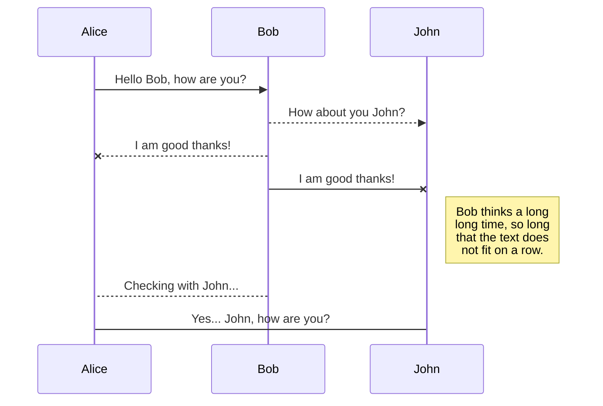
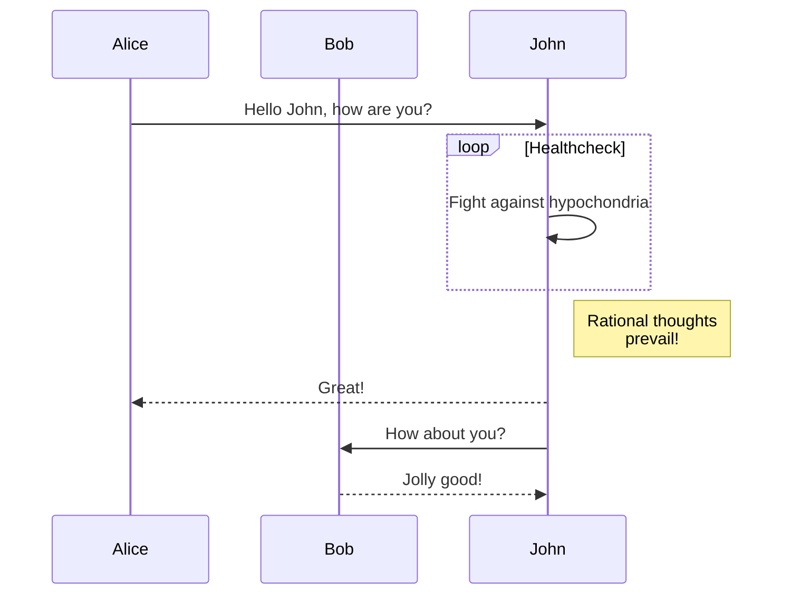
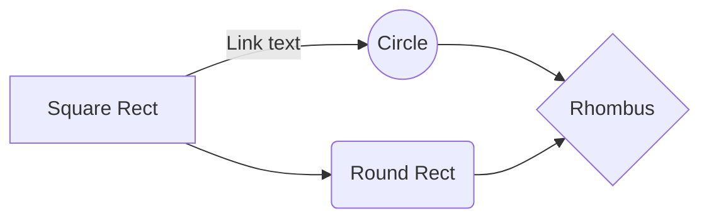
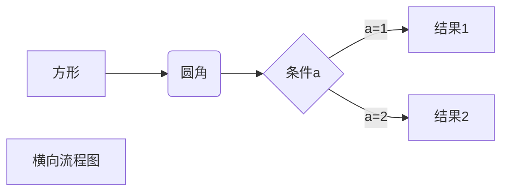
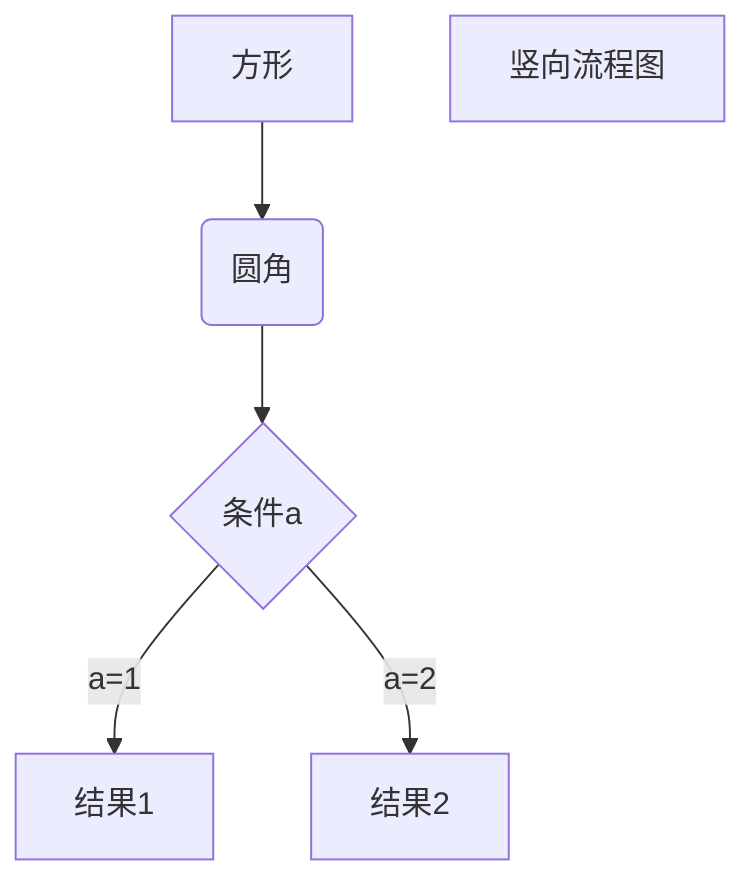
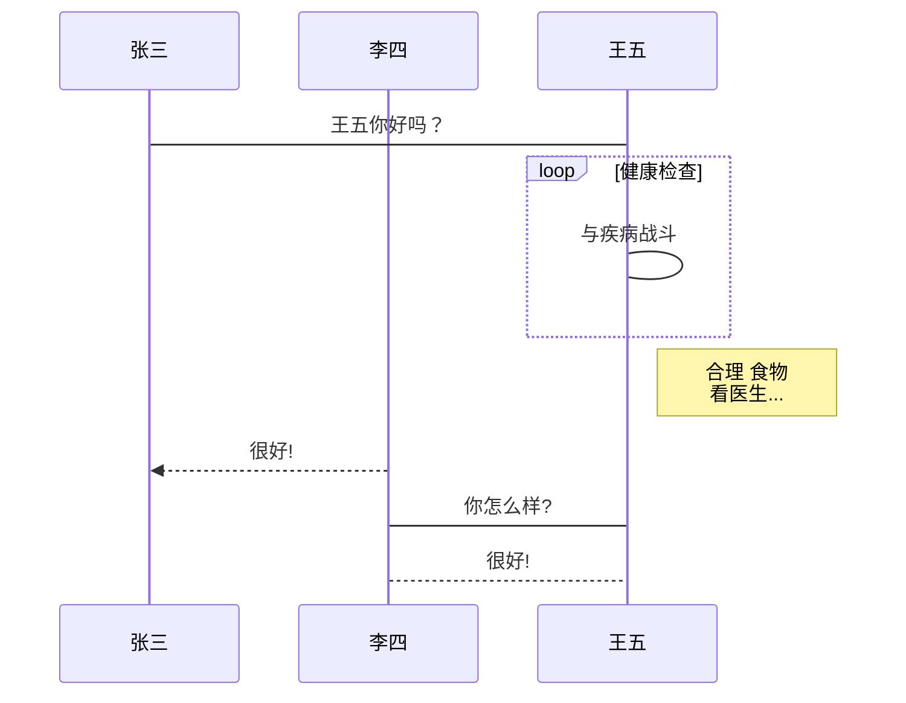
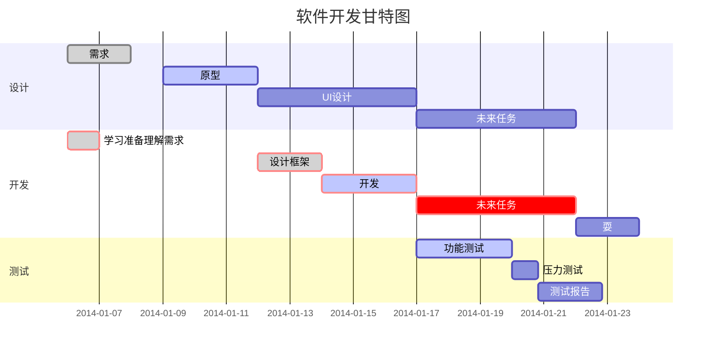
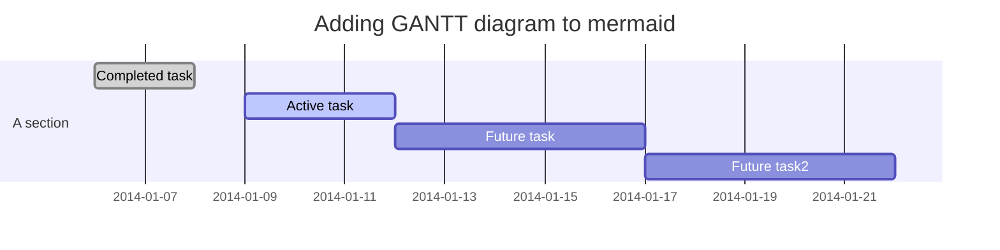
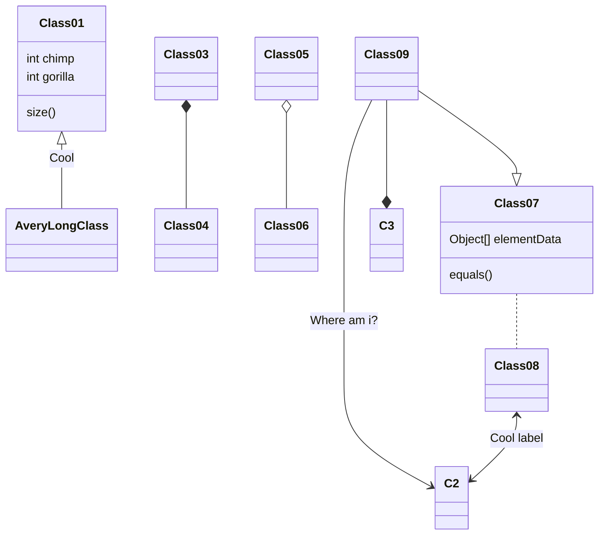

# Markdown基本语法

## 字体

md代码：

```md
正常 **加粗** 正常 *斜体* 正常 ***斜体加粗*** 正常 ~~删除线~~ 正常

正常 *__斜体加粗__* 正常 __*斜体加粗*__ 正常 *__斜体加粗__* 正常

正常 **_斜体加粗_** 正常 _**斜体加粗**_ 正常 ___斜体加粗___ 正常
```

效果：

正常 **加粗** 正常 *斜体* 正常 ***斜体加粗*** 正常 ~~删除线~~ 正常

正常 *__斜体加粗__* 正常 __*斜体加粗*__ 正常 *__斜体加粗__* 正常

正常 **_斜体加粗_** 正常 _**斜体加粗**_ 正常 ___斜体加粗___ 正常

## 引用

md代码：

```md
> Note
>
> 你好
```

效果：

> Note
>
> 你好

### 双重引用

md代码：

```md
> Note
>
>> 你好
```

效果：

> Note
>
>> 你好

## 分割线

md代码：

```md
***
```

效果：

***

## 超链

md代码：

```md
[淘宝](http://taobao.com)
```

效果：

[淘宝](http://taobao.com)

## 参考式

md代码：

```md
[Github][1]

[1]:http://github.com
```

效果：

[Github][1]

[1]:http://github.com

## 列表

### 无序列表

md代码：

```md
* 你好
- 我是
+ 嘿嘿嘿
```

效果：

- 你好
- 我是
- 嘿嘿嘿

### 有序列表

md代码：

```md
1. 你好
1. 我是
1. 嘿嘿嘿
```

效果：

1. 你好
1. 我是
1. 嘿嘿嘿

## 图片

md代码：

```md

```

效果：


## 反转义

md代码：

```md
\*
```

效果：

\*

## 表格

md代码：

```md
第一格表头 | 第二格表头
---------:| -------------
内容单元格 第一列第一格 | 内容单元格第二列第一格
内容单元格 第一列第二格 多加文字 | 内容单元格第二列第二格
内容单元格 第一列第三格 多加文字 | 内容单元格第二列第三格
内容单元格 第一列第四格 多加文字 | 内容单元格第二列第四格
```

效果：

第一格表头 | 第二格表头
---------:| -------------
内容单元格 第一列第一格 | 内容单元格第二列第一格
内容单元格 第一列第二格 多加文字 | 内容单元格第二列第二格
内容单元格 第一列第三格 多加文字 | 内容单元格第二列第三格
内容单元格 第一列第四格 多加文字 | 内容单元格第二列第四格

md代码：

```html
<table>
    <tr><th colspan="2">OSI</th><th>TCP/IP</th></tr>
    <tr><td colspan="2">应用层</td><td rowspan="3">应用层</td></tr>
    <tr><td colspan="2">表示层</td></tr>
    <tr><td colspan="2">会话层</td></tr>
    <tr><td colspan="2">传输层</td><td>传输层</td></tr>
    <tr><td colspan="2">网络层</td><td>网络层</td></tr>
    <tr><td colspan="2">数据链路层</td><td rowspan="2">网络接口层</td></tr>
    <tr><td colspan="2">物理层</td></tr>
</table>
```

效果：

<table>
    <tr><th colspan="2">OSI</th><th>TCP/IP</th></tr>
    <tr><td colspan="2">应用层</td><td rowspan="3">应用层</td></tr>
    <tr><td colspan="2">表示层</td></tr>
    <tr><td colspan="2">会话层</td></tr>
    <tr><td colspan="2">传输层</td><td>传输层</td></tr>
    <tr><td colspan="2">网络层</td><td>网络层</td></tr>
    <tr><td colspan="2">数据链路层</td><td rowspan="2">网络接口层</td></tr>
    <tr><td colspan="2">物理层</td></tr>
</table>

## KaTeX

You can render LaTeX mathematical expressions using [KaTeX](https://khan.github.io/KaTeX/):

The *Gamma function* satisfying $\Gamma(n) = (n-1)!\quad\forall n\in\mathbb N$ is via the Euler integral

$$
\Gamma(z) = \int_0^\infty t^{z-1}e^{-t}dt\,.
$$

> You can find more information about **LaTeX** mathematical expressions [here](http://meta.math.stackexchange.com/questions/5020/mathjax-basic-tutorial-and-quick-reference).

## UML diagrams

You can render UML diagrams using [Mermaid](https://mermaidjs.github.io/). For example, this will produce a sequence diagram:

### Mermaid





And this will produce a flow chart:
















### Other

```sequence
Title: title here
Alice ->> Bob: Hello Bob, how are you?
Bob-->>John: How about you John?
Note right of Alice: 111
Note left of Bob: 222
Bob--> Alice: I am good thanks!
Bob-> John: I am good thanks!
Note right of John: test
Note over Alice,Bob: test2

Bob-->Alice: Checking with John...
Alice->John: Yes... John, how are you?

participant Green
Note right of Green: ~
```

```flow
st=>start: 开始框
op=>operation: 处理框
cond=>condition: 判断框(是或否?)
sub1=>subroutine: 子流程
io=>inputoutput: 输入输出框
e=>end: 结束框
st->op->cond
cond(yes)->io->e
cond(no)->sub1(right)->op
```

```flow
st=>start: 开始框
op=>operation: 处理框
cond=>condition: 判断框(是或否?)
sub1=>subroutine: 子流程
io=>inputoutput: 输入输出框
e=>end: 结束框
st(right)->op(right)->cond
cond(yes)->io(bottom)->e
cond(no)->sub1(right)->op
```