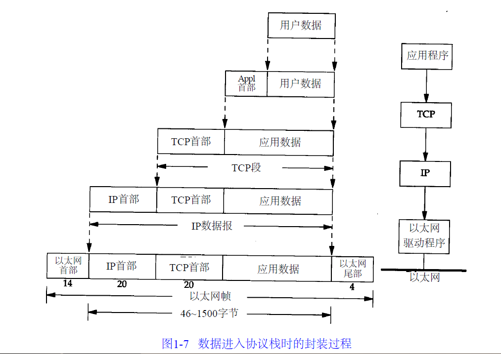
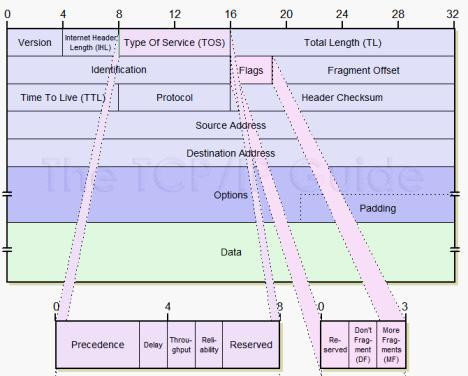
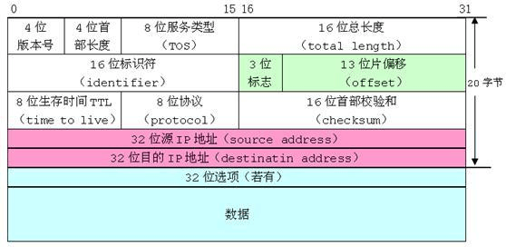

# TCP/IP 协议模型

## TCP/IP 协议模型
TCP/IP 协议模型 (Transmission Control Protocol/Internet Protocol)，包含了一系列构成互联网基础的网络协议，是 Internet 的核心协议。

基于TCP/IP的参考模型将协议分成四个层次，它们分别是链路层、网络层、传输层和应用层。下图表示 TCP/IP 模型与 OSI 模型各层的对照关系。

<table>
    <tr><th>OSI</th><th colspan="2">TCP/IP</th></tr>
    <tr><td>应用层</td><td rowspan="3">应用层</td><td rowspan="3">http, ftp</td></tr>
    <tr><td>表示层</td></tr>
    <tr><td>会话层</td></tr>
    <tr><td>传输层</td><td>传输层</td><td>TCP, UDP</td></tr>
    <tr><td>网络层</td><td>网络层</td><td>IP, ICMP, ARP, RARP, IGMP</td></tr>
    <tr><td>数据链路层</td><td rowspan="2">网络接口层</td><td rowspan="2">/</td></tr>
    <tr><td>物理层</td></tr>
</table>

封装过程：



上图清楚地表示了 TCP/IP 协议中每个层的作用，而 TCP/IP 协议通信的过程其实就对应着数据入栈与出栈的过程。入栈的过程，数据发送方每层不断地封装首部与尾部，添加一些传输的信息，确保能传输到目的地。出栈的过程，数据接收方每层不断地拆除首部与尾部，得到最终传输的数据。HTTP 在这里就是 app1+用户数据 的角色。

## 网络接口层

**物理层**负责 01 比特流与物理设备电压高低、光的闪灭之间的互换。**数据链路层**负责将 01 序列划分为数据帧从一个节点传输到临近的另一个节点，这些节点是通过 MAC 来唯一标识的。

- 封装成帧：把网络层数据报加头和尾，封装成帧，帧头中包括源 MAC 地址和目的 MAC 地址。
- 透明传输：零比特填充、转义字符。
- 可靠传输: 在出错率很低的链路上很少用，但是无线链路 WLAN 会保证可靠传输。
- 差错检测(CRC):接收者检测错误,如果发现差错，丢弃该帧。

## 网络层

### IP 协议

IP 协议是 TCP/IP 协议的核心，所有的 TCP，UDP，IMCP，IGMP 的数据都以 IP 数据格式传输。要注意的是，**IP 不是可靠的协议**，这是说，IP 协议没有提供一种数据未传达以后的处理机制，这被认为是上层协议：TCP 或 UDP 要做的事情。

#### IP 地址

在数据链路层中我们一般通过 MAC 地址来识别不同的节点，而在 IP 层我们也要有一个类似的地址标识，这就是 IP 地址。

32 位 IP 地址分为网络位和地址位，这样做可以减少路由器中路由表记录的数目，有了网络地址，就可以限定拥有相同网络地址的终端都在同一个范围内，那么路由表只需要维护一条这个网络地址的方向，就可以找到相应的这些终端了。

A类IP地址: 0.0.0.0~127.0.0.0

B类IP地址:128.0.0.1~191.255.0.0

C类IP地址:192.168.0.0~239.255.255.0

#### IP 协议头





这里只介绍 8 位的 TTL 字段。这个字段规定该数据包在穿过多少个路由之后才会被抛弃。一个 IP 数据包每穿过一个路由器，该数据包的TTL数值就会减少 1，当该数据包的 TTL 成为零，它就会被自动抛弃。

这个字段的最大值也就是 255，也就是说一个协议包也就在路由器里面穿行 255 次就会被抛弃了，根据系统的不同，这个数字也不一样，一般是 32 或者是 64 。

### ARP 及 RARP 协议

ARP 是根据 IP 地址获取 MAC 地址的一种协议。

ARP (地址解析) 协议是一种解析协议，本来主机是完全不知道这个 IP 对应的是哪个主机的哪个接口，当主机要发送一个 IP 包的时候，会首先查一下自己的 ARP 高速缓存 (就是一个 IP-MAC 地址对应表缓存) 。

如果查询的 IP－MAC 值对不存在，那么主机就向网络发送一个 ARP 协议广播包，这个广播包里面就有待查询的 IP 地址，而直接收到这份广播的包的所有主机都会查询自己的 IP 地址，如果收到广播包的某一个主机发现自己符合条件，那么就准备好一个包含自己的 MAC 地址的 ARP 包传送给发送 ARP 广播的主机。

而广播主机拿到 ARP 包后会更新自己的 ARP 缓存 (就是存放 IP-MAC 对应表的地方) 。发送广播的主机就会用新的 ARP 缓存数据准备好数据链路层的的数据包发送工作。
RARP 协议的工作与此相反，不做赘述。

### ICMP

#### Ping

IP 协议并不是一个可靠的协议，它不保证数据被送达，那么，自然的，保证数据送达的工作应该由其他的模块来完成。其中一个重要的模块就是 ICMP (网络控制报文) 协议。ICMP 不是高层协议，而是 IP 层的协议。

当传送 IP 数据包发生错误。比如主机不可达，路由不可达等等，ICMP 协议将会把错误信息封包，然后传送回给主机。给主机一个处理错误的机会，这 也就是为什么说建立在 IP 层以上的协议是可能做到安全的原因。

ping 可以说是 ICMP 的最著名的应用，是 TCP/IP 协议的一部分。利用 “ping” 命令可以检查网络是否连通，可以很好地帮助我们分析和判定网络故障。

ping 这个单词源自声纳定位，而这个程序的作用也确实如此，它利用 ICMP 协议包来侦测另一个主机是否可达。原理是用类型码为 0 的 ICMP 发请 求，受到请求的主机则用类型码为 8 的 ICMP 回应。

ping 程序来计算间隔时间，并计算有多少个包被送达。用户就可以判断网络大致的情况。我们可以看到， ping 给出来了传送的时间和 TTL 的数据。

#### Traceroute

Traceroute 是用来侦测主机到目的主机之间所经路由情况的重要工具，也是最便利的工具。

Traceroute 的原理是非常非常的有意思，它收到到目的主机的 IP 后，首先给目的主机发送一个 TTL=1 的 UDP 数据包，而经过的第一个路由器收到这个数据包以后，就自动把 TTL 减 1，而 TTL 变为 0 以后，路由器就把这个包给抛弃了，并同时产生 一个主机不可达的 ICMP 数据报给主机。

主机收到这个数据报以后再发一个 TTL=2 的 UDP 数据报给目的主机，然后刺激第二个路由器给主机发 ICMP 数据 报。如此往复直到到达目的主机。这样，traceroute 就拿到了所有的路由器 IP。

## 传输层

### TCP/UDP

TCP/UDP 都是是传输层协议，但是两者具有不同的特性，同时也具有不同的应用场景，下面以图表的形式对比分析。

~|TCP|UDP
:-:|:-:|:-:
可靠性|可靠|不可靠
连接性|面向连接|无连接
报文|面向字节流|面向报文
效率|传输效率低|传输效率高
双工性|全双工|一对一、一对多、多对一、多对多
流量控制|滑动窗口|无
拥塞控制|慢开始、拥塞避免、快重传、快恢复|无
传输速度|慢|快
应用场景|对效率要求低，对准确性要求高或者要求有连接的场景|对效率要求高，对准确性要求低

#### 面向报文

面向报文的传输方式是应用层交给 UDP 多长的报文，UDP 就照样发送，即一次发送一个报文。因此，应用程序必须选择合适大小的报文。若报文太长，则 IP 层需要分片，降低效率。若太短，会是 IP 太小。

#### 面向字节流

面向字节流的话，虽然应用程序和 TCP 的交互是一次一个数据块（大小不等），但 TCP 把应用程序看成是一连串的无结构的字节流。TCP 有一个缓冲，当应用程序传送的数据块太长，TCP 就可以把它划分短一些再传送。

TCP 和 UDP 协议的一些应用：

<table>
    <tr><th>应用层协议</th><th>应用</th><th>传输层协议</th></tr>
    <tr><td>SMTP</td><td>电子邮件</td><td rowspan="4">TCP</td></tr>
    <tr><td>TELNET</td><td>远程终端接入</td></tr>
    <tr><td>HTTP</td><td>万维网</td></tr>
    <tr><td>FTP</td><td>文件传输</td></tr>
    <tr><td>DNS</td><td>域名转换</td><td rowspan="4">UDP</td></tr>
    <tr><td>TFTP</td><td>文件传输</td></tr>
    <tr><td>SNMP</td><td>网络管理</td></tr>
    <tr><td>NFS</td><td>远程文件服务器</td></tr>
</table>

## 应用层

### DNS

DNS (Domain Name System，域名系统) ，因特网上作为域名和 IP 地址相互映射的一个分布式数据库，能够使用户更方便的访问互联网，而不用去记住能够被机器直接读取的 IP 数串。通过主机名，最终得到该主机名对应的 IP 地址的过程叫做域名解析（或主机名解析）。DNS 协议运行在 UDP 协议之上，使用端口号 53。

## TCP 连接的建立与终止

### TCP 三次握手

```sequence
participant client
participant server
Note left of client: CLOSED
client->client: 主动打开
Note right of server: LISTEN监听
client->server: SYN=1, seq=x
Note left of client: SYN-SENT同步已发送
server->client: SYN=1, ACK=1, seq=Y, ack=x+1
Note right of server: SYN-RCVD同步收到
client->server: ACK=1, seq=x+1, ack=y+1
Note left of client: ESTABLISHED已建立连接
Note right of server: ESTABLISHED已建立连接
```

#### （1）三次握手的详述

首先 Client 端发送连接请求报文，Server 段接受连接后回复 ACK 报文，并为这次连接分配资源。Client 端接收到 ACK 报文后也向 Server 段发生 ACK 报文，并分配资源，这样 TCP 连接就建立了。


 最初两端的 TCP 进程都处于 CLOSED 关闭状态，A 主动打开连接，而 B 被动打开连接。**（A、B 关闭状态 CLOSED——B 收听状态 LISTEN——A 同步已发送状态 SYN-SENT——B 同步收到状态 SYN-RCVD——A、B 连接已建立状态 ESTABLISHED）**

- B 的 TCP 服务器进程先创建传输控制块 TCB，准备接受客户进程的连接请求。然后服务器进程就处于 LISTEN（收听）状态，等待客户的连接请求。若有，则作出响应。

- 1）**第一次握手**：A 的 TCP 客户进程也是首先创建传输控制块 TCB，然后向 B 发出连接请求报文段，**（首部的同步位 SYN=1， 初始序号 seq=x）**，（SYN=1 的报文段不能携带数据）但要消耗掉一个序号，此时 TCP 客户进程进入 SYN-SENT（同步已发送）状态。

- 2）**第二次握手**：B 收到连接请求报文段后，如同意建立连接，则向 A 发送确认，在确认报文段中 **（SYN=1，ACK=1，确认号 ack=x+1，初始序号 seq=y）**，测试 TCP 服务器进程进入 SYN-RCVD（同步收到）状态；

- 3）**第三次握手**：TCP 客户进程收到 B 的确认后，要向 B 给出确认报文段 **（ACK=1，确认号 ack=y+1，序号 seq=x+1）**（初始为 seq=x，第二个报文段所以要 + 1），ACK 报文段可以携带数据，不携带数据则不消耗序号。TCP 连接已经建立，A 进入 ESTABLISHED（已建立连接）。
当 B 收到 A 的确认后，也进入 ESTABLISHED 状态。

#### （2）总结三次握手过程

- **第一次握手**：起初两端都处于 CLOSED 关闭状态，Client 将标志位 SYN 置为 1，随机产生一个值 seq=x，并将该数据包发送给 Server，Client 进入 SYN-SENT 状态，等待 Server 确认；

- **第二次握手**：Server 收到数据包后由标志位 SYN=1 得知 Client 请求建立连接，Server 将标志位 SYN 和 ACK 都置为 1，ack=x+1，随机产生一个值 seq=y，并将该数据包发送给 Client 以确认连接请求，Server 进入 SYN-RCVD 状态，此时操作系统为该 TCP 连接分配 TCP 缓存和变量；

- **第三次握手**：Client 收到确认后，检查 ack 是否为 x+1，ACK 是否为 1，如果正确则将标志位 ACK 置为 1，ack=y+1，并且此时操作系统为该 TCP 连接分配 TCP 缓存和变量，并将该数据包发送给 Server，Server 检查 ack 是否为 y+1，ACK 是否为 1，如果正确则连接建立成功，Client 和 Server 进入 ESTABLISHED 状态，完成三次握手，随后 Client 和 Server 就可以开始传输数据。

起初 A 和 B 都处于 **CLOSED** 状态 ——B 创建 TCB，处于 **LISTEN** 状态，等待 A 请求 ——A 创建 TCB，发送连接请求（SYN=1，seq=x），进入 **SYN-SENT** 状态 ——B 收到连接请求，向 A 发送确认（SYN=ACK=1，确认号 ack=x+1，初始序号 seq=y），进入 **SYN-RCVD** 状态 ——A 收到 B 的确认后，给 B 发出确认（ACK=1，ack=y+1，seq=x+1），A 进入 **ESTABLISHED** 状态 ——B 收到 A 的确认后，进入 ESTABLISHED 状态。

**TCB** **传输控制块** Transmission Control Block，存储每一个连接中的重要信息，如 TCP 连接表，到发送和接收缓存的指针，到重传队列的指针，当前的发送和接收序号。

#### （3）为什么 A 还要发送一次确认呢？可以二次握手吗

答：**主要为了防止已失效的连接请求报文段突然又传送到了 B，因而产生错误**。如 A 发出连接请求，但因连接请求报文丢失而未收到确认，于是 A 再重传一次连接请求。后来收到了确认，建立了连接。数据传输完毕后，就释放了连接，A 工发出了两个连接请求报文段，其中第一个丢失，第二个到达了 B，但是第一个丢失的报文段只是在**某些网络结点长时间滞留了，延误到连接释放以后的某个时间才到达 B**，此时 B 误认为 A 又发出一次新的连接请求，于是就向 A 发出确认报文段，同意建立连接，不采用三次握手，只要 B 发出确认，就建立新的连接了，此时 A 不理睬 B 的确认且不发送数据，则 B 一致等待 A 发送数据，浪费资源。

#### （4）Server 端易受到 SYN 攻击吗

服务器端的资源分配是在二次握手时分配的，而客户端的资源是在完成三次握手时分配的，所以服务器容易受到 SYN 洪泛攻击，SYN 攻击就是 Client 在短时间内伪造大量不存在的 IP 地址，并向 Server 不断地发送 SYN 包，Server 则回复确认包，并等待 Client 确认，由于源地址不存在，因此 Server 需要不断重发直至超时，这些伪造的 SYN 包将长时间占用未连接队列，导致正常的 SYN 请求因为队列满而被丢弃，从而引起网络拥塞甚至系统瘫痪。

防范 SYN 攻击措施：降低主机的等待时间使主机尽快的释放半连接的占用，短时间受到某 IP 的重复 SYN 则丢弃后续请求。

### TCP 四次挥手

#### （1）四次挥手的详述

假设 Client 端发起中断连接请求，也就是发送 FIN 报文。Server 端接到 FIN 报文后，意思是说 "我 Client 端没有数据要发给你了"，但是如果你还有数据没有发送完成，则不必急着关闭 Socket，可以继续发送数据。所以你先发送 ACK，"告诉 Client 端，你的请求我收到了，但是我还没准备好，请继续你等我的消息"。这个时候 Client 端就进入 FIN_WAIT 状态，继续等待 Server 端的 FIN 报文。当 Server 端确定数据已发送完成，则向 Client 端发送 FIN 报文，"告诉 Client 端，好了，我这边数据发完了，准备好关闭连接了"。Client 端收到 FIN 报文后，"就知道可以关闭连接了，但是他还是不相信网络，怕 Server 端不知道要关闭，所以发送 ACK 后进入 TIME_WAIT 状态，如果 Server 端没有收到 ACK 则可以重传。“，Server 端收到 ACK 后，" 就知道可以断开连接了 "。Client 端等待了 2MSL 后依然没有收到回复，则证明 Server 端已正常关闭，那好，我 Client 端也可以关闭连接了。Ok，TCP 连接就这样关闭了！


数据传输结束后，通信的双方都可释放连接，A 和 B 都处于 ESTABLISHED 状态。（A、B 连接建立状态 ESTABLISHED——A 终止等待 1 状态 FIN-WAIT-1——B 关闭等待状态 CLOSE-WAIT——A 终止等待 2 状态 FIN-WAIT-2——B 最后确认状态 LAST-ACK——A 时间等待状态 TIME-WAIT——B、A 关闭状态 CLOSED）

- 1）A 的应用进程先向其 TCP 发出连接释放报文段 **（FIN=1，序号 seq=u）**，并停止再发送数据，主动关闭 TCP 连接，进入 FIN-WAIT-1（终止等待 1）状态，等待 B 的确认。

- 2）B 收到连接释放报文段后即发出确认报文段，**（ACK=1，确认号 ack=u+1，序号 seq=v）**，B 进入 CLOSE-WAIT（关闭等待）状态，此时的 TCP 处于半关闭状态，A 到 B 的连接释放。

- 3）A 收到 B 的确认后，进入 FIN-WAIT-2（终止等待 2）状态，等待 B 发出的连接释放报文段。

- 4）B 没有要向 A 发出的数据，B 发出连接释放报文段 **（FIN=1，ACK=1，序号 seq=w，确认号 ack=u+1）**，B 进入 LAST-ACK（最后确认）状态，等待 A 的确认。

- 5）A 收到 B 的连接释放报文段后，对此发出确认报文段 **（ACK=1，seq=u+1，ack=w+1）**，A 进入 TIME-WAIT（时间等待）状态。此时 TCP 未释放掉，需要经过时间等待计时器设置的时间 2MSL 后，A 才进入 CLOSED 状态。

#### （2）总结四次挥手过程

起初 A 和 B 处于 **ESTABLISHED** 状态 ——A 发出连接释放报文段并处于 **FIN-WAIT-1** 状态 ——B 发出确认报文段且进入 **CLOSE-WAIT** 状态 ——A 收到确认后，进入 **FIN-WAIT-2** 状态，等待 B 的连接释放报文段 ——B 没有要向 A 发出的数据，B 发出连接释放报文段且进入 **LAST-ACK** 状态 ——A 发出确认报文段且进入 **TIME-WAIT** 状态 ——B 收到确认报文段后进入 **CLOSED** 状态 ——A 经过等待计时器时间 2MSL 后，进入 CLOSED 状态。

#### （3）为什么 A 在 TIME-WAIT 状态必须等待 2MSL 的时间

MSL 最长报文段寿命 Maximum Segment Lifetime，MSL=2

答： 两个理由：**1）保证 A 发送的最后一个 ACK 报文段能够到达 B。2）防止 “已失效的连接请求报文段” 出现在本连接中。**

1. 这个 ACK 报文段有可能丢失，使得处于 LAST-ACK 状态的 B 收不到对已发送的 FIN+ACK 报文段的确认，B 超时重传 FIN+ACK 报文段，而 A 能在 2MSL 时间内收到这个重传的 FIN+ACK 报文段，接着 A 重传一次确认，重新启动 2MSL 计时器，最后 A 和 B 都进入到 CLOSED 状态，若 A 在 TIME-WAIT 状态不等待一段时间，而是发送完 ACK 报文段后立即释放连接，则无法收到 B 重传的 FIN+ACK 报文段，所以不会再发送一次确认报文段，则 B 无法正常进入到 CLOSED 状态。

1. A 在发送完最后一个 ACK 报文段后，再经过 2MSL，就可以使本连接持续的时间内所产生的所有报文段都从网络中消失，使下一个新的连接中不会出现这种旧的连接请求报文段。

#### （4）为什么连接的时候是三次握手，关闭的时候却是四次握手

答：因为当 Server 端收到 Client 端的 SYN 连接请求报文后，可以直接发送 SYN+ACK 报文。其中 ACK 报文是用来应答的，SYN 报文是用来同步的。但是关闭连接时，当 Server 端收到 FIN 报文时，很可能并不会立即关闭 SOCKET，所以只能先回复一个 ACK 报文，告诉 Client 端，"你发的 FIN 报文我收到了"。只有等到我 Server 端所有的报文都发送完了，我才能发送 FIN 报文，因此不能一起发送。故需要四步握手。
