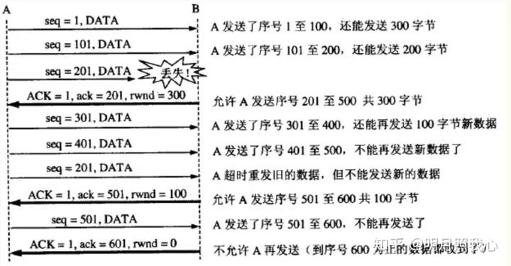
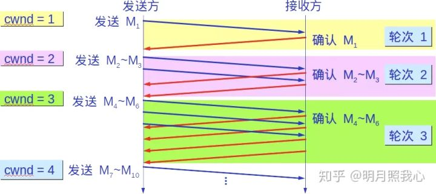
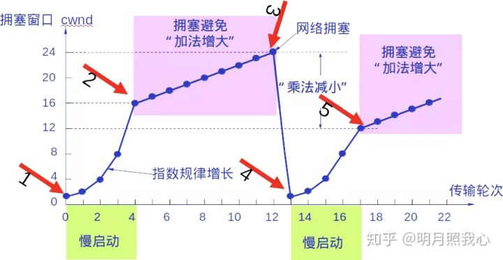
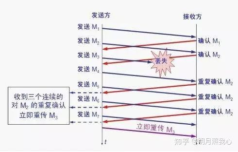
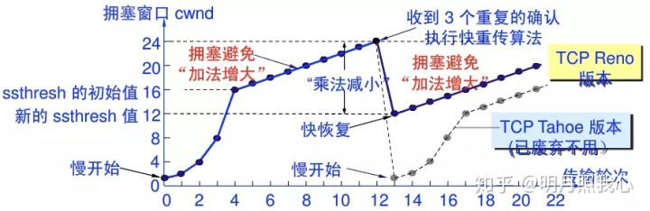

# TCP 补充

## TCP 流量控制

如果发送方把数据发送得过快，接收方可能会来不及接收，这就会造成数据的丢失。所谓流量控制就是让发送方的发送速率不要太快，要让接收方来得及接收。

利用滑动窗口机制可以很方便地在 TCP 连接上实现对发送方的流量控制。

设 A 向 B 发送数据。在连接建立时，B 告诉了 A：“我的接收窗口是 rwnd = 400”(这里的 rwnd 表示 receiver window) 。因此，发送方的发送窗口不能超过接收方给出的接收窗口的数值。请注意，TCP 的窗口单位是字节，不是报文段。假设每一个报文段为 100 字节长，而数据报文段序号的初始值设为 1。大写 ACK 表示首部中的确认位 ACK，小写 ack 表示确认字段的值 ack。

从图中可以看出，B 进行了三次流量控制。第一次把窗口减少到 rwnd = 300 ，第二次又减到了 rwnd = 100 ，最后减到 rwnd = 0 ，即不允许发送方再发送数据了。这种使发送方暂停发送的状态将持续到主机 B 重新发出一个新的窗口值为止。B 向 A 发送的三个报文段都设置了 ACK = 1 ，只有在 ACK=1 时确认号字段才有意义。

TCP 为每一个连接设有一个持续计时器 (persistence timer)。只要 TCP 连接的一方收到对方的零窗口通知，就启动持续计时器。若持续计时器设置的时间到期，就发送一个零窗口控测报文段（携 1 字节的数据），那么收到这个报文段的一方就重新设置持续计时器。

## TCP 拥塞控制

### 慢开始和拥塞避免

发送方维持一个拥塞窗口 cwnd (congestion window) 的状态变量。拥塞窗口的大小取决于网络的拥塞程度，并且动态地在变化。发送方让自己的发送窗口等于拥塞窗口。
发送方控制拥塞窗口的原则是：只要网络没有出现拥塞，拥塞窗口就再增大一些，以便把更多的分组发送出去。但只要网络出现拥塞，拥塞窗口就减小一些，以减少注入到网络中的分组数。

慢开始算法：

当主机开始发送数据时，如果立即所大量数据字节注入到网络，那么就有可能引起网络拥塞，因为现在并不清楚网络的负荷情况。

因此，较好的方法是 先探测一下，即由小到大逐渐增大发送窗口，也就是说，由小到大逐渐增大拥塞窗口数值。

通常在刚刚开始发送报文段时，先把拥塞窗口 cwnd 设置为一个最大报文段 MSS 的数值。而在每收到一个对新的报文段的确认后，把拥塞窗口增加至多一个 MSS 的数值。用这样的方法逐步增大发送方的拥塞窗口 cwnd ，可以使分组注入到网络的速率更加合理。

每经过一个传输轮次，拥塞窗口 cwnd 就加倍。一个传输轮次所经历的时间其实就是往返时间 RTT。不过 “传输轮次” 更加强调：把拥塞窗口 cwnd 所允许发送的报文段都连续发送出去，并收到了对已发送的最后一个字节的确认。
另，慢开始的 “慢” 并不是指 cwnd 的增长速率慢，而是指在 TCP 开始发送报文段时先设置 cwnd=1，使得发送方在开始时只发送一个报文段（目的是试探一下网络的拥塞情况），然后再逐渐增大 cwnd。

为了防止拥塞窗口 cwnd 增长过大引起网络拥塞，还需要设置一个慢开始门限 ssthresh 状态变量。慢开始门限 ssthresh 的用法如下：

- 当 cwnd < ssthresh 时，使用上述的慢开始算法。
- 当 cwnd > ssthresh 时，停止使用慢开始算法而改用拥塞避免算法。
- 当 cwnd = ssthresh 时，既可使用慢开始算法，也可使用拥塞控制避免算法。拥塞避免
让拥塞窗口 cwnd 缓慢地增大，即每经过一个往返时间 RTT 就把发送方的 拥塞窗口 cwnd 加 1，而不是加倍。这样拥塞窗口 cwnd 按线性规律缓慢增长，比慢开始算法的拥塞窗口增长速率缓慢得多。

无论在慢开始阶段还是在拥塞避免阶段，只要发送方判断网络出现拥塞（其根据就是没有收到确认），就要把慢开始门限 ssthresh 设置为出现拥塞时的发送 方窗口值的一半（但不能小于 2）。然后把拥塞窗口 cwnd 重新设置为 1，执行慢开始算法。

这样做的目的就是要迅速减少主机发送到网络中的分组数，使得发生 拥塞的路由器有足够时间把队列中积压的分组处理完毕。

如下图，用具体数值说明了上述拥塞控制的过程。现在发送窗口的大小和拥塞窗口一样大。

### 快重传和快恢复

#### 快重传

快重传算法首先要求接收方每收到一个失序的报文段后就立即发出重复确认（为的是使发送方及早知道有报文段没有到达对方）而不要等到自己发送数据时才进行捎带确认。

接收方收到了 M1 和 M2 后都分别发出了确认。现在假定接收方没有收到 M3 但接着收到了 M4。

显然，接收方不能确认 M4，因为 M4 是收到的失序报文段。根据 可靠传输原理，接收方可以什么都不做，也可以在适当时机发送一次对 M2 的确认。

但按照快重传算法的规定，接收方应及时发送对 M2 的重复确认，这样做可以让 发送方及早知道报文段 M3 没有到达接收方。发送方接着发送了 M5 和 M6。接收方收到这两个报文后，也还要再次发出对 M2 的重复确认。这样，发送方共收到了 接收方的四个对 M2 的确认，其中后三个都是重复确认。

**快重传算法还规定，发送方只要一连收到三个重复确认就应当立即重传对方尚未收到的报文段 M3，而不必 继续等待 M3 设置的重传计时器到期。**

由于发送方尽早重传未被确认的报文段，因此采用快重传后可以使整个网络吞吐量提高约 20%。

#### 快恢复

与快重传配合使用的还有快恢复算法，其过程有以下两个要点：

1. 当发送方连续收到三个重复确认，就执行 “乘法减小” 算法，把慢开始门限 ssthresh 减半。

1. 与慢开始不同之处是现在不执行慢开始算法（即拥塞窗口 cwnd 现在不设置为 1），而是把 cwnd 值设置为 慢开始门限 ssthresh 减半后的数值，然后开始执行拥塞避免算法（“加法增大”），使拥塞窗口缓慢地线性增大。

