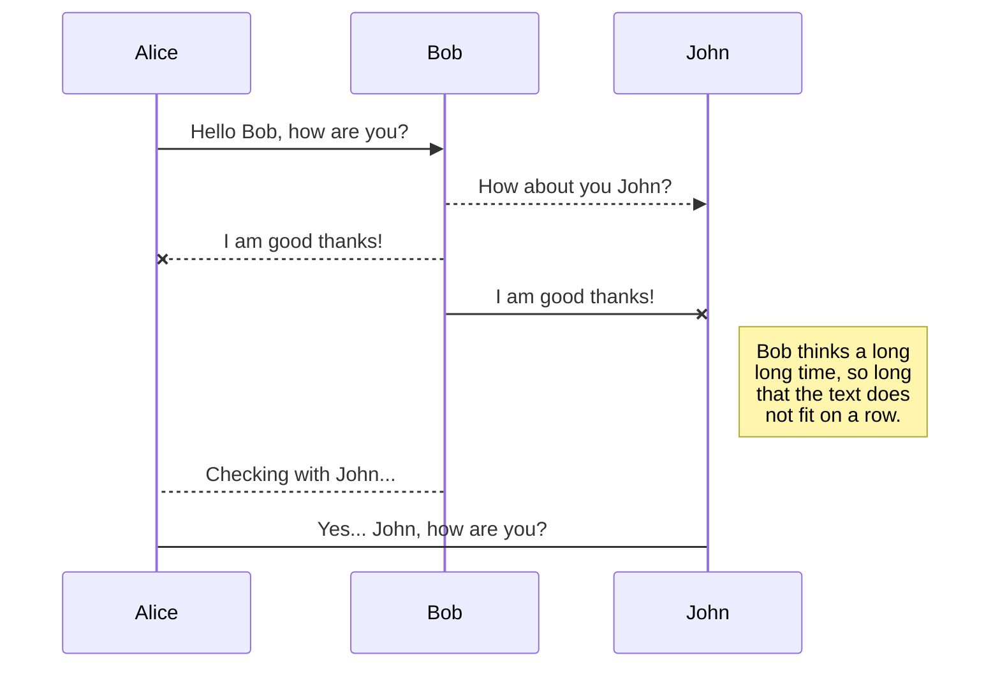
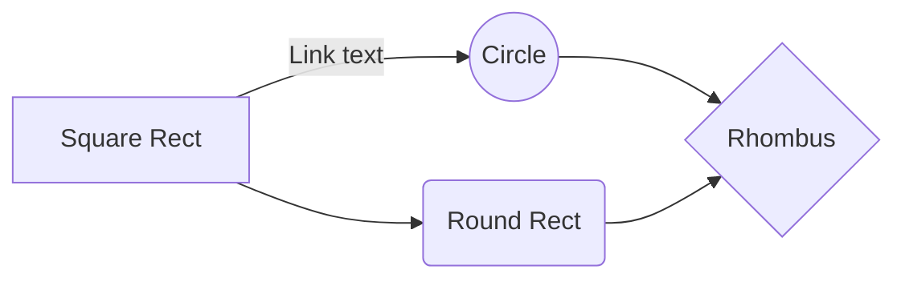

# Markdown基本语法

## 字体

md代码：

```md
正常 **加粗** 正常 *斜体* 正常 ***斜体加粗*** 正常 ~~删除线~~ 正常

正常 *__斜体加粗__* 正常 __*斜体加粗*__ 正常 *__斜体加粗__* 正常

正常 **_斜体加粗_** 正常 _**斜体加粗**_ 正常 ___斜体加粗___ 正常
```

效果：

正常 **加粗** 正常 *斜体* 正常 ***斜体加粗*** 正常 ~~删除线~~ 正常

正常 *__斜体加粗__* 正常 __*斜体加粗*__ 正常 *__斜体加粗__* 正常

正常 **_斜体加粗_** 正常 _**斜体加粗**_ 正常 ___斜体加粗___ 正常

## 引用

md代码：

```md
> Note
>
> 你好
```

效果：

> Note
>
> 你好

### 双重引用

md代码：

```md
> Note
>
>> 你好
```

效果：

> Note
>
>> 你好

## 分割线

md代码：

```md
***
```

效果：

***

## 超链

md代码：

```md
[淘宝](http://taobao.com)
```

效果：

[淘宝](http://taobao.com)

## 参考式

md代码：

```md
1. 你好
1. 我是
1. 嘿嘿嘿
```

效果：

[Github][1]

[1]:http://github.com

## 列表

### 无序列表

md代码：

```md
* 你好
- 我是
+ 嘿嘿嘿
```

效果：

- 你好
- 我是
- 嘿嘿嘿

### 有序列表

md代码：

```md
1. 你好
1. 我是
1. 嘿嘿嘿
```

效果：

1. 你好
1. 我是
1. 嘿嘿嘿

## 图片

md代码：

```md

```

效果：


## 反转义

md代码：

```md
\*
```

效果：

\*

## 表格

md代码：

```md
第一格表头 | 第二格表头
---------| -------------
内容单元格 第一列第一格 | 内容单元格第二列第一格
内容单元格 第一列第二格 多加文字 | 内容单元格第二列第二格
内容单元格 第一列第三格 多加文字 | 内容单元格第二列第三格
内容单元格 第一列第四格 多加文字 | 内容单元格第二列第四格
```

效果：

第一格表头 | 第二格表头
---------| -------------
内容单元格 第一列第一格 | 内容单元格第二列第一格
内容单元格 第一列第二格 多加文字 | 内容单元格第二列第二格
内容单元格 第一列第三格 多加文字 | 内容单元格第二列第三格
内容单元格 第一列第四格 多加文字 | 内容单元格第二列第四格

## KaTeX

You can render LaTeX mathematical expressions using [KaTeX](https://khan.github.io/KaTeX/):

The *Gamma function* satisfying $\Gamma(n) = (n-1)!\quad\forall n\in\mathbb N$ is via the Euler integral

$$
\Gamma(z) = \int_0^\infty t^{z-1}e^{-t}dt\,.
$$

> You can find more information about **LaTeX** mathematical expressions [here](http://meta.math.stackexchange.com/questions/5020/mathjax-basic-tutorial-and-quick-reference).


## UML diagrams

You can render UML diagrams using [Mermaid](https://mermaidjs.github.io/). For example, this will produce a sequence diagram:



And this will produce a flow chart:

