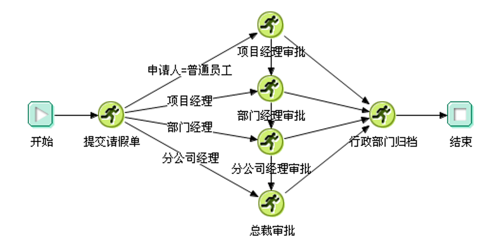
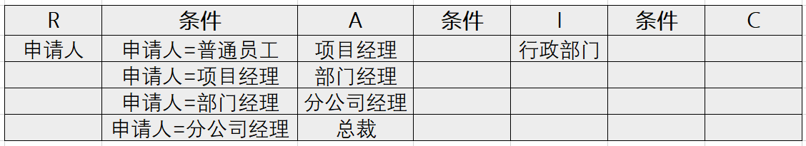

# [RACI模式梳理业务流程](http://p.primeton.com/articles/5ce6324c4be8e639e6001eaf)

2019年5月

最近经常在不同场合说，技术发展已经进入深水区。IT 技术发展已经越来越成熟了，尤其在金融行业，以前是解决从无到有的问题，现在该有的系统都有了，是解决进一步发展的问题。所谓深水区就是用原来单纯技术突破的方式不行了。例如有些企业，早年用流程系统解决了无纸化办公的问题，可下一个阶段做什么呢？

类似问题，在很多客户那里都存在，他们希望IT公司能帮助他们面向未来，找到新的发展方向。但是，由于他们自身已经进入深水区，近年来涌现的很多技术，对他们的帮助并不是很直接，很难像当年一样，某项技术能立竿见影解决问题了。这里我来比较一下：当年，使用关系数据库立刻解决了大规模数据存储问题，别的不用想，研究好Oracle/DB2/Sybase/Informix就够了，而现在懂 Hadoop 的体系结构不够，你要知道客户的数据在哪里、业务如何优化，如何支持决策，这些连客户自己也说不清；再如，当年使用应用服务器立刻解决了C/S架构客户端难以维护的问题，业务可以更好的通过互联网发布了，价值清晰可见，但现在微服务/分布式的一系列技术，都是希望用来解决高并发、易维护的问题，做起来却不是立竿见影产生效果的，一来很多模式需要仔细推敲、设计（比如应用如何拆分等等，设计不好起不到效果），对人的要求高；二来做了类似良好设计后会发现，原来的技术也是可以做到的，用了新的技术好在哪里。

究其原因，进入深水区后，这些问题会变得离散化、隐形化，解决起来不再立竿见影，而是牵一发动全身、进退两难。在我看来，虽然问题更复杂了，但 IT 提高业务效能、适应业务灵活变化、提供决策依据、提高开发效率、提高软件质量、提高发布效率这些要求并没有变，这就需要我们更加深入分析问题，提高对业务的抽象能力，从问题中抽象出解决方案。我写的一些东西也都是类似的一些抽象，希望能从业务中抽象出若干模式，用这些模式解决深水区遇到的问题。

举一个流程业务抽象模式的例子，希望能够缩短流程类业务的上线周期。金融业务多是以流程为表现形式，以往我们对流程的设计就是一个接一个环节，顺序执行下去，这种方式更多是技术语言、编码方式，业务和技术的沟通成本很高，信息传递上经常有缺失，导致流程上线效率不高。

RACI，就是在流程应用中抽象出的业务模式。这个词学过 PMP 的同学都知道，是用来明确组织过程中各个角色及其相关责任的方法，其中：

- 谁负责（R = Responsible）,即负责执行任务的角色，他/她具体负责操控项目、解决问题。
- 谁批准（A = Accountable）,即对任务负全责的角色，只有经他/她同意或签署之后，项目才能得以进行。
- 咨询谁（C = Consulted）,拥有完成项目所需的信息或能力的人员。
- 通知谁 (I =Informed),即拥有特权、应及时被通知结果的人员，却不必向他/她咨询、征求意见。

看一个请假流程，这个流程中 R 可以当作提交申请单的人，各级审批就是 A，行政部门就是 I，C这个类型有点不好理解，其实就是能够帮助 R、A 完成工作的人，例如审批的时候我可以咨询一下人事部门某人。

在这一个操作流程中，分清楚R、A、C、I，就可以用一个表格来表示流程，而这个表格是可以生成一个技术上的流程定义：

上述流程，用一张表就可以表述出来，这种方式更容易与业务方进行沟通。如果我们分析一下目前企业的操作流程会发现，绝大多数可以用 RACI 表格模式体现出来，如果是这样，我们以后可以不再画上面那样技术的流程，直接用这种表格方式与用户沟通需求。

这样做的好处是：

在大型企业中，这样的方式业务更容易理解，因为岗位职责清晰，便于确定需求、优化流程、方便审计。本来大企业的流程管理就是用类似的思维在考虑问题，尤其是审计/风控部门，他们就是关注 RACI 和条件的，更加一目了然，沟通需求的时间会大大缩短，可以想象一下，把所有流程都写成 Excel 进行讨论、审批，而不是用一张张流程图，效率会有多高，想达到每天一支甚至多支流程，就是要用这种流程集中梳理讨论的方式；

这个表格可以生成技术流程的定义，而不是程序员再画，这样就可以把一些处理模式固化到翻译的流程中，提高适应变化的能力。例如上图中，行政部门归档是 I，归档方式可能是数据库插一条记录，也可能是邮件通知，这都是可以变成 I 处理的固定模式。

RACI这种方式就是我说的业务抽象，把流程的开发与流程的梳理紧密结合起来，提高业务发布的效率。当然，提高业务发布效率的手段还有很多，我会陆续分享。

我用这个示例来解释深水区，未来遇到的问题，往往不够明确、直接，需要根据业务进行抽象，转换为简化的技术实现手段，而不是说直接根据业务需求翻译成技术实现。如果从单纯技术编码的角度看，这种方式漏洞百出，但从业务视角看，他却是丰满的，所以最后要说一下，实在不能满足的情况，我们还有编码这样一个退路，不要求全责备。

关于作者：焦烈焱，普元信息CTO，致力于技术创新和金融创新解决方案研究。专注于企业技术架构领域，对分布式环境的企业计算、 企业信息架构的规划与实践有着丰厚经验，带领普元技术团队相继在云计算、大数据及移动开发领域取得多项突破，并主持中国工商银行、中国建设银行等多家大型企业技术平台的规划与研发。
