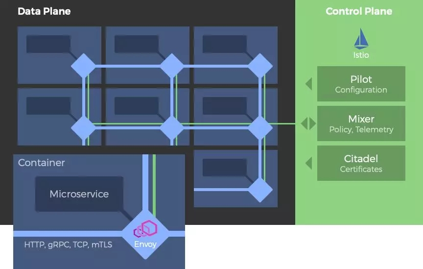
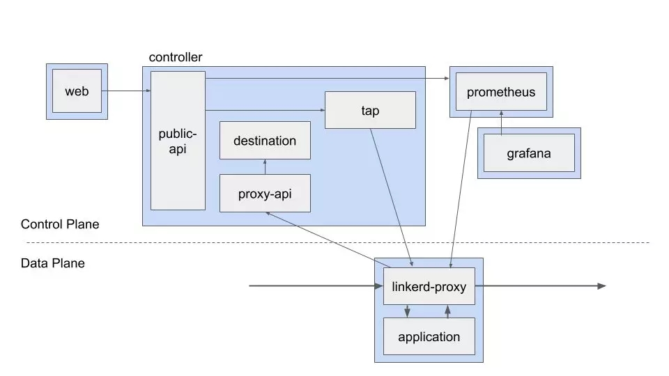
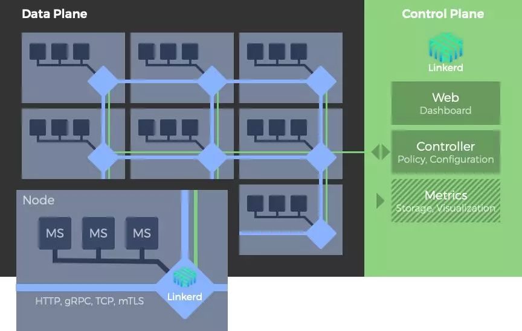

# [Service Mesh框架对比：Linkerd vs. Istio](http://p.primeton.com/articles/5c909ea94be8e631b80002f0)

2019年3月

> 作者：Marcus Schiesser
>
> 译者：白小白
>
> 原题：Comparing Service Meshes: Linkerd vs. Istio
>
> 原文：[http://t.cn/Ext9FpD](http://t.cn/Ext9FpD)

引言：

各个细分行业和领域的组织机构正在持续的加速采用微服务架构。随之而来的是容器的使用以及端点和服务通信的爆炸式增长。企业内部的复杂性和不确定性正在不断增加。如何在这样的情况下实现对规模化通信安全性和可见性的管理颇具挑战。因此，无论是运营者或者开发者都强烈渴望将网络层的复杂性封装为一个新的网络基础架构层。当此之时，处理此事的最流行的方式是服务网格（Service Mesh）。

因此，在本文中，我们将对比两种主流的服务网络的特性，以找出两者的异同之处，即Linkerd和Istio。文中也会提及有关服务网格使用的争论，探寻在某种特定的场景下，基于特定的用例和架构，何者比何者更具优势。

## 一、服务网格是什么

服务网格是一个专有的基础设施层，这一层级的存在可以使得微服务架构内部的服务间通信更加可靠、快捷和安全。其基本的理念是在服务间插入一个代理组成的网络来实现对网络层的抽象。一言以蔽之，服务网格的设计初衷就是帮助开发者解决微服务间的交互挑战。

## 二、Istio是什么

Istio是由Google、IBM和Lyft发起的开源的服务网格项目。该项目在2017年推出，并在2018年7月发布了1.0版本。Istio基于Envoy代理并以之为数据层（data plane）。可以说Istio是如今最炙手可热的服务网格，但由于仅应用于Kubernetes，其应用价值受到某种限制。

## 三、Linkerd是什么

Linkerd（音似chickadee），最初是由Buoyant团队于2016年打造的一个服务网格项目。Linkerd是CNCF的官方项目，基于Twitter的Finagle项目并和后者一样，最初是由Scala语言编写，设计理念是支持基于主机（物理主机或者虚拟节点）的部署模式。由于最初版本的内存占用广受诟病，导致了Conduit项目的开发，Conduit是一个轻量级的服务网格，为Kubernetes定制，用Rust和Go语言编写。Conduit项目目前已经合并到Linkerd项目，并在2018年7月发布为Linkerd 2.0 版本。鉴于Linkerd 2.x 基于Kubernetes，而Linkerd 1.x 可以基于节点的模式部署，当面临复杂环境的场景时，人们可以有更灵活的选择。除非特指，本文的比较都是基于Linkerd 2.x。

## 四、特性和功能对比

### 架构

Istio和Linkerd都支持以主流的外挂（Sidecar）模式部署。在这种模式下，每个微服务都被分配一个单独的代理。微服务间的通信并不直接进行，而是通过自身的代理转发。代理会将请求路由到目标微服务的代理，该代理再将请求转发到目标微服务。所有这些服务代理构成了数据层。在服务网格的架构下，数据层由控制层（control plane）来进行配置和监控，控制层一般另行独立部署。

架构图示意：以Istio为例。Envoy代理以外挂形式部署。在这样的部署模型中，代理将注入每个容器单元，因此可以独立的配置。Istio控制层由很多的组件组成，用来对服务间通信进行配置、度量、控制和安全管控。

### 控制层

控制层的使命是通过一系列API和工具对服务网格内的代理实现控制。在控制层中，可以将整个数据层作为一个整体来指定认证策略，收集度量指标，进行配置。

Istio的控制层由三个组件构成。首先是Pilot，负责配置数据层。其次是Mixer，负责收集通信流量的度量指标，并响应数据层各种不同的查询请求，包括授权、访问控制和配额查询等。基于所启用的适配器的不同，Mixer也可与日志和监控系统进行对接。最后是Citadel，这个组件允许开发者基于服务身份认证而非网络控制建立一个零信任（零信任，zero-trust，简单讲，即假定所有通信方不可信赖并必须进行验证）机制的网络环境。Citadel负责为每个服务指定证书，如果有需要，也可以接受外部的证书授权密钥。

### 白小白

Linkerd的控制层由一个Web组件、一个控制组件和一个度量组件组成。Web组件提供了基于Web的管理控制面板。控制组件由多个容器部署组成。完成了控制层的多数功能（包括聚合遥测数据，提供用户界面API，为数据层提供控制数据等）。度量组件由定制化的Prometheus和Grafana组成。Prometheus负责抓取Linkerd暴露的度量指标并储存下来。Linkerd本身会生成很多外部面板，Grafana负责渲染和展现这些面板。

### 数据层

在一个典型的服务网格环境中，服务的部署过程将纳入一个专有的外挂代理。如前文所述，服务并不直接向网络传递消息，而是由本身的代理来进行通信。这样的机制封装了服务间通信的复杂性。服务网格内的代理之间相互连接，构成了数据层。

默认情况下，Istio使用Envoy作为数据层，Envoy原本是设计用来与其他类型的代理（比如Nginx）来进行工作的。Linkerd使用自有的代理。

### 平台支持

尽管声称支持大量的环境和框架，但在实践中，Istio仅能与kubernetes相处融洽，这严重限制了他的应用范畴。

Linkerd 2.x目前也需要与Kubernetes协同工作。然而Linkerd 1.x 部署广泛，并处于活跃的研发状态，可以在多种环境和框架下工作，包括与AWS ECS、DC/OS和Docker协同工作。能够支持如此广泛的环境，得益于Linkerd 1.x 可以基于主机的部署模式，这使得其可以与用户的环境进行整合而无需以外挂的形式部署。

Linkerd 1.x 主机部署模式：linkerd服务网格可以基于主机部署。基于这样的模式，同一主机的多个微服务共享一个Linkerd（1.x）实例。

主机部署模式的主要缺点在于单点代理的失败将影响多个微服务。从另一方面讲，主机部署模式相对于外挂模式对资源的消耗更低。

### 协议支持

基于外挂代理，Istio和Linkerd 2.x 都支持HTTP 1.1, HTTP2, gRPC和TCP协议的服务间通信。但Linkerd 1.x 不支持TCP连接。

### 实现语言

Istio的控制层和Linkerd 2.x 都是用Go语言编写的，Istio数据层的Envoy代理是由C++编写的，Linkerd 2.x 的数据层是用Rust编写的。Linkerd 1.x 是用Scala编写的。

### 安全、加密和授权

Istio的控制层组件提供了如下的安全功能： Citadel：密钥和证书管理。 Pilot：认证策略和安全命名信息的分发。 Mixer：授权和审计的管理。 外挂：实现代理间基于TLS加密的安全通信。

本文成文时，Linkerd的自动化的TLS加密还处于实验阶段，主机间认证也还未获支持。

### 外挂注入

将外挂加入到部署包并且在服务网格的控制层进行注册的过程即为“外挂注入”。Istio和Linkerd都支持手动和自动的外挂注入。

### 高可用性

Istio支持高可性，当且仅当配置了Kubernetes的多副本模式，并且打开podAntiAffinity开关的情况下。

linkerd的高可用性目前仍处于实验阶段。

### 监控和跟踪

Istio原生支持Prometheus并且集成了Jaeger来进行分布式跟踪。Linkerd支持Prometheus和Grafana从外部进行监控，但目前并不支持分布式跟踪。

### 性能

Linkerd 2.x 在性能上的常规开销总体上比Istio要低一些。一项关于两者的性能测试表明，基于一组由HTTP请求组成的测试负载，每秒的千次查询数（kqps）基准值是30-35kqps，经由代理转发后，性能会有所下降，Linkderd降到了10-12kqps，而Istio则降到了3.2-3.9kqps。

## 五、什么时候应该谨慎使用服务网格

有五个主要的原因，可能阻止你考虑使用服务网格来管理微服务架构所带来的潜在的网络复杂性挑战。

### 1、服务网格具有排他性

服务网格是一个平台解决方案，因此是排他性的。这意味着你将被迫在“服从他们的方式”和“基于我自己的业务和技术考量选择适合的方式”之间做出选择。根据你所处的形势，对服务网格的前期投资可能十分昂贵。

而且，如果说控制应用和服务间通信对你的组织来说具有战略性的重要意义的话，那么使用一个现成的服务网格就没有意义了。这样或许可以受益于框架成长带来的收益 ，但无法对你的目标实现控制。

### 2、服务网格具有复杂性

服务网格的部署将向你的架构引入相当可观的复杂性。部署过程需要引入外挂代理，服务网格需要与现有的环境进行整合并在未来的时间里反复的配置，所有的加密可能需要重新设计。基于Kubernetes这样的平台建立服务网格的实例，会要求你不仅是服务网格的专家，并且是熟悉Kubernetes的专家。

### 3、服务网格可能运行缓慢

随着网格的扩张和路由表的膨胀，通过一系列代理进行的路由通信将慢的痛苦异常。

### 4、服务网格倾向于建立自治的架构蓝图

使用服务网格来追踪服务间的通信请求并不总是像最初那样看起来有价值。比如，假设你的微服务环境与其他团队的应用和服务相整合，在跨越不同的技术团队和业务单元的边界时，翻译不同的追踪记录将十分挑战，如果是企业级环境或者是云端供应商的情况下，这种挑战将更加严峻。

### 5、服务网格着眼于开发者层面的考量

服务网格着眼于典型的开发者视角的服务间通信问题。对于规模化且不确定的应用和服务而言，组件之间的交互会天然衍生一系列的复杂性，对这些新兴行为的管控，服务网格无能为力。
