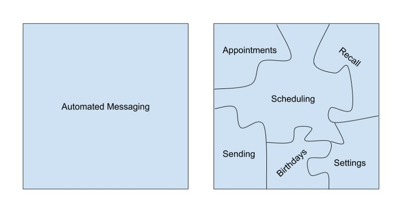
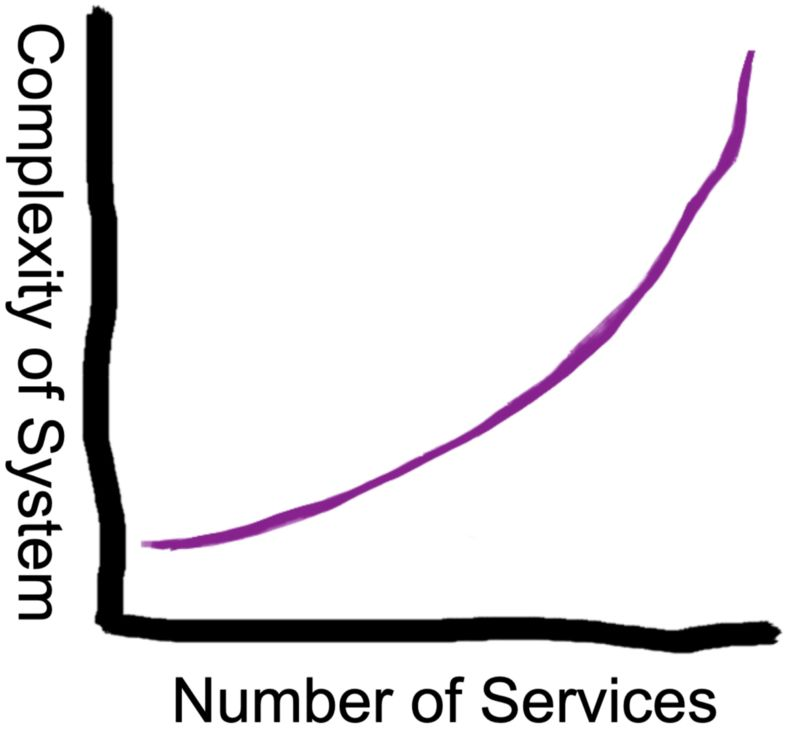
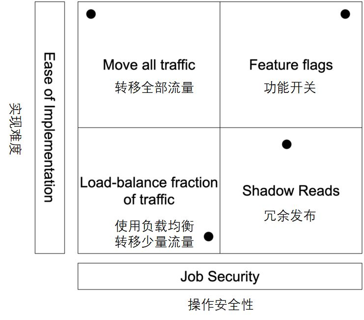

# [与单体式应用分手的7个正确姿势](http://p.primeton.com/articles/5ca2c4fe4be8e60c2d000cfb)

2019年4月

> 作者：Troy Leland
>
> 译者：白小白
>
> 原文：[http://t.cn/EJrGI9M](http://t.cn/EJrGI9M)
>
> 原题：Breaking up with a Monolith

## **第0课：什么时候提分手？**

微服务时下大红大紫。人们很容易迷失在决定使用“最先进的技术”这样的兴奋之中，把微服务这一行业“最佳”实践当作是本公司的正确选择，仅仅是因为有雪片一样的文章描绘了这一架构在Netflix这样的公司是如何的成功。

如果你既不想快速的扩张你的客户基础，也不想快速扩张你的工程团队。那么大刀阔斧的把系统拆分成更多的服务前，一定要三思而行，因为这也同时意味着系统复杂性的快速扩张。

话虽如此，把单体应用重构成微服务毕竟还是有很多的优点。还是强烈建议定期梳理系统中已知的服务以确保其满足企业业务发展的需要。

仅仅是因为你的企业使用了Kubernetes或者有许多的后端服务项目（可能每个项目在README.md文件中都有一段明确而简短的说明）并不意味着能够避免一些隐含的单体应用会给你的开发努力带来问题。今天看起来足够“微”的系统架构，明天可能就需要修修补补，因为业务是不断增长的，产品也会不断的变更。

到底什么时候该把单体应用切成微服务呢？

如果你的服务有如下的特征之一，那么可能需要重新架构你的系统了：

1. 没有明确的所有者；或者有多个团队对某个服务指手画脚；
2. 无数的外部依赖和向前依赖；
3. 不支持多实例运行（可能因为服务是有状态的）；
4. 某些特性很难测试；
5. 部署成功率听天由命（即使是小的变更也是如此）；

### Weave公司的分手实践

在2017年的某个时刻，我们大无畏的CTO Clint Berry，责成每个研发团队要确保其产品可以在2019年拥有4倍于当前客户基数的需要的伸缩能力，并且不能有服务中断。

我捋了捋我们所负责的项目，发现有一个关键服务很可能连2018年的增长需要都无法满足。

我所在的公司主要为小型的业务单位（如牙医）提供集成通信平台，其主要卖点之一就是自动消息发送（如预约提醒）。上面说到的那个关键服务就是用来规划和发送所有的自动化通信的，从预约通知短信到生日祝福邮件，涵盖了消息的方方面面。

表面上看，这个服务本来就不该是单体应用。比如，这个服务有一段简明的工作职责描述：“规划和发送自动化的消息”。但服务本身并不需要实际的发送任何消息或邮件，而是通过其他微服务来完成这个任务。

然而仔细观察的话，这个服务还是释放出很多的危险信号以致于不能简单的拆解成微服务。这个服务本身需要执行很多的批量处理任务，这就使其横向扩展方面受到制约。对这个服务的测试是困难和复杂的，即使是微小的变更也是如此。这个服务“知道的太多”，拥有大量的外部依赖。每次的部署都让我紧张兮兮，有时甚至需要在凌晨3点把某个兄弟叫起来，只是为了确认一切安好。

这个服务目前为止工作良好。但是现在不拆，我就需要在接下来的一年里提心吊胆。

## **第1课：迁移过程需要有专人负责**

从单体向微服务架构迁移的重要性和严重性，常常被项目团队成员所低估。需要有专人手持上方宝剑来为之奋斗，让公司优先考虑这一使命的达成而不是获得更多的客户案例，尽管后者可以更显而易见的驱动业务的推进。

只有良好的愿望是无法让单体应用自然而然的变成设计良好的微服务的。不要对这一点存有错误的奢望。

现实中，我们需要解决很多的小型的迁移过程。这些过程可能耗时数月，在某些案例中，甚至结结实实的花费了超过一年的时间，这一现状在今时今日仍旧在重演。制定规划，小步快走，方为上策。

立刻、马上完成迁移过程，并不需要成为每个人的头号优先级任务。但却需要有专人负责确保后续的迁移过程始终有人维护，平衡其他的工作任务，并将此做为一个优先任务。  

## **第2课：越简单越好**

### 部署、数据库和虚拟机置备

几年前，所有的Weave后端服务都基于虚拟机运行。创建一个微服务需要在开发端和运维端往来反复，去置备一个满足必要依赖条件的虚拟机。部署服务过程是有点痛苦的，回滚操作尤其如此。即使是这样，Weave还是积累了一堆服务。

理想情况下，向微服务架构迁移之前，开发者应该能够容易的为服务置备其计算资源，安全无误的部署服务，并且在某处安全的保存服务的多副本数据，然而，要达到这样的前提条件显然不大现实。

从Weave的实践看来，作为迁移的一部分，当需要创建一个微服务时，Kubernetes可以解决上述的大多数问题，让事情变得容易许多。

### 隔离、拆分、重构与重写

在告别单体式架构的同时，我们也面临着巨大的诱惑，毕竟这是一个把所有业务逻辑从零开始重写一遍的机会。

虽然有大量的个案证明，重写是一个正确的选择，但在引入了新的微服务，并且将所有的流量路由到新服务以前，我们仍然需要从整体上避免大的变更。迁移本身已经带来了太多的变化 ，不要承担不必要的复杂性。

迁移过程首先从单体应用中一些逻辑上相对独立的部分开始，并将这些部分转移为对应的微服务。这意味着在实际的迁移过程开始之前，做为准备工作，需要对单体架构做一些重构。

然后，我们对该部分的功能实现物理的隔离（通常也就是把原来的代码拷贝和粘贴了一下）。然后再慢慢向新的微服务导入用户流量。

一旦我们确认了新创建的服务可以正常工作，就可以灵活的根据需要对服务进行重构以及重写。在对业务逻辑做出重大的变更之前，我们会一直等待直到对迁移过程的平滑运行达到满意，否则的话，迁移过程实际上远未完成。

### 跟踪

随着服务的数量越来越多，调试的难度也越来越大。一个请求可能依赖一堆的服务给出响应。精准的定位失败，找到哪一个服务发生了问题，变得困难无比。

使用类似Jaeger这样的工具来进行请求的跟踪可以极大的改善对微服务的分析和测试。我们可以从整体上而不仅仅是在本地的上下文中观察服务请求.Jaeger是我们用过的最棒的工具之一，传统的日志工具相形见绌。

如果不能进行某种方式的跟踪，以处理分布式系统的复杂性，我宁愿不和微服务架构打交道。因为我了解跟踪的价值。  

## **第3课：了解成功的标志**

从单体架构向微服务架构的迁移可能看起来简单，但前行的路上充满荆棘。

不妨这样设想一下：你希望目前的开发者对此前的开发者留下的工作进行一个全新的架构设计。这将需要对公司数年前的系统拥有一定的知识储备。

确实有一些迁移过程就像把代码拷来拷去一样简单，但多数情况下都会发生意外。鉴于这些不确定性的存在，了解以下两点尤为重要：即何时迁移过程是成功的需要向前推进，而何时是失败的需要退回到原来的位置。

这就意味着，在建立干净和崭新的微服务代码库之前很早的时间，就需要针对给定的单体架构开展微服务架构的迁移工作。

### 测试和测试计划

鉴于我们已经确定不会进行任何大的重构工作，这使得我们有能力把所有的单元测试移植到新创建的微服务中，并且有把握不会出什么大的纰漏。当然，在此过程中，所有的测试也需要保持原状。单元测试对于安全的部署来说是个好东西，如果特定的代码段未经测试，我们会在迁移前把他们写到单体架构中。

集成测试与实现依赖度不高，会更多的对重构后的系统进行行为验证，这样的处理方式更为合理。遗憾的是集成测试就像独角兽一样虚无缥缈，无法实现。

在向微服务迁移代码的过程中，如果没有自动化的集成测试，我们将不得不求助于手工测试。尽管令人遗憾并且困难重重，但不失为通往成功的路径之一。

### 度量

Prometheus 和 Graphite 也是成功之路上的关键工具，可以让我们有能力收集度量指标。在向新服务导入用户流量的过程中，我们依赖这些指标来表征没有发生任何重要的意外的变更。正如单元测试可以确认某个特定功能运行的实际结果符合预期一样，度量指标可以对整个系统完成这个工作。

为了让度量行之有效，我们需要做两个工作：一是将度量工作排在第一优先级，二是确保新的度量指标相对于现有的指标从可用性的角度具有可比性。注意，从这个意义上讲，建立具有可比性的指标要比建立正确的指标更加重要。

尽管度量是一个事后指标，仅在某些问题已经出现之后才显现，在我们向越来越多的客户引入变更的过程中，度量指标仍旧使我们受益良多。

## **第4课：****承担适当的风险，随时准备回退**

即使变更微小而明确，代码覆盖率也很棒，部署这一过程仍旧存在内在的风险。

将单体应用重构为微服务架构的风险在于，大量的变化在同一时间发生，而发生变化的代码往往是当下的开发者所无法充分理解的遗留代码。

好在直到你已经做好准备向新的微服务导入流量之前，完全可以从大体上让原有的单体应用保持原样不动并继续运行。在此过程中，不断的把单体应用中的一部分拆分出来成为新的服务。

最后，在编写、测试以及部署了新的微服务之后，你将迎来宿命的冒险：向新服务导入真实的用户流量。

你需要综合评估所能承受的风险以及每种推进策略实现的可行性，来决定最好的推进策略。

对相关策略的评估需要考虑回退过程是否会出现问题。如前所述，知道什么时候成功十分重要，与此同等重要的是当意识到失败的时候有能力回退到原来的状态。当论及单体架构的迁移工作时，如果你的团队成员建议“破釜沉舟，不留后路”的话，我建议你找到一条风险更低的路径。

在努力重构自动消息发送这一单体应用的过程中，我们的团队以这样或那样的形态评估了如下所有的策略。  

### 转移全部流量

对于我们所遇到的特定的问题来说，将所有的流量导入到新的微服务是很容易的，但随之而来的是大量的风险。一旦系统出现问题，错误的预约提醒将会以短信的形式永久记录在案，让我们的错误无所遁形。（举个例子吧，如果成千上万的预约提醒在凌晨4:30发给用户的话，显然不大理想，好在这样的事情从未发生😬 🤦‍♂️）

而处理一个简单的CRUD应用，只需要在某个晚上部署上线一段时间，看是否能正常工作即可。此时的回退策略也很简单，如果应用不能正常工作，就把流量切回单体应用即可。

### 通过负载均衡转移少量流量

这种方式可能有效，但同时也带来两个问题。首先，我们并不真的需要一个单独的框架来完成服务间的负载均衡。我们使用gRPC通信，再弄一个负载均衡有点画蛇添足。此外，我们需要对哪些请求调用了新的服务施加更多的控制，以便可以跟踪到每个客户的执行结果，而不是对请求过程随机处理听天由命。

### 功能开关

功能开关（Feature Flags）在我们的团队用得很好，因为我们已经有了一个现成的框架进入到了Beta测试阶段。我们可以对使用新服务的特定用户开放某个特定功能，这让我们有把握将功能安全的开放给更多的用户，同时又可以在出问题时很容易的回滚操作。

### 冗余发布

我们所考虑采用的最后一个策略是实现冗余发布（Shadow Reads）。这一策略的理念是同时使用实际验证可靠的单体应用和重构后的微服务来响应同一个请求，对比两者的执行结果来验证新的服务可以正常工作。如果出现了意外情况，就把错误记录下来，并以单体应用的执行结果为准。

以这样的方式，回滚策略和代码高度融合。我们可以一次性的对整个客户群体进行测试（相对于功能开关的缓慢回滚显然效率更高）。不足之处是实现这项工作需要花费更多的精力，同时也隐含更多的风险。

一段时间里，这样的策略对我们很有效，但后来我们转而使用功能开关来实现更多的控制。

## 第5课：避免矫枉过正

前面说过，Weave曾经在虚拟机上发布服务，但转向Kubernetes让事情变得更容易。事实上，因为发布一个新的服务是如此的容易，以至于Weave的开发团队心血来潮就会发布一个，这也是为什么现在我们需要对数百个服务进行监控和维护的原因。看来有时太容易也不是件好事。

但大体上我还是认可Weave处理微服务架构的方式，从单体应用向微服务的迁移总是存在着矫枉过正的风险，人们会开发比谨慎评估所需更多的微服务。

我想这是Weave必须上的一课，我们也会静观事态的进展。然而，将如下的建议谨记于心可能仍旧重要：把单体应用拆分成几个更小、定义更合理的单体应用，而不是几十个过于细小的微服务，相对你的企业来说可能是更好的选择。

## 第6课：清理自己代码

最后一课十分重要：只要代码清理工作没完成，迁移工作就没结束。

如前文所述，我们的团队对于自动化消息发送服务的迁移工作耗时数月。因此，随着微服务数量的增长，原有的单体应用的代码库本应急遽缩水。

糟糕的是，道理都懂，但我并不总是勤于清理自己的代码，这带来了很多不确定性。其他的团队成员甚至我自己有时候都很难调试一段代码，原因很可能是同样的或者类似的代码段同时在两个地方同时并存着。

这样的情况实际发生过。当时一个团队的新人花了数天的时间来修复一段已经瘫痪了一个月的代码。我得坦白，正是由于我没有经常性的巡视代码并删除旧的代码片断才引发了这样的困扰。
