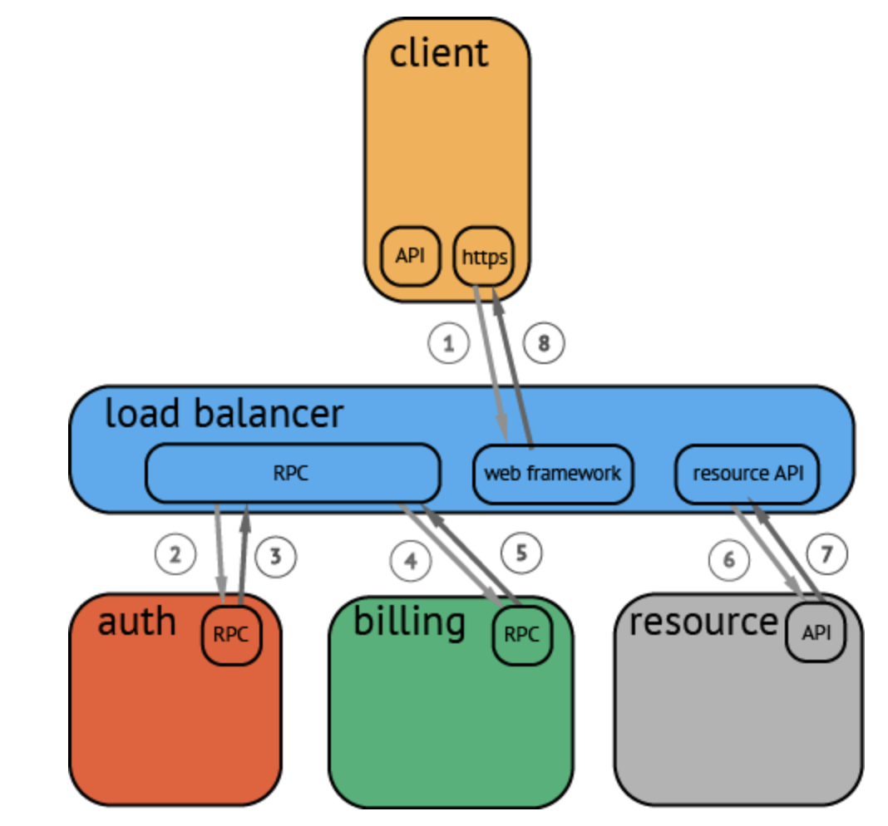
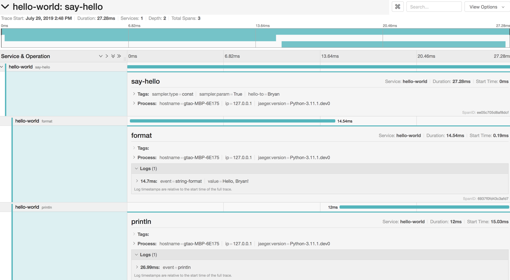
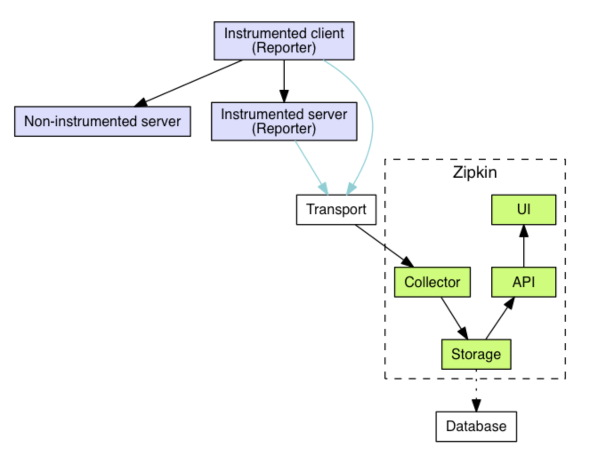
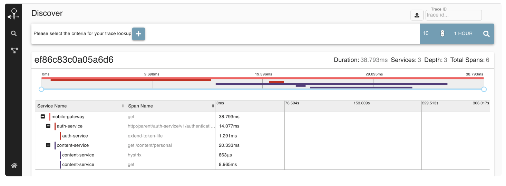

# [微服务监控之分布式追踪](http://p.primeton.com/articles/5d4a94e84be8e6606500022e)

2019年8月

> 如何有效的对微服务架构进行有效的监控成为微服务架构运维成功的关键。

现在越来越多的应用迁移到基于微服务的云原生的架构之上，微服务架构很强大，但是同时也带来了很多的挑战，尤其是如何对应用进行调试，如何监控多个服务间的调用关系和状态。如何有效的对微服务架构进行有效的监控成为微服务架构运维成功的关键。用软件架构的语言来说就是要增强微服务架构的可观测性（Observability）。



微服务的监控主要包含一下三个方面：

- 通过收集日志，对系统和各个服务的运行状态进行监控
- 通过收集量度（Metrics），对系统和各个服务的性能进行监控
- 通过分布式追踪，追踪服务请求是如何在各个分布的组件中进行处理的细节

对于是日志和量度的收集和监控，大家会比较熟悉。常见的日志收集架构包含利用Fluentd对系统日志进行收集，然后利用ELK或者Splunk进行日志分析。而对于性能监控，Prometheus是常见的流行的选择。

分布式追踪正在被越来越多的应用所采用。分布式追踪可以通过对微服务调用链的跟踪，构建一个从服务请求开始到各个微服务交互的全部调用过程的视图。用户可以从中了解到诸如应用调用的时延，网络调用（HTTP，RPC）的生命周期，系统的性能瓶颈等等信息。那么分布式追踪是如何实现的呢？

## 1.分布式追踪的概念

谷歌在2010年4月发表了一篇论文[《Dapper, a Large-Scale Distributed Systems Tracing Infrastructure》](http://1t.click/6EB)，介绍了分布式追踪的概念。


对于分布式追踪，主要有以下的几个概念：

- 追踪 Trace：就是由分布的微服务协作所支撑的一个事务。一个追踪，包含为该事务提供服务的各个服务请求。
- 跨度 Span：Span是事务中的一个工作流，一个Span包含了时间戳，日志和标签信息。Span之间包含父子关系，或者主从（Followup）关系。
- 跨度上下文 Span Context：跨度上下文是支撑分布式追踪的关键，它可以在调用的服务之间传递，上下文的内容包括诸如：从一个服务传递到另一个服务的时间，追踪的ID，Span的ID还有其它需要从上游服务传递到下游服务的信息。

## 2.OpenTracing 标准概念

基于谷歌提出的概念[OpenTracing](http://1t.click/6tC)定义了一个开放的分布式追踪的标准。

Span是分布式追踪的基本组成单元，表示一个分布式系统中的单独的工作单元。每一个Span可以包含其它Span的引用。多个Span在一起构成了Trace。


OpenTracing的规范定义每一个Span都包含了以下内容：

- 操作名（Operation Name），标志该操作是什么
- 标签 （Tag），标签是一个名值对，用户可以加入任何对追踪有意义的信息
- 日志（Logs），日志也定义为名值对。用于捕获调试信息，或者相关Span的相关信息
- 跨度上下文 （SpanContext），SpanContext负责子微服务系统边界传递数据。它主要包含两部分：
和实现无关的状态信息，例如Trace ID，Span ID
- 行李项 （Baggage Item）。如果把微服务调用比做从一个城市到另一个城市的飞行, 那么SpanContext就可以看成是飞机运载的内容。Trace ID和Span ID就像是航班号，而行李项就像是运送的行李。每次服务调用，用户都可以决定发送不同的行李。

这里是一个Span的例子：

```yaml
t=0            operation name: db_query               t=x

     +-----------------------------------------------------+
     | · · · · · · · · · ·    Span     · · · · · · · · · · |
     +-----------------------------------------------------+

Tags:
- db.instance:"jdbc:mysql://127.0.0.1:3306/customers
- db.statement: "SELECT * FROM mytable WHERE foo='bar';"

Logs:
- message:"Can't connect to mysql server on '127.0.0.1'(10061)"

SpanContext:
- trace_id:"abc123"
- span_id:"xyz789"
- Baggage Items:
  - special_id:"vsid1738"
```

要实现分布式追踪，如何传递SpanContext是关键。OpenTracing定义了两个方法Inject和Extract用于SpanContext的注入和提取。


Inject 伪代码

```bash
span_context = ...
outbound_request = ...

# We'll use the (builtin) HTTP_HEADERS carrier format. We
# start by using an empty map as the carrier prior to the
# call to `tracer.inject`.
carrier = {}
tracer.inject(span_context, opentracing.Format.HTTP_HEADERS, carrier)

# `carrier` now contains (opaque) key:value pairs which we pass
# along over whatever wire protocol we already use.
for key, value in carrier:
    outbound_request.headers[key] = escape(value)
```

这里的注入的过程就是把context的所有信息写入到一个叫Carrier的字典中，然后把字典中的所有名值对写入 HTTP Header。

Extract 伪代码

```bash
inbound_request = ...

# We'll again use the (builtin) HTTP_HEADERS carrier format. Per the
# HTTP_HEADERS documentation, we can use a map that has extraneous data
# in it and let the OpenTracing implementation look for the subset
# of key:value pairs it needs.
#
# As such, we directly use the key:value `inbound_request.headers`
# map as the carrier.
carrier = inbound_request.headers
span_context = tracer.extract(opentracing.Format.HTTP_HEADERS, carrier)
# Continue the trace given span_context. E.g.,
span = tracer.start_span("...", child_of=span_context)

# (If `carrier` held trace data, `span` will now be ready to use.)
```

抽取过程是注入的逆过程，从carrier，也就是HTTP Headers，构建SpanContext。

整个过程类似客户端和服务器传递数据的序列化和反序列化的过程。这里的Carrier字典支持Key为string类型，value为string或者Binary格式（Bytes）。

## 3.怎么用

好了讲了一大堆的概念，作为程序猿的你早已经不耐烦了，不要讲那些有的没的，快上代码。不急我们这就看看具体如何使用Tracing。

我们用一个程序猿喜闻乐见的打印‘hello world’的Python应用来说明OpenTracing是如何工作的。
客户端代码

```py
import requests
import sys
import time
from lib.tracing import init_tracer
from opentracing.ext import tags
from opentracing.propagation import Format


def say_hello(hello_to):
    with tracer.start_active_span('say-hello') as scope:
        scope.span.set_tag('hello-to', hello_to)
        hello_str = format_string(hello_to)
        print_hello(hello_str)

def format_string(hello_to):
    with tracer.start_active_span('format') as scope:
        hello_str = http_get(8081, 'format', 'helloTo', hello_to)
        scope.span.log_kv({'event': 'string-format', 'value': hello_str})
        return hello_str

def print_hello(hello_str):
    with tracer.start_active_span('println') as scope:
        http_get(8082, 'publish', 'helloStr', hello_str)
        scope.span.log_kv({'event': 'println'})

def http_get(port, path, param, value):
    url = 'http://localhost:%s/%s' % (port, path)

    span = tracer.active_span
    span.set_tag(tags.HTTP_METHOD, 'GET')
    span.set_tag(tags.HTTP_URL, url)
    span.set_tag(tags.SPAN_KIND, tags.SPAN_KIND_RPC_CLIENT)
    headers = {}
    tracer.inject(span, Format.HTTP_HEADERS, headers)

    r = requests.get(url, params={param: value}, headers=headers)
    assert r.status_code == 200
    return r.text


# main
assert len(sys.argv) == 2

tracer = init_tracer('hello-world')

hello_to = sys.argv[1]
say_hello(hello_to)

# yield to IOLoop to flush the spans
time.sleep(2)
tracer.close()
```

客户端完成了以下的工作：

- 初始化Tracer，trace的名字是‘hello-world’
- 创建一个客户端操作say_hello，该操作关联一个Span，取名‘say-hello’，并调用span.set_tag加入标签
- 在操作say_hello中调用第一个HTTP 服务A，format_string， 该操作关联另一个Span取名‘format’，并调用span.log_kv加入日志
- 之后调用另一个HTTP 服务B，print_hello， 该操作关联另一个Span取名‘println’，并调用span.log_kv加入日志
- 对于每一个HTTP请求，在Span中都加入标签，标志http method，http url和span kind。并调用tracer.inject把SpanContext注入到http header 中。

服务A代码

```py
from flask import Flask
from flask import request
from lib.tracing import init_tracer
from opentracing.ext import tags
from opentracing.propagation import Format

app = Flask(__name__)
tracer = init_tracer('formatter')

@app.route("/format")
def format():
    span_ctx = tracer.extract(Format.HTTP_HEADERS, request.headers)
    span_tags = {tags.SPAN_KIND: tags.SPAN_KIND_RPC_SERVER}
    with tracer.start_active_span('format', child_of=span_ctx, tags=span_tags):
        hello_to = request.args.get('helloTo')
        return 'Hello, %s!' % hello_to

if __name__ == "__main__":
    app.run(port=8081)
```

服务A响应format请求，调用tracer.extract从http headers中提取信息，构建spanContext。

服务B代码

```py
from flask import Flask
from flask import request
from lib.tracing import init_tracer
from opentracing.ext import tags
from opentracing.propagation import Format

app = Flask(__name__)
tracer = init_tracer('publisher')

@app.route("/publish")
def publish():
    span_ctx = tracer.extract(Format.HTTP_HEADERS, request.headers)
    span_tags = {tags.SPAN_KIND: tags.SPAN_KIND_RPC_SERVER}
    with tracer.start_active_span('publish', child_of=span_ctx, tags=span_tags):
        hello_str = request.args.get('helloStr')
        print(hello_str)
        return 'published'

if __name__ == "__main__":
    app.run(port=8082)
```

服务B和A类似。

之后在支持分布式追踪的软件UI上（下图是Jaeger UI），就可以看到类似下图的追踪信息。我们可以看到服务hello-word和三个操作say-hello/format/println的详细追踪信息。



当前有很多分布式追踪软件都提供了OpenTracing的支持，包括：Jaeger，LightStep，Instanna，Apache SkyWalking，inspectIT，stagemonitor，Datadog，Wavefront，Elastic APM等等。其中作为开源软件的[Zipkin](http://1t.click/6Ec)和[Jaeger](http://1t.click/6DY)最为流行。

### Zipkin

[Zipkin](http://1t.click/6Ec)是Twitter基于Dapper开发的分布式追踪系统。它的设计架构如下图：



蓝色实体是Zipkin要追踪的目标组件，Non-Intrumented Server表示不直接调用Tracing API的微服务。通过Intrumented Client从Non-Intrumented Server中收集信息并发送给Zipkin的收集器Collector。Intrumented Server 直接调用Tracing API，发送数据到Zipkin的收集器。

Transport是传输通道，可以通过HTTP直接发送到Zipkin或者通过消息/事件队列的方式。

Zipkin本身是一个Java应用，包含了：收集器Collector负责数据采集，对外提供数据接口；存储；API和UI。

Zipkin的用户界面像这个样子：




Zipkin官方支持以下几种语言的客户端：C#，Go，Java，JavaScript，Ruby，Scala，PHP。开源社区也有其它语言的支持。

Zipkin发展到现在有快4年的时间，是一个相对成熟的项目。

### Jaeger

[Jaeger](http://1t.click/6DY)最早是由Uber开发的分布式追踪系统，同样基于Dapper的设计理念。现在Jaeger是CNCF（Cloud Native Computing Foundation）的一个项目。如果你对CNCF这个组织有所了解，那么你可以推测出这个项目应该和Kubernetes有非常紧密的集成。

Jaeger基于分布式的架构设计，主要包含以下几个组件：

- Jaeger Client，负责在客户端收集跟踪信息。
- Jaeger Agent，负责和客户端通信，把收集到的追踪信息上报个收集器 Jaeger Collector
- Jaeger Colletor把收集到的数据存入数据库或者其它存储器
- Jaeger Query 负责对追踪数据进行查询
- Jaeger UI负责用户交互

这个架构很像ELK，Collector之前类似Logstash负责采集数据，Query类似Elastic负责搜索，而UI类似Kibana负责用户界面和交互。这样的分布式架构使得Jaeger的扩展性更好，可以根据需要，构建不同的部署。

Jaeger作为分布式追踪的后起之秀，随着云原生和K8s的广泛采用，正变得越来越流行。利用官方给出的[K8s部署模版](http://1t.click/6DU)，用户可以快速的在自己的k8s集群上部署Jaeger。

## 4.分布式跟踪系统——产品对比

当然除了支持OpenTracing标准的产品之外，还有其它的一些分布式追踪产品。这里引用一些其它博主的分析，给大家一些参考：

- [调用链选型之Zipkin，Pinpoint，SkyWalking，CAT](http://1t.click/6tY)
- [分布式调用链调研（pinpoint,skywalking,jaeger,zipkin等对比](http://1t.click/6DK)
- [分布式跟踪系统——产品对比](http://1t.click/6ug)

## 5.总结

在微服务大行其道，云原生成为架构设计的主流的情况下，微服务系统监控，包含日志，指标和追踪成为了系统工程的重中之重。OpenTracing基于Dapper的分布式追踪设计理念，定义了分布式追踪的实现标准。在开源项目中，Zipkin和Jaeger是相对优秀的选择。尤其是Jaeger，由于对云原生框架的良好集成，是构建微服务追踪系统的必备良器。

参考资料

- [http://1t.click/6tC](http://1t.click/6tC)
- [http://1t.click/6t7](http://1t.click/6t7)
- [http://1t.click/6tD](http://1t.click/6tD)
- [http://1t.click/6tK](http://1t.click/6tK)
- [http://1t.click/6tP](http://1t.click/6tP)
- [http://1t.click/6tS](http://1t.click/6tS)
- [https://dwz.cn/vBqhTHL1](https://dwz.cn/vBqhTHL1)

关于作者：陶刚，Splunk资深软件工程师，架构师，毕业于北京邮电大学，现在在温哥华负责Splunk机器学习云平台的开发，曾经就职于SAP，EMC，Lucent等企业，拥有丰富的企业应用软件开发经验，熟悉软件开发的各种技术，平台和开发过程，在商务智能，机器学习，数据可视化，数据采集，网络管理等领域都有涉及。
