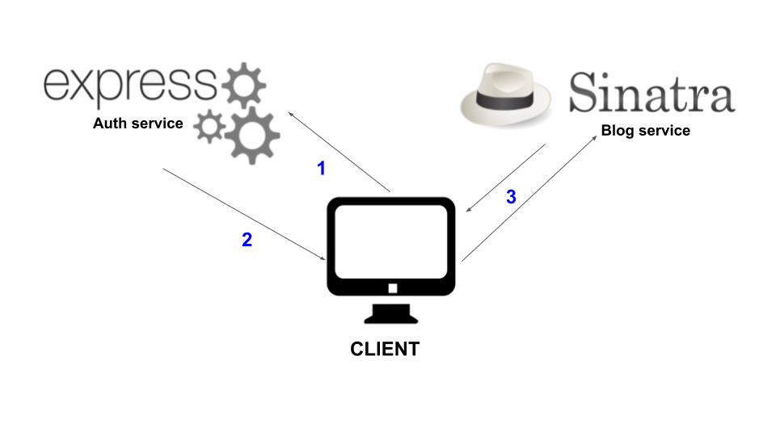
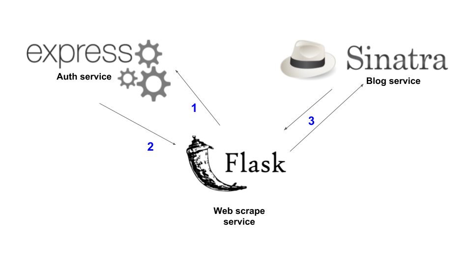

# [基于JWT规范实现的认证微服务](http://p.primeton.com/articles/5c7cf10a4be8e67a430015ff)

2019年3月

> 作者：Marcelo Fonseca
>
> 译者：白小白
>
> 原题：Building an authentication micro-service with JWT standard
>
> 原文：[http://t.cn/EI67VmL](http://t.cn/EI67VmL)

*在微服务架构下，我们需要管理很多的后端服务，需要对更多的应用路由提供保护。本文基于JSON Web Tokens（JWT）标准实现了一个简单的认证和授权服务。*

目录：

一、微服务介绍

二、随之而来的认证和授权问题

三、项目架构通信

四、用于签名以及验证的公钥和私钥令牌

五、项目数据库同步问题

## 一、微服务介绍

微服务日渐流行，几乎所有流行语言都提供了两种框架实现，一是面向Web开发的大型框架，一是面向小型应用的微框架。轻量级框架作为微服务架构来说，是个好的选择。微服务架构有很多优势，诸如高可维护性，独立部署等等。微服务架构让我们可以针对特定语言选择最优的解决方案来建立特定的服务，比如，针对爬虫类应用或者AI场景，我们可以选择建立一个Python服务；针对加密库的场景建立JS服务；针对Active Record的场景建立Ruby服务等等。基于这样的理念，我们不需要受限于使用单一语言来建立整个后端服务。

## 二、随之而来的认证和授权问题

在微服务架构下，前后端的认证逻辑相比常规的CS应用要复杂的多。客户端与后端的API服务器并不是一对一的关系，我们需要管理很多的后端服务，需要对更多的应用路由提供保护。为了解决这一问题，人们实践了很多方式来建立微服务架构下的认证和授权逻辑。本文展示了其中一种方案，基于JSON Web Tokens（JWT）标准来实现一个简单的认证和授权服务。

## 三、项目架构通信

简化起见，示例中只实现了两个后端服务。我将建立一个用于认证和授权的expressJS应用，以及一个Sinatra应用来作为博客服务的后端。目前为止，在本例 中将有两个后端以及一个前端。

下面介绍一下应用间通信的实现机制。

### 前后端通信机制



*ExpressJS实现了前端应用的用户注册和登陆。*

*如果认证成功，ExpressJS应用将返回一个JWT令牌。*

*前端将这一令牌附加在请求的消息头中用以访问Sinatra应用数据。*

### 服务间通信机制

当我们需要实现后端之间的通信时，就需要利用这样的机制。作为示例场景，假设还有一个Flask API后端用于爬取网络上的内容，并更新Sinatra博客应用中的数据。这样我们就一共有了三个后端和一个前端。



*Flask应用向ExpressJS应用请求JWT令牌。*

*请求成功后，ExpressJS应用返回令牌。*

*Flask应用将令牌附加在请求的消息头，并访问Sinatra应用的后端路由。*

此处需要注意两件事。无论是用户发出请求或者后端发出请求，都需要合法的身份来进行认证以及访问其他后端。但作为后端服务来讲是不会使用邮件和密码的，而是以API秘钥作为身份的证明代之。比如，Flask应用向ExpressJS应用的路由发送一个登陆秘钥，只要秘钥是正确的，就可以授权Flask服务获得JWT令牌。

## 四、用于签名以及验证的公钥和私钥令牌

在这套架构下，所有的微服务应用将使用其自身的JWT库来对访问请求进行认证并保护其API路由。此处我们将使用JWT RSA256策略。认证服务ExpressJS将同时持有私钥和公钥。使用私钥来对用户或应用的令牌进行签名，用公钥对令牌进行解码和验证。其他服务将仅持有公钥来进行验证。

使用RSA算法需要生成一个公钥/私钥对。可以通过如下的代码在终端中实现，作为执行结果，代码将生成.pem文件：

```bash
openssl genrsa -des3 -out private.pem 2048
openssl rsa -in private.pem -outform PEM -pubout -out public.pem
```

### 签名令牌

在用户或者API的登陆路由中实现令牌签名。下面的代码示例了ExpressJS认证服务的用户登陆路由。只要用户身份是合法的，代码将访问私钥rsa2048priv.pem并且签名一个新的JWT令牌。

```js
// User sign-in route with JWT RSA algorithm example
var User = require('../models/user') var express = require('express');
var router = express.Router();
const mongoose = require('mongoose');
const bcrypt = require('bcrypt');
const jwt = require('jsonwebtoken');
const fs = require('fs');
router.route('/sign-in').post(function(req, res, next) {
    User.find({
        email: req.body.email
    }).then(user = >{
        if (user.length < 1) return res.status(400).json({
            message: 'Authentication failed.'
        });

        bcrypt.compare(req.body.password, user[0].passwordHash, (err, success) = >{
            if (success) {
                let cert = fs.readFileSync('../rsa_2048_priv.pem');
                const token = jwt.sign({
                    email: user[0].email,
                    //id: user[0]._id,
                },
                cert, {
                    expiresIn: '1h',
                    algorithm: 'RS256',
                    issuer: user[0].role,
                });
                res.status(200).json({
                    token: token,
                    message: 'Successfully authenticated.'
                });

            } else return res.status(400).json({
                message: 'Authentication failed.'
            });
        });
    });
});
```

### 验证令牌

所有的服务都需要对持有合法JWT令牌的进站请求进行验证。这可以通过在应用中建立一个中间件来实现。这一中间件将访问公钥pem文件来对令牌进行解码和验证。在ExpressJS或者Sinatra服务中，这样的中间件代码类似如下所示。

ExpressJS认证和授权中间件代码：

```js
// JWT authentication middleware example.
// Uses RS256 strategy with .pem key pair files.
const fs = require('fs');
const jwt = require('jsonwebtoken');
module.exports = (req, res, next) = >{
    let publicKey = fs.readFileSync('../rsa_2048_pub.pem');
    try {
        const token = req.headers.authorization.split(' ')[1]; //req.headers.token;
        console.log(token);
        var decoded = jwt.verify(token, publicKey) console.log(decoded);

        next();
    } catch(err) {
        return res.status(401).json({
            error: err,
            message: 'Invalid token.'
        });
    }
};
```

## 五、项目数据库同步问题

将博客服务和认证服务分离，将引发同步问题。原因之一是，两者都需要各自保存用户信息。ExpressJS需要用到用户的身份信息，而Sinatra需要用到其他的用户信息（比如头像，个人描述以及发帖、评论数据之间的关联关系等），对于这个问题可以有多种解决方案：

- 方案一：在认证服务的用户表中保存全部用户信息。在博客服务的用户表中将仅保存用户的ExpressJS服务ID（即user_id）以用来在认证服务中索引和查询用户数据。

- 方案二：在博客服务中不设用户表。所有涉及到用户数据的博客数据库表都将保存ExpressJS用户ID作为索引。

- 方案三：在认证服务中仅保存身份信息（如邮件地址和密码），其余的信息保存在博客服务中。当需要在博客服务中引用认证服务的用户数据时，以用户ID或者邮件地址作为唯一索引来关联，当使用邮件地址时，需要在博客服务中同时保存用户的邮件地址。

可以按自己的实际情况从上述的方案中做出选择。我会选择第三个方案，让每个服务仅保存自己所需要的合理的数据。这样，只需要少量的代码修改，我就可以在未来的项目中复用这一认证服务，以期在Sinatra应用中充分利用Ruby的Active Record机制来进行用户关系建模和查询。要谨慎的时刻保持应用间的用户数据同步，比如，如果在ExpressJS应用中删除或者新建了一条用户信息，确保这一变更同步到Sinatra应用。
