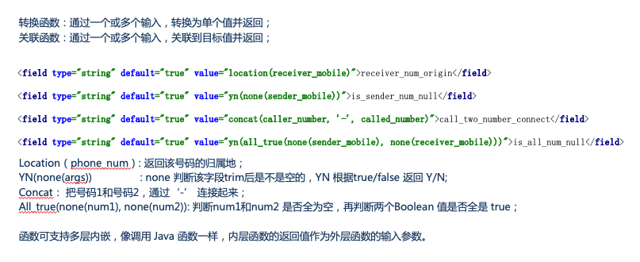

# [基于XML描述的可编程函数式ETL实现](http://p.primeton.com/articles/5d19c6284be8e64e660006d0)

2019年7月

> 有效的提高了数据处理效率、降低了数据处理开发难度

引言：

传统 ETL 主要以 SQL 为主要技术手段，把数据经抽取、清洗转换之后加载到数据仓库。但是在如今移动互联网大力发展的场景下，产生大量碎片化和不规则的数据。政府，公安等行业，传统数据库已经远远无法满足需求。数据原始文件通过文件导入到基础库，再通过大数据 HQL等技术手段提取出二级库，这中间的数据导入和 SQL ETL 的提取的过程，大量消耗 IO 性能和计算资源，在很多场景下已经是数据处理的瓶颈所在。

普元在实施公安项目过程中开发了一种基于 XML 描述的可编程的函数 ETL 转换方法。主要用于大数据文件处理领域，能从原始数据文件直接、快速加载到专题库的技术手段。技术方案主要解决了用 XML 的技术手段描述数据文件的格式，包含文件字段切分、字段类型、默认值、异常值校验、时间格式校验。在处理时可添加自行开发的 JAVA UDF 函数，函数实参支持变量、常量、表达式、函数和运算符重载。同时函数支持多层嵌套，即内部函数的返回值最为外部函数的实参。该方案实现了 XML 内函数体的语法解析并在运行过程中直接编译为 Java 字节码的技术。有效的解决了政府、公安、电信行业巨量的数据处理需要的大量计算资源和 IO 性能瓶颈，有效的提高了数据处理效率和降低了数据处理开发难度。

目录：

一、基于 XML 控制文件解析数据文件方案介绍

二、XML 控制文件结构和语法

三、函数和多层嵌套函数传参

四、UDF 函数编写方法

五、数据测试工具

六、FlumeOnYarn 架构和分布式部署

## 一、基于 XML 控制文件解析数据文件方案介绍

对于数据开发项目，我们常常会面临众多的数据对接,部分场景不仅数据量大，且数据种类多，数据解析开发工作量巨大。对于大量数据对接，一般设计的 RPC 接口和 WebService 一般都达不到数据性能要求的。并且他们都是点对点的服务，一旦上下游系统故障，都会造成整个数据对接异常。因此大部分都会选择使用文件的方式进行数据对接。


对于非实时数据对接需求，这种方式的优点：

- 在数据量大的情况下，可以通过文件传输，上游只写入，无需关心数据业务和故障；
- 方案简单，避免了网络协议相关的概念；
- 维护简单，只需保证磁盘写入稳定性即可；

我们常常会面临基于此架构的数据对接。但基于此架构数据处理工作都在下游（即数据使用方）。

面对大量数据对接和众多的数据类型，我们对于每种数据文件解析、解码、清洗消耗大量的人力，并且基于编码的方式对于较多数据类型的场景代码量大，且难以管理。因此经过多次数据开发实践，我们开发了一种基于 XML 描述的方式来解析和清洗数据文件的实现。

本架构实现适合以下几个方面：

- 基于文件的数据对接；
- 文件无法直接导入到目标数据库，需要做转换，清洗为目标格式；

如上数据对接架构图，Flume 基本实现了基于文件系统的自动扫描和读取，因此架构实现了基于 Flume Sink 的模块。本架构也可作为SDK 作为框架集成到现有数据处理方案中。

## 二、XML数据控制文件结构和语法

```xml
<?xml version="1.0" encoding="UTF-8"?>
<schema>
<key>JD_TYPE_V1</key>
<type>textfile</type>
<delimiter>,</delimiter>
<fields>
<field type="int">exp_flag</field>
    <field type="string">sender_id</field>
  <field type="string">sender_num</field>
  <field type="string" value="unknown">sender_address</field>
  <field type="string">receiver_num</field>
  <field type="date" pattern="yyyy-MM-dd HH:mm:ss">expect_time</field>
  <field type="string" default="true" value="location(receiver_num)">receiver_num_origin</field>
    <field type="string" default="true" value="yn(none(sender_num))">is_sender_num_null</field>
    <field type="string" default="true" value="concat(caller_number, '-', called_number)">number_connect</field>
    <field type="string" default="true" value="yn(all_true(none(sender_num), none(receiver_num)))">all_num_null</field>
  <field type="string" default="true" value="province_code(sender_province)">sender_province_code</field>
  </fields>
</schema>
```

如上 XML 描述了一种数据文件类型及该类型的切分方法，数据每行经过切分后，产生的多个数据列的转换方法。

理论上，每种数据类型应该对应一个控制文件，意味着控制文件来描述该种数据类型如何解析和转换。

- Key 主要标注该控制文件处理的类型ID；
- Delimiter 为文件列切割字符；
- Fields 中包含每列的字段描述；
- 数据类型支持Java基本类型和date类型；
- Skip为数据对齐语法，控制在列中忽略某列的值；
- Default = true 属性为数据对齐语法，给某列提供默认值，提供默认值的列在数据列中不移动位移；
- Value 提供了给该字段提供当列中无值时提供默认值；value=null则指定列值为null；
- Date 类型需 pattern 属性；

## 三、函数和多层嵌套函数传参



### 默认值

词法分析时字段field 的value 属性值没有以英文小括号闭合的实体。如下示例中的primeton：

`<field type="string" default="true" value="primeton">data_vendor</field>`

### 函数

函数是由一组字符串、数字、下划线组成的合法函数名和0 到多个形式参数组成。在词法分析时字段field 的 value 属性值由英文小括号闭合的实体。如下示例中的：

```xml
location(),yn(),concat();
<field type="string" default="true" value=" unix_timestamp ">curr_time</field>
<field type="string" default="true" value="location(receiver_num)">receiver_num_origin</field>
    <field type="string" default="true" value="yn(none(sender_num))">is_sender_num_null</field>
    <field type="string" default="true" value="concat(caller_number, '-', called_number)">number_connect</field>
```

### 函数名

函数体小括号前面的部分。一般由字符串、数字、下划线组成的一组特定的名称。如location(receiver_tel)，location 即为该函数的函数名称。

### 函数的形式参数

1. 无参数

   词法分析时value的值满足函数条件且函数体内无参数。如下示例中：unix_timestamp() 获得当前系统内的 Unix 时间戳；

   `<field type="string" default="true" value=" unix_timestamp()">curr_time</field>`

2. 常量型形参

   词法分析时函数体内以英文单引号引用的值为函数体的常量型形参。如’100’,函数示例为：random_int(‘100’),生成 0-100 以内的随机整形数值；

   `<field type="string" default="true" value="random_int(‘100’)">rand_num</field>`

3. 变量型形参

   词法分析时函数体内参数没有英文单引号引用并且不以英文小括号闭合的为函数体的变量型形参。如下示例中的receiver_tel；

   `<field type="string" default="true" value="location(receiver_tel)">r_num_loc</field>`

4. 函数型形参

   词法分析时函数体内没有英文单引号并且以英文小括号闭合的参数类型参数为函数体的函数型参数。如下示例中的：none(sender_num)和none(receiver_num)；

   `<field type="string" default="true" value="yn(all_true(none(sender_num), none(receiver_num)))">all_num_null</field>`

   词法分析获得到函数体的同时，使用函数名调用UdfRegistors.getUdf(udfName) 函数，以检验当前系统必要存在该函数，否则则抛出无法识别的函数异常。

5. 类型校验

   词法分析阶段获得了字段 field 的取值是默认值或者函数，下一步需校验其默认值或函数的返回值是否能和定义的字段类型相匹配。如果是函数同时校验函数的形参和实参类型是否相匹配。

   `<field type="string" default="true" value="primeton">data_vendor</field>`

   `<field type="int"    default="true" value="2">call_flag</field>`

如上示例中的primeton 需能转换为 string 类型，call_flag 需能转换为 int 类型。如果类型不能转换，则会抛出类型无法转换异常。对于函数，通过 returnType 返回类型和字段类型进行校验，可匹配或者是该类型的子类型则类型验证通过。

## 四、UDF 函数编写方法

编写一个UDF函数的步骤：

- 继承 UDF 类，实现 eval 方法；
- Eval 方法传入的是一个数组参数；
- 判断参数长度是否和预期的一致；
- 判断位置参数类型是否和预期的一致；
- 实现函数体；
- 返回eval函数执行的返回值，理论上该返回值的类型应该一致，不应该同一函数返回多种类型值；
- 函数编写者应该保证函数体内是线程安全的；

UDF 实现如下：

```java
public abstract class UDF {
   /**
   * 是否支持该组参数类型，不支持抛出UnsupportedTypeException异常。默认返回 true
   */
   public void support(Class<?>... paramsClass)throws UnsupportedTypeException;
   /**
    * 该 UDF 返回值类型，用于校验嵌套函数类型是否匹配。可返回简单类型，map，array，record 等类型.默认返回 String 类型
    */
   public Class<?> returnType();
    /**
    * UDF 执行函数，当输入不符合预期时，向外抛出异常
    * @param params 函数的输入实参
    * @return 函数输出结果，简单类型或者复杂类型，支持简单类型，map，array，record 类型
    */
    public abstract Object eval(Object... params);
}
```

一个判断是否包含子串的UDF写法：


所有的UDF都通过一个核心注册类（这点类似 Hive 的FunctionRegistry）

```java
public final class UdfRegistors {
   /**
    * UDF 函数映射
    */
    static final Map<String, UDF> UDF_CACHED = new HashMap<String, UDF>();
    static {
      UDF_CACHED.put("copy", new CopyUDF());  // 复制一个变量的值
      UDF_CACHED.put("eq", new EqUDF()); // 判断两个变量是否相等
      UDF_CACHED.put("yn", new YnUDF()); // 根据输入true，false 转换为 Y、N
      UDF_CACHED.put("null", new NullUDF()); // 判断变量是否为null
// add udf method
      UDF_CACHED.put("location", new LocationUDF());     // 获得手机号码的归属地
      UDF_CACHED.put("nation_code", new NationCodeUDF()); // 根据国家名称获取国家代码
      UDF_CACHED.put("province_code", new ProvinceCodeUDF()); //根据省名称获取省代码
      UDF_CACHED.put("city_code", new CityCodeUDF());    // 根据城市名称获取城市代码
      UDF_CACHED.put("phone_num", new PhoneNumUDF());  // 校验是否是手机号或者固话
      UDF_CACHED.put("number_format", new NumberFormatUDF()); //校验是否可以转化成数字
}
    /**
     * 添加一个UDF函数
     * @param key UDF 函数
     * @param value UDF 函数 eval 应线程安全
     * @return
     */
    public static boolean addUdf(String key, UDF value) {
        return UDF_CACHED.put(Optional.of(key).map((it)->it.toLowerCase()).get(), value) != null;
    }
    /**
     * 获得内置的 udf 函数
     */
    public static UDF getUdf(String udfName) {
        return UDF_CACHED.get(udfName.toLowerCase());
    }
}
```

UDF 函数注册时期：

- 可在编译期绑定内置的 UDF 函数；
- 可在系统启动时配置自加载的 UDF 函数；
- 可在运行期动态注入UDF 函数；

## 五、数据测试工具

数据对接过程，面对数据是否能转换为目标结果常常无从所知。基于XML 控制文件的数据解析，可实现一个测试工具。该工具通过上传数据文件和上传 XML 控制文件，可对数据文件随机的读取行进行匹配测试，只要数据列和目标 XML文件能通过列匹配测试，则数据可通过 ETL 解析清洗。否则继续修改 XML 控制文件，直到顺利通过匹配。


## 六、FlumeOnYarn 架构和分布式部署

本架构适合以文件作为数据对接的方案，另一方面，通过扩展 Flume 即可实现拿来主义。Flume 内部实现对 Channel 的 Transaction，对于每个以文件构造的 Event 对象是原子操作，要么全部成功，要么失败。flume依赖事务来保证event的可靠性。Flume 默认没有分布式实现，因此开发了 FlumeOnYarn 的架构，用于支持 Flume 的分布式部署。

### FlumeOnYarn优势

- 无需每个节点安装 Flume，可一键启动和停止；
- 配置文件在客户端节点修改，自动复制到 Yarn 上各实例，无需每个节点修改；
- 基于 CDH或HDP的发行版，即使实现了 Web 可视化化的配置和分布式部署，但是对于 Flume 只能实现单配置文件实例，无法实现多配置实例；
- 集群的规模可以根据数据量大小进行实时的调整（增减节点），实现弹性处理。通过命令或者 api 即可控制（CDH 等需要在页面添加 host，繁琐且不易动态调整）；
- 多个租户或者同一租户多个处理实例互不影响，且能隔离（Yarn Container）；

### FlumeOnYarn架构


上图所示，提交FlumeOnYarn 需要客户端，该客户端没有太多和Flume安装包结构特殊的地方，只是在 lib 下添加了 flume-yarn 的架构支持和 bin 下 flume-on-yarn 的启动脚本。

### FlumeOnYarn客户端程序


通过 bin/flume-on-yarn 即可提交 FlumeOnYarn Application 集群。如下的命令即可一次性申请多个 Yarn 资源节点，实现一键部署：

`bin/flume-on-yarn yarn -s --name agent_name –conf  conf/flume-hdfs.conf  --num-instances 5`
