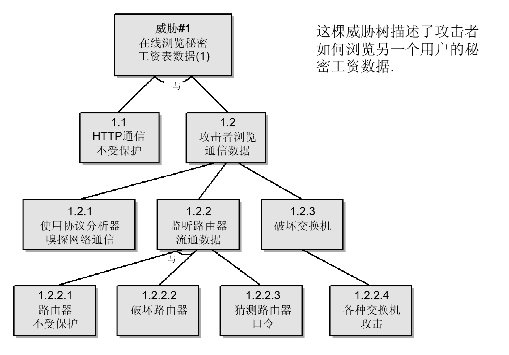

# [老焦专栏 | 如何做一个有说服力的方案？](http://p.primeton.com/articles/5cdd2bd24be8e6018b004cbf)

2019年5月

> 没有自证的方案，不是一个好的方案。

经常有技术人员收到这样的反馈：技术精通，但做方案的能力不强。其中一个原因就是：我们的方案通常只是论述了如何做，没有证明做法是正确的。例如，需要应用安全的方案，我们的方案是做安全扫描，而安全扫描只是保证安全的一个做法，并没有证明为什么有了安全扫描就安全了（实际上仅仅做了安全扫描，也不意味着应用安全）；再如，需要高可用的方案，我们的方案是做双机热备，并没有证明为什么双机热备就可以实现高可用了。没有自证的方案，不是一个好的方案，这里我通过应用安全的例子，讲一讲在方案中如何证明自己。

首先说一个下图的示例，一个工资管理系统，如何设计这个系统的安全性：

安全的设计要从分解系统、进行威胁建模开始：

由于安全的内容比较多，分级威胁和缓和方案我就不具体介绍了，缓和方案就是具体的做法，这个相信大家都能做出一些，这里主要讲推导过程，即如何论证上图的缓和方案是正确的。

首先是分解系统（应用程序）：

下面是上图的图例，主要有交互者（外部实体）、数据流、进程、数据存储、边界这几个部分。

分析了系统，下面分析威胁的各个种类，一般来说，系统的威胁分为六个方面，简称 STRIDE（假冒、篡改、否认、信息泄露、拒绝服务、提升授权）：

根据系统的分解，系统的每个部分都有可能发生威胁，系统的各个部分包括外部实体、进程、数据存储、数据流，但不是每个方面都有上述六方面，见下表：

针对威胁，就可以设计解决方案了，例如每个进程都可能因为 SQL 注入漏洞，存在篡改（T）和信息泄露（I）的威胁，利用安全扫描的方式可以消除因为SQL注入产生的篡改和信息泄露威胁。再如：

我们可以用下述方法，解决各种威胁：

用了这种几步分解、系统性描述的论证方式，囊括了系统分解、威胁建模、威胁评估和缓和方案，我认为，就是一个说服力的方案，也就是能够自我证明的解决方案。

关于作者：焦烈焱，普元信息CTO，致力于技术创新和金融创新解决方案研究。专注于企业技术架构领域，对分布式环境的企业计算、 企业信息架构的规划与实践有着丰厚经验，带领普元技术团队相继在云计算、大数据及移动开发领域取得多项突破，并主持中国工商银行、中国建设银行等多家大型企业技术平台的规划与研发。
