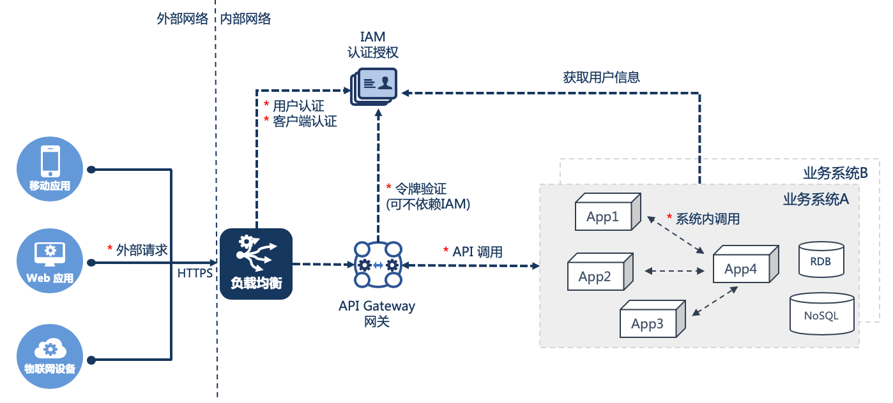
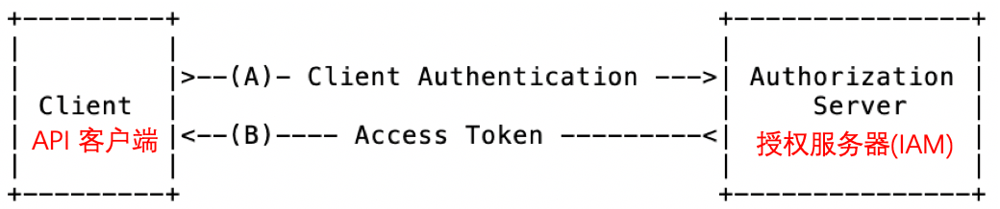

# [从五个方面入手，保障微服务应用安全](http://p.primeton.com/articles/5d5cbd804be8e620df000001)

2019年8月

> 着重介绍认证、授权、通信等技术相关内容。

随着计算机、互联网技术的飞速发展，信息安全已然是一个全民关心的问题，也是各大企业非常重视的问题。企业一般会从多个层次着手保障信息安全，如：物理安全、网络安全、系统安全(主机和操作系统)、应用安全等。

对于应用程序安全，需要在应用架构、代码、运维、管理等多个角度进行安全性评估，在整个应用程序生命周期中，软件工程师们则主要负责身份验证、访问授权、进程间通信安全、代码安全、安全的管理与审计这五方面的方案落地。这五个方面中，前三个侧重于技术实现，代码安全、管理与审计则更需要规范的管理和执行，本文将着重对认证、授权、通信等技术相关内容重点介绍，管理规范相关内容仅做简单说明。

文中以采用了微服务架构的应用程序为背景进行描述，但多数的应用程序的安全方案与是否采用微服务架构并没有强关联，如有差异的地方，文中会提出来。文中描述过程中会涉及到一些微服务架构中相关的概念名词，说明如下：

名词 | 解释说明
-|-
应用 | 即应用程序，本文中特指一个微服务应用
业务系统 | 即传统意义上的软件系统，如：OA办公系统、个贷系统等。微服务架构中，业务系统不是个业务逻辑概念，一个业务系统由一个或多个应用（微服务）组成。
网关 | 即API Gateway 是客户端访问应用的入口，后端应用的API门户。通常负责身份认证、API管理、路由、编排等等
服务 | 即API，特指程序接口 ，如服务调用 即为 API调用。需注意在本文中不要与微服务、应用等概念混淆
认证管理系统 | 认证管理系统（IAM），负责身份识别和访问管理，其核心业务是应用系统的访问者的注册、账号密码凭证、访问者基本信息的管理和对已注册的访问者进行合法性认证和访问授权。
授权服务 | 指身份认证授权服务，在微服务架构中，通常是认证管理系统（IAM）的一个应用。认证中心具备读取"访问者"身份信息的权限。负责核实"访问者"的身份、为访问者颁发授权码、访问令牌等能力
访问者 | 在安全领域统称"Principal"，指应用程序功能UI或API的使用者，包含两类：1，基于登录的客户端，2，API 客户端
API客户端 | API Client 即客户端程序类型的访问者，这类客户端自身具备部分API的访问权限，不需要用户授予其访问权限。
基于登录的客户端 | Login-based Client ，用户访问服务提供者的应用程序的功能时，需要通过一个客户端交互界面来与服务提供者交互，用户需要先登录，然后由客户端代表用户身份去访问服务提供者应用程序。

微服务架构中安全访问相关的简化版的运行视图如下：

图中星号*标注的位置就是服务调用过程中安全访问过程中的一些需要认证鉴权的关键位置，如：内外部访问认证、令牌验证与授权、内外网通信协议等。后续章节将对这部分展开分析。

## 1.身份认证

多数业务功能类的应用的首要任务就是需要做身份认证。对于数据公开或新闻发布类的门户网站类应用不需要考虑这一点，他们更关注的是数据开放之前的管理和审批。

身份认证或身份验证(Authentication)，顾名思义就是对应用程序的"访问者"的身份进行验证识别。访问者分两类。

基于用户登录的客户端(Login-based Client)：用户访问服务提供者的应用程序的功能时，需要通过一个客户端交互界面来与服务提供者交互，用户需要先登录，然后由客户端代表用户身份去访问服务提供者应用程序。

API 客户端(API Client)：客户端程序类型的访问者，这类客户端自身具备部分API的访问权限，不需要用户授予其访问权限。

### 1.使用认证管理系统IAM进行访问者注册认证

不论是用户还是API客户端，在访问应用之前，均需要先到认证管理系统IAM进行注册，以创建其的身份凭证(用户账号和密码、客户端ID和密码)。有了身份凭证，才能通过认证服务的验证。

统一认证管理系统IAM(Identity and Access Management )负责身份识别和访问管理，其核心业务是应用系统的访问者的注册、账号密码凭证、访问者基本信息的管理、对已注册的访问者进行合法性认证和访问的初级授权(获取访问者自身数据)等等。

有些企业还会将组织机构、角色甚至业务功能权限数据也一并归入IAM系统管理。IAM对权限管理范围可大可小，不同企业的管理需求和力度也不一样，需要集中进行功能授权管理还是下放到业务系统中自治各有优缺点，选择合适自己的方式就好。

### 2.IAM认证管理系统使用OAuth2.0进行访问者授权

传统WEB应用对于用户登录访问，采用会话状态在服务端保存的方案，用户请求通常采用会话粘滞(Sticky session)或会话复制(Replication session)策略，来保持客户端和服务端的会话。为了会话共享而不得不将会话信息写入公共缓存或数据库，导致微服务应用之间产生了耦合性。

微服务架构中不推荐采用服务端保存会话的方式，如果引入状态管理不是必要的，那么应用尽量保持无状态运行。推荐使用另外一种基于访问令牌的模式，这种模式下应用中不需要保存会话状态，并且API客户端和基于登录的客户端均方便使用访问令牌。微服务架构推荐使用OAuth2.0 授权协议来搭建IAM系统。Spring 体系可以基于Spring Security OAuth实现授权服务器和客户端。

在本文的上下文中，面向的是企业基于微服务的总体架构进行方案设计，企业整体架构中，默认认证体系方案为企业统一认证而非业务系统各自认证（此方案的前提条件）。OAuth2.0本身是为三方授权而设计的，而在本方案中讨论的是企业内部应用的整体认证和授权，不存在第三方。因此本方案中基于OAuth2.0实现的授权服务可以简单理解为仅为IAM统一认证管理系统中的“账号管理应用资源提供者”做授权，并且默认实现为认证通过自动授予已登录账号数据的读写权限，不在登录通过后与用户交互确认是否同意授权。其他业务系统作为资源提供者的授权则是系统管理员预置好的授权，也不需要由用户登录时决定是否授权。这个OAuth2.0的使用场景可能与其他OAuth2.0相关资料或授权框架默认实现有所不同，请大家注意区分。

OAuth协议中定义了四种角色：

- 资源所有者

  能够许可对受保护资源的访问权限的实体。当资源所有者是个人时，它被称为最终用户。

- 资源服务器

  托管受保护资源的服务器，能够接收和响应使用访问令牌对受保护资源的请求。

- 客户端

  使用资源所有者的授权代表资源所有者发起对受保护资源的请求的应用程序。术语“客户端”并非特指任何特定的的实现特点(例如：应用程序是否是在服务器、台式机或其他设备上执行)。

- 授权服务器

  在成功验证资源所有者且获得授权后颁发访问令牌给客户端的服务器。

角色分析：

对于前面提到的API 客户端，自身具备API访问权，不需要用户授权，因此在OAuth角色对应时，它既是客户端又是资源所有者。

微服务架构中Web应用一般采用前后端分离的模式，前端为基于浏览器访问的纯前端应用，网关作为应用程序的入口，此时网关本身可以代表OAuth中的客户端身份访问服务提供端应用的功能接口。

在微服务架构中，负责颁发访问令牌的授权服务通常在IAM系统中实现

资源服务器，在微服务架构中，所有的业务系统中的服务功能提供者都是资源服务器，也包括IAM系统的账号、组织机构服务、资源权限管理服务等等

在OAuth2.0授权协议中，主要定义了四种许可类型：授权码许可、简单许可、密码凭据许可和客户端凭据许可，详细请参见规范内容：[rfc6749 - The OAuth 2.0 Authorization Framework](https://tools.ietf.org/html/rfc6749)

下面我们根据访问者类型，分别推荐合适的授权方案。

#### 2.1 API客户端作为访问者，使用客户端凭证许可

典型的API客户端如批量调度系统、物联网设备程序等，通常不需要用户登录授权就可以自动运行。使用客户端凭证许可类型比较适合。

上图为OAuth2.0规范标准流程图，结合此场景中，对应OAuth2.0中的角色，API客户端作为OAuth2.0的客户端、IAM则为授权服务器。

1. API客户端与授权服务器IAM进行身份验证并请求访问令牌。
2. 授权服务器IAM对API客户端进行身份验证，如果有效，颁发访问令牌。客户端存储访问令牌，在后 续的请求过程中使用。如果令牌过期或失效或需要重复此流程再次申请访问令牌。

其他说明：

- 此类应用通常不具备与用户交互的UI，无需用户授权，具备保证客户端凭证安全的能力
- 此类应用后端需要具备通过https访问授权服务器的能力
- 此类应用或设备需要具备存储Access Token的能力

#### 2.2 基于登录的客户端作为访问者，使用授权码许可

##### 2.2.1 Web 应用

OAuth2.0 协议中提出前端单页Web应用可以用简单许可模式，但简单许可模式有些局限性，令牌到期就需要重新登录授权，不支持令牌刷新，用户体验较差。很多使用简单授权的应用为了改善用户体验会颁发一个长期的令牌几天甚至几周。

如果有条件使用授权码模式，支持刷新令牌则是一个更好的选择。对访问令牌时间较短如2分钟，刷新令牌为一次性令牌有效期略长如30分，如果存在已作废的刷新令牌换取访问令牌的请求，授权端点也能够及时发现做出相应入侵处理，如注销该用户的所有刷新令牌。在保持良好用户体验的同时还兼顾了部分安全性。

本场景以微服务架构中常见的前后端分离Web应用作为示例，前端是单页应用，网关作为Web后台是服务提供端应用功能入口，也可作为OAuth2.0的客户端，让前端Web应用能借助网关实现授权码交换。因此在微服务架构中，即便是纯前端单页应用类的Web应用，仍可以用基于网关交互的授权码模式获取访问令牌。其他非前后端分离的混合Web应用自身就是客户端，不需要借助网关交换访问令牌。

上图为OAuth2.0规范标准流程图，结合此场景对应OAuth2.0中的角色，用户是资源所有者、浏览器为用户代理、网关作为被授权的客户端、IAM则为授权服务器。

1. 网关通过引导浏览器开始流程授权流程，重定向到统一认证中心的登录页面。
2. 用户输入密码登录，授权服务器验证用户身份，并确认用户是否授权网关的访问请求。
3. 用户授权后，认证中心根据之前网关注册时提供的回调地址，引导浏览器重定向回到网关。重定向URI包含授权码
4. 网关通过包含上一步中收到的授权码和网关自身凭证从授权服务器IAM的请求访问令牌。
5. 授权服务器IAM对网关进行身份验证，验证授权代码，并确保接收的重定向URI与网关注册时的URI相匹配。匹配成功后，授权服务器IAM响应返回访问令牌与可选的刷新令牌给网关。

其他说明：

为了前端会话保持，访问令牌由网关在响应时返回到前端，存储到前端存储空间，如Cookie、Local Storage、Session Storage等。

访问令牌失效后，网关根据自己的客户端凭证+刷新令牌一起发送授权服务器，获取新的访问令牌和刷新令牌，并再返回响应中将访问令牌写入到用户浏览器的存储中。

授权码模式中，用户的凭证(用户名、密码)是用户通过浏览器与授权服务交互，并不经过网关， 安全性最好。

##### 2.2.2 移动App

个人移动设备上安装的原生App本身具备实现授权码流程的能力，不需要借助网关实现授权码流程。认证通过后网关仅负责校验访问令牌即可。

移动App实现登录重定向通常可以采用如下方式：

- 模拟web端，使用移动端浏览器与WebView
- 使用URI scheme与Intent在应用间跳转

移动端App的运行环境是不可信的，容易被恶意App入侵的风险，包含如下两种情况：

- 重定向过程中的回调URL参数，容易被恶意App占用URL Scheme或者监听localhost端口截取。
- 运行环境不可靠，移动App不具备安全保存客户端秘钥的能力，而使用授权码获取访问令牌时需要校验客户端秘钥。

基于上述风险和问题，移动App基于授权码获取访问令牌的流程需要进行优化解决，rfc规范中建议的实现方案是移动App授权流程采用使用带有PKCE支持的授权码模式。PKCE, 全称Proof Key for Code Exchange，即保护授权代码授权。这其实是通过一种密码学手段确保恶意第三方即使截获Authorization Code或者其他密钥，也无法向认证服务器交换Access Token。

经过PKCE改进的授权码、访问令牌交换过程示意图如下：

上图为PKCE模式下授权码申请和交换访问令牌的过程，说明如下：

1. 移动App客户端创建并保存名为code_verifier的随机秘钥串，并将秘钥字符串加密转换的结果t(code_verifier)称为code_challenge，将转换后的code_challenge以及转换方法一并发送到授权服务中。
2. 授权服务返回授权码并记录code_challenge和转换方法t_m。
3. 移动App客户端收到授权码后，将授权码和code_verifier秘钥串发送到授权服务器，用以申请访问令牌。
4. 授权服务器根据转换方法t_m 转换code_verifier 并与步骤A中收到的code_challenge比较，如果一致则返回访问令牌，否则拒绝非法请求。

第三方无法根据code_challenge推导出code_verifier，因为code_challenge采用了不可逆加密方式。只有移动App客户端自己才知道这两个值。因此即使恶意App截获了code_challenge和授权码，也无法换取访问令牌避免了安全问题。要实现这种移动App的PKCE授权码模式，出移动App自身外，还需要IAM的授权服务器基于标准的授权码流程扩展配合实现。

关于移动App安全认证的详细内容请参考官方规范：

- [rfc8252 - OAuth 2.0 for Native Apps](https://tools.ietf.org/html/rfc825)
- [rfc7636 - Proof Key for Code Exchange by OAuth Public Clients](https://tools.ietf.org/html/rfc7636)

#### 2.3 高度信任的特权类客户端，可以使用资源所有者密码凭据许可

上图为OAuth2.0规范标准流程图，结合此场景中，对应OAuth2.0中的角色，用户是资源拥有者、特权应用是客户端、IAM提供授权服务器

1. 用户提供给特权App用户名和密码。
2. 特权App将用户凭据提交给授权服务器IAM，申请访问令牌
3. 授权服务器IAM 验证用户的凭证，如果有效，颁发访问令牌给特权App。特权App对授权服务器颁发的访问令牌、刷新令牌进行存储和更新。

其他说明：

虽然是特权App，但App中不要持久化保存用户密码，仅登录时使用

App负责保存Access Token 、Refresh Token

### 3. 使用API 网关作业务系统访问入口，负责验证访问令牌

访问者能够访问的接口通常是两类：身份认证API、应用功能类API。

- 身份认证类API：即登录认证相关的API。为了避免用户、客户端凭证泄漏第三方(除IAM、访问者之外为第三方)，身份认证类API或UI建议由IAM系统直接开放给访问者调用进行身份认证。
- 应用功能类API：功能实现来自服务提供者，通过网关开放给访问者。网关是访问应用API的入口。

用户登录认证由IAM授权服务器配合用户资源服务负责。认证成功后，IAM访问者颁发访问令牌。后续对应用功能的访问过程中，均须携带访问令牌以表明访问者的身份。

#### 3.1 由网关负责客户端身份验证

网关作为业务系统的API入口，当面向外网的访问者时网关还是内外网的分界，访问令牌验证理应由网关负责，不应该将令牌验证的事情交给服务提供者。网关负责验证既能避免未经验证的请求进入内网，又能够简化服务提供端的代码，服务提供端无需处理不同类型客户端的验证。实际上好处还不只这些，在网关可以统一做流控无需应用端重复建设类似功能；系统内部调试、变更敏捷，减少了跨组织交互。

网关验证访问令牌有两种方案：网关委托认证服务验证、网关直接验证，说明如下：

方案一：网关委托授权服务验证，每次收到请求后，网关均将访问令牌发送到IAM认证服务进行认证，认证通过后才允许继续访问。

客户端成功认证后，使用UUID类型的访问令牌调用网关上的服务

由于UUID类型令牌不包含客户端的信息，网关需要委托IAM认证服务校验令牌

令牌检查合法后，将请求路由到服务提供者

应用中也无法解析令牌，需要根据UUID令牌到IAM中获取用户信息

方案二(推荐)：网关直接验证，要求网关能识别IAM颁发的令牌，这种模式推荐用 JWT令牌，网关需要具备解析校验JWT加密的访问令牌的能力。

客户端成功认证后，使用JWT令牌调用网关上的服务

网关自己直接解密JWT令牌进行校验

令牌检查合法后，将请求路由到服务提供者

应用受到请求后，如果需要更多权限信息，如果可以根据Token去权限管理服务获取权限信息(非必须步骤，需要时添加)。

上述两方案中，方案一的令牌是无业务含义的身份标识字符串，每次收到请求网关都去IAM认证，对IAM认证服务的性能压力较大。方案二中IAM颁发的令牌中包含部分客户端或用户信息，使用JWT加密，IAM将验证方式或SDK提供给了负责认证的网关。对于IAM来说，减少了每次请求令牌认证带来的通信次数，减轻了IAM的压力。

推荐采用方案二实现令牌检查，需要注意的是方案二中的JWT令牌中仅包含必要的信息即可，不要放太多的角色权限信息。后续功能中需要额外的信息时，可以根据令牌再去IAM中获取。如果令牌中存放了很多的权限数据，一旦后台的授权数据发生变化，令牌中的权限数据与实际IAM的权限会存在不一致的问题，只能强制用户下线重新登录。

JWT令牌是防篡改的，但并不加密，如需要存储到浏览器存储中，建议采用JWT+JWE方式进行令牌加密。令牌中存放必要少量数据即可，避免滥用。多数服务器通常会对Http header、cookie长度做限制。

#### 3.2 系统内部应用是否通过网关

我的答案是不需要，否则太麻烦了。通常网关是独立团队负责，API变更发布、内部联调验证还得跨团队协调实在不可行。推荐系统内直通不走网关，系统之间访问必须走网关。要做到这一点，应用也需要实别请求来源进行客户端认证，这种认证方案没必要太复杂，应用只应该允许信任的网关和系统内部应用程序访问其服务，不允许系统外部请求绕过网关直接调用，因此，需要在网关和系统内部应用之间这个小范围内建立信任，常见方案有两种：

方案一，内部令牌：系统内的应用在发布接口到网关时，提供一个系统内部共享的令牌给网关和系统内所有应用，接收到请求时检查请求头中是否包含系统内信任的令牌， 如果包含可信任令牌，那么就允许访问，否则就拒绝

方案二，系统内保密令牌+网关证书单独认证：系统内用保密令牌交互就是方案一，只是内部令牌不共享给网关，网关用公私钥证书签名方式与域内系统建立信任，由网关生成公私钥证书，颁发公钥给各个系统，网关调用服务提供者时，请求头中带上用私钥签名的令牌，应用收到请求以后用网关发布的公钥验证其令牌。

方案一优点是实现简单，缺点是安全级别略低，常见的企业架构中，网关和业务系统会是不同团队甚至不同的厂商负责开发维护，内部令牌共享给了其他团队负责的网关，存在一定的风险。方案二相比方案一略复杂一点，安全性更高，系统内互通用内部令牌，系统和网关认证使用了网关提供的安全令牌检查方式。两种方案可根据实际需求选择。

## 2.访问授权

通过认证的API客户端能够访问网关开发的所有API吗？通过认证的用户能够调用所有API吗？通过认证的用户允许调用修改订单的接口，那么他能修改所有人的订单吗？

很显然绝大多数场景下上述三个问题答案都是"不能"。在绝大多数业务场景中除了对访问者的身份认证之外，我们还需要再进一步控制权限。

### 1. API客户端访问网关接口时，网关需进行API权限控制

如果访问者是API客户端时，API调用的权限需由网关进行控制。建议采用先订阅再访问的授权模式，网关应该仅允许API客户端访问其订阅过的API 。具体实现方法就是绝大多数网关都会提供的基于API Key控制API访问的方式。

需要注意的是，仅使用API key的访问控制是不够的。API Key是在网关订阅API时生成的一串唯一编号，并不具备识别客户端身份的能力。就好比以前买火车票是不实名的，谁拿到火车票，都可以乘坐对应车次。火车票实名制之后，首先需要核验身份证，核验通过后才能购票乘车。如果证票不符，则不允许乘车。

将客户端认证和API Key配合进行访问认证和权限校验才是个更安全的方案。

上图为访问令牌结合API Key的认证鉴权示意图，说明如下：

- 客户端1获取了API Key 但其没有合法的访问令牌，如果不允许匿名访问，则网关会拒绝客户端1访问，返回错误码401表示客户端未通过认证；
- 客户端2拥有了合法的访问令牌，但其API Key不合法，网关在客户端2认证检查通过后，检查API Key，发现其权限不足，则返回错误码403表示客户端的权限不足；
- 客户端3拥有合法的客户端访问令牌和API Key访问网关上的服务，网关认证、鉴权通过之后，将请求路由到实际的服务提供端，最终发回正常响应数据。

### 2. 用户访问应用功能时需要进行权限控制

用户访问的功能权限或数据权限不要交给网关管控，原因是网关仅能支持API Path授权，而实际需要控制的用户权限有很多，如菜单、API、数据等。如果由网关控制用户权限，管少了不满足需求，管多了就要耦合太多应用数据。

因此推荐用户权限由业务系统自行管理维护和控制。每个业务系统内部如果需要控制用户权限，可以建设一个基础权限框架，负责管理权限数据，并提供访问请求拦截和权限检查的SDK给其他应用。

也有部分企业权限管理要求较高，将系统内部的基础权限框架抽取为独立的权限管理服务，由独立团队维护该服务，采用分布式部署+权限缓存的方式保障性能。这样做的好处是权限模型统一、容易对权限变更进行审批控制和审计。缺点是跨团队交互，变更流程复杂。

关于权限管理，是业务系统自治或是集中管控，根据企业自身的需求特点决定即可。

## 3.通信安全

通信安全的方案就是基于传输过程加密的方式，常见的选择就是使用Https协议通信。

微服务架构体系中，逻辑层面上外部请求接入都是通过网关作为入口，网关作为内外网的分界，实际部署上，网关本身也是多实例分布式的高可用部署形态，前面架设有一个负载均衡F5或nginx，用来对外提供Https协议接入和路由转发，而网关内部就是企业内网，默认是可信任的，内网的系统之间的通信会采用更轻量级的HTTP协议。此方案中微服务换成SOA，把网关换成ESB，就是传统的SOA架构中的安全通信方案，本质上没有区别。

示意图如下：

为什么用了https就能保证通信安全呢？https是http+ssl，采用密码学手段对通信报文做了加密，使得报文无法被篡改，做到了安全传输，从而保障了通信安全。关于https原理和负载均衡器证书配置相关资料网络上有很多，请大家即用即查。

## 4.代码安全

敏感配置加密：上述各种服务安全场景和方案聊了那么多，大家发现保存好令牌、密钥、密码是一切安全的前提。这些东西千万不能外泄。要保证密码不泄露的办法就是做好敏感数据保密，技术手段上则要求存储密码、凭证的地方(配置文件和数据库表)需要加密存储。如：配置文件中的数据库口令、数据表中存放的密码数据等

代码质量管理：建议在开发期对于编码规范进行制定，还可以通过工具进行辅助检查和控制，如开源的代码质量管理工具Sonar，可以支持多种程序语言，方便的与编译构建工具集成如Maven，在代码进入正式提交对应分支前就将一些安全问题在前期预防，如SQL注入等。

运行时安全扫描：测试阶段，可以通过安全扫描软件，如AppScan 等工具对业务系统的前后端功能进行扫描，检查系统漏洞并即时修复。尽量减小在上线运行后出现安全事故的风险。

## 5.管理审计

运维管理安全方面，根据安全需求，要有安全相关的管理规范和工具支撑，对系统管理、权限分配和关键数据进行严格管控，并做好操作审计日志记录。

比如很多安全级别高的行业或企业中如军工类，对于业务系统的修改、权限管理审计做了严格的流程规范和功能支撑。如典型的三员管理，采用三权分立、互相制约的思路，包含系统管理员、安全管理员、安全审计员三个角色，互相能看到对方的信息，将业务过程分成不同的段，每段由对应人员负责，不让任何人掌控全局。

审计工作是非常重要的一环，没有任何系统和流程是绝对安全的。关键的操作、数据变化等审计日志需要完整记录。一旦发生问题，可以通过审计日志排查分析追踪。常见内容举例如下：

- 对于敏感数据项(如：密码)的访问
- 客户端注册、用户认证授权过程
- 权限的授予和废除
- 关键数据的变更、删除
- 审计功能的启动和关闭
- 其他关键API、命令的访问

以上这些审计方面的工作中，如果是基于API相关的审计信息记录，如边界交互报文数据，建议基于统一的技术框架进行记录管理。一些内部实现方法，则可以采用接口、方法上加注解，AOP拦截后记录的方案。其他情况可根据实际需求设计审计数据存储的方案。

## 参考引用

- [rfc6749-The OAuth 2.0 Authorization Framework](https://tools.ietf.org/html/rfc6749)
- [rfc8252-OAuth 2.0 for Native Apps](https://tools.ietf.org/html/rfc8252)
- [rfc7636-Proof Key for Code Exchange by OAuth Public Client](https://tools.ietf.org/html/rfc76)
- [PKCE授权码模式](https://tonyxu.io/zh/posts/2018/oauth2-pkce-flow/)
- [如何在微服务架构中实现安全性](https://mp.weixin.qq.com/s/zMJknIq2qVCkNMtyBiFtag)
- [如何在移动端开发中正确地使用OAuth协议](https://www.jianshu.com/p/ca3fc5890b05)

关于作者：炎峰，现任普元金融研究院架构师。主要负责普元流程产品的核心架构设计与产品版本发展规划，先后参与了国家电网BPM、BAM平台、浦发银行新一代流程平台等大型平台项目建设与实施 。
