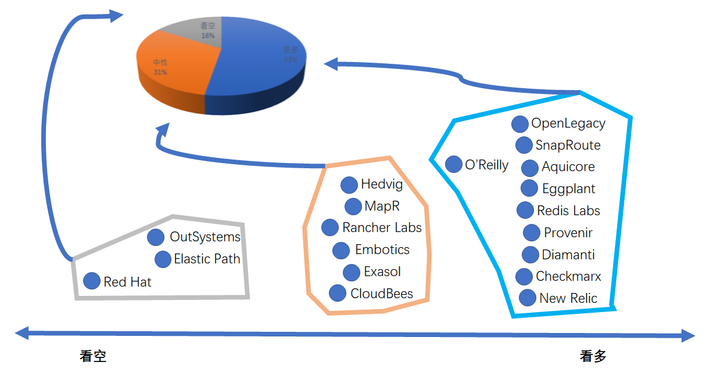
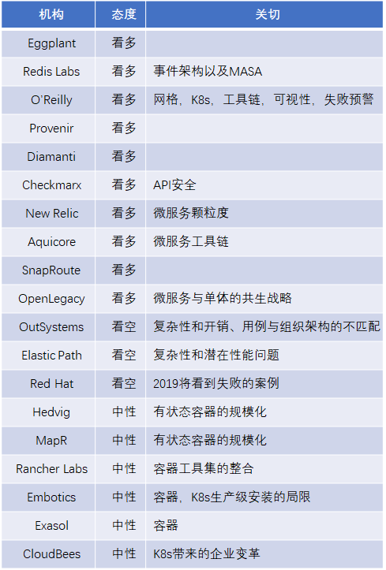

# [微服务在2018年带来的惊喜和2019年预测](http://p.primeton.com/articles/5c1b60ff4be8e626d00068fa)

2018年12月

> 作者：Tom Smith
> 译者：白小白
> 原题：Microservices 2018 Surprises and 2019 Predictions
> 原文：[http://t.cn/EysMZn4](http://t.cn/EysMZn4)

_*本文整理了19家IT公司的22条观点*

全文3056字，阅读约需要7分钟

译注：
本文整理了19家IT公司的22条观点，覆盖了2018-2019年度对微服务领域的一些关切，事实上，在普遍看好微服务的大背景下，仍旧有一些警醒的声音指出了一些风险，因此对微服务的态度自然分成了不成比例的3派，占主流的看多派，有10票；而并未就此发表评论（主要重点在于对容器技术的关切）的，我们列为中性，有6票；看空的有3票半，Red Hat是坚定的看空派，认为在2019年将出现微服务失败的铁证，而O’Reilly在看好微服务的同时，也表示了对失败案例的担心，据此，我们做了一个图表。

作为一种日新月异的技术变革，微服务领域在2018年取得了一些令人惊喜的进展，并且一些未来的趋势也初见端倪。我们相信这些会是读者比较关心的内容，因此我们总结了一些IT高管对于这个主题的想法，列在下面：

## 01 2018年的惊喜

Shannon Williams Rancher Labs，联合创始人/销售副总裁
围绕Envoy, LinkerD以及Istio的热情比我预期的早了一两年。使用Kubernetes的团队真正感兴趣的是如何更有效地管理微服务。

Glenn Sullivan SnapRoute，联合创始人
Kubernetes在微服务、容器化和云原生领域以惊人的速度站稳了脚跟。前瞻的运营者正逐渐认识到基于Kubernetes的云原生环境所带来的差异化和敏捷性。

Zeev Avidan OpenLegacy，产品总监
目前还没有明确的微服务市场领导者出现。提到API，人们会想到APIgee或者MuleSoft，但还没有供应商可以与微服务形成这种强关联。

## 02 2019年的预测

Gaurav Yadav Hedvig，创始工程师/产品经理
在2019年，微服务体系结构将迎来演进中的最大挑战：如何规模化的运行有状态容器。目前大多数存储解决方案只适用于虚拟化平台（如VMware等）。但不太适合容器技术。在2019年需要解决的问题是，找到一个存储解决方案来支持这些完全独立的虚拟化机制，以便它们能够高效、无缝地共存。

Bill PetersonMapR，行业解决方案副总裁
容器需要能够访问持久化存储及其内部的数据。容器必须支持横向扩展的存储机制，以提供可操作性和轻量级分析的能力。

Antony Edwards Eggplant，首席运营官
微服务将被直接称为服务，因为所有服务都将是微服务。“微”是新常态。

Madhukar Kumar Redis Labs，技术和产品营销副总裁
在2019年，微服务以及基于事件的体系结构将继续演进。特定的服务将越来越需要与诸如MASA（Mesh App and Services Architectures ）这样的单体应用相兼容，利用数据服务来侦听事件并实时地作出反应。

Christopher Guzikowski O’Reilly，软件架构与开发高级内容总监
我们相信，由于在速度和可伸缩性方面所具有的优势，微服务将在2019年继续蓬勃发展。大型的关键任务代码库需要的是迭代而不是从头来过，应用微服务方法可以降低这一过程中的风险，微服务允许对某个特定的关切保持关注，而不会对整个体系结构产生负面影响。服务网格（特别是Istio）作为管理微服务所带来的部署复杂性的有效手段，将获得极大的关注。Kubernetes将在企业里大行其道。支持微服务各个方面的工具生态系统将出现爆炸式增长。可观察性仍然很重要，因为架构师们需要不断适应对多个实体对象保持关注。最后，从技术的视角来看，很可能在采用微服务方面会出现一些显著的失败，这也是很自然的。面对潜在的失败，微服务采用者要么保持坚定的态度，要么接受倒退到单体应用的现实。

Mike LaFleur Provenir，全球解决方案架构主管
微服务在2018年可以说“炙手可热”，我认为其在2019年将继续是一个备受讨论和关注的话题。微服务促成了旧的互联网领域的一次重大范式变革。

Thomas Barton Diamanti，首席执行官
2019年，IT主管们将如梦初醒的意识到这样一个事实：微服务体系结构已经不再是虚无飘渺的理念，而成为近在咫尺的现实。IDC预测，到2022年，90%的企业新建应用程序将以微服务为基础，而在2019年，许多IT部门将绞尽脑汁地想办法使他们的虚拟机基础设施支持微服务架构。

Shannon Williams Rancher Labs，联合创始人兼销售副总裁
管理容器化应用程序需要采用广泛的工具集，我认为，在2019年将可能会看到一些新的开源项目旨在对这些工具集形成整合。

Jesse Stockall Embotics，CTO
虽然看起来“马上就实现”，但通过Kubeadm进行生产级安装仍然任重道远。如果供应商仅着眼于安装K8s，而不提供进一步的价值，将有可能遭遇某些业务风险。

Andy Pemberton OutSystems，解决方案架构副总裁
微服务走回头路。许多已经尝试过微服务的公司将向更传统的中间件方法靠拢。我们将看到良好管理和治理的API平台的复兴，因为许多公司会发现，微服务所带来的复杂性和开销对于企业的许多用例来说都是不合理的，企业的组织架构也无法支撑。

Mathias Golombek Exasol，CTO
2019年将有越来越多地将企业遗留的工作负载迁移到容器架构。其好处在于，容器在设计上与以前的遗留环境相匹配，极大地减少了技术挑战，并尽可能避免了应用程序的重写。许多人认为，2018年末IBM收购RedHat的交易是IBM抢占容器市场的重大战略举措的一部分。

Viktor Farcic CloudBees，首席DevOps顾问
随着Kubernetes被越来越多的企业所采用，人们将开始意识到仅仅采用Kubernetes是不够的，需要在企业的流程、工具和体系结构等方面发生改变。Kubernetes将有力的推动整个公司范围内的深刻变革。2019年将被铭记为不安于现状的一年。我们将开始迈向由Kubernetes所推动的一些原则（如微服务化、连续交付、不可变基础设施、云原生等等)。

Erez Yalon Checkmarx，安全研究主管
微服务架构已成为业界的普遍实践。如果需要敏捷，快速、智能地交付，微服务就成为必由之路。然而，微服务所带来的多服务环境需要服务间通信或API的支撑。而API所暴露的攻击表面正被恶意行为者所乘，也带来了更多对API漏洞的滥用，安全行业将致力于定义API所需的安全措施。

Lee Atchison New Relic，战略架构高级主任
**在2019年，一些决定因素将使人们开始急于采用微服务体系结构。而转向微服务的危险之一是人们不完全理解服务的颗粒度究竟应该有多大。有一些团队号称创建了微服务架构，却不过是用10个更小的单体应用替换了原来的1个单体应用。服务的颗粒太大，将无法解决单体应用的问题。而服务太小，则意味着所有复杂性都会从团队层面上升到系统层面，这将使普通开发者束手无策。**

Sal Visca Elastic Path，CTO
微服务已经成为一个热门话题，虽然在理念上为应用程序开发者提供了一些收益，但在实操层面，分布式系统所带来的复杂性和潜在的性能问题却不容忽视 。最令人惊讶的是，一方面，微服务已经开始被采纳为一种广泛应用的标准的体系结构风格；另一方面，集成应用程序（又称单体应用，在技术语境下常带有贬义）是如此之快的被弃如敝履。而业界本该对这一切保持谨慎。
由此产生的后果是，我们将看到更好的服务编排工具和越来越大的微服务颗粒度。

Michael Payne Aquicore，产品团队主管 
在2019年，我们将看到更多的康威定律的实践，企业将对技术团队的组织架构实现重构，以推进他们所追求的系统设计理念。此外，伴随着企业从单体应用向微服务架构迁移的趋势的持续，降低复杂性成本的需求将进一步增加，由此，我认为我们将看到围绕微服务部署的工具链产生更多的玩家。

Glenn Sullivan SnapRoute，联合创始人
在2019年，我们将看到一种面向“聚焦DevOps”、云原生、网络操作系统(NOS)的转变，所有协议和管理功能都将被构建为基于不可变容器设施的微服务。从而，网络运营商可以原生的利用持续集成和持续部署(CI/CD)的能力。使用由容器化的微服务构建的NOS，运营商可以仅部署他们所需的功能，降低复杂性和安全攻击向量，在生产过程中升级组件，而不必担心会破坏其他服务，并且可以使用Kubernetes等云原生工具来自然而然地管理这些网络服务。此外，我们需要开始利用围绕微服务的庞大的开源社区，来创建创新的网络组件。

Zeev Avidan OpenLegacy，产品总监
微服务正从趋势走向最佳实践。微服务与单体应用的共生战略将变得更加重要和突出。

Edson Yanaga Red Hat，开发者体验总监
微型服务可能正进入幻灭期的低谷。我预计在明年，我们将开始看到在采用微服务时失败的团队和组织的铁证。我们将认识到，虽然在某些特定情况下非常有用，但微服务并不是灵丹妙药，也从来就没有什么灵丹妙药。期望业界可以对微服务的最佳实践进行一些整合。
