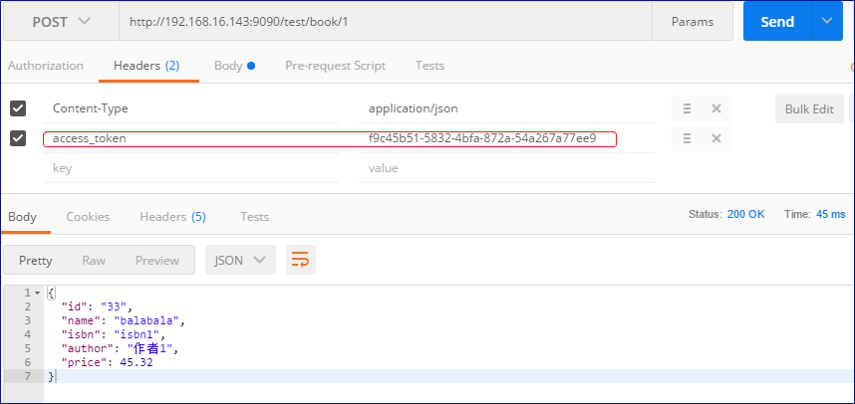

# [普元EOS8网关设计及应用](http://p.primeton.com/articles/5c35942b4be8e632cd0000b1)

2019年1月

> EOS API Gateway 可以帮助开发者轻松创建、发布、维护、监控API。

引言：

普元EOS 8 API Gateway作为一个独立模块，可以对API进行创建、发布、维护、监控等全生命周期管理。

目录：

一、为什么引入EOS8网关

二、EOS 8网关的技术框架

三、API接入和监控示例

## 一、为什么引入EOS8网关


随着微服务的热度不断上升，线上商业的发展和人们需求的扩增，企业中业务服务种类众多，数量巨大，对如此规模的服务做升级、管理和维护，时间和资源成本的开销不言而喻。API Gateway的价值随之彰显出来。与此同时对API Gateway的选择也尤为重要。

统一的API管理、高并发请求全周期异步化、灵活的API适配是EOS 8 API Gateway的优势。

### API Gateway 在各个模块间如何运作


上图展示了EOS 8 API Gateway模块间的进程视图，方便我们理解整个业务执行过程。

首先，需要将网关和后端应用注册到Eureka（如果后端服务不是微服务，可以忽略这一步）。

然后，在governor界面创建需要发布的API，并配置相应的ip认证和流控配置，这些操作都会同步到Gateway Server的缓存。

最后，服务消费者系统需要在Governor订阅API，获得网关颁发给调用方的token凭证（后面的版本会加入IAM授权），消费方系统拿到token凭证访问已发布的API，Gateway Server从Redis读取缓存进行ip和流控校验，从自身缓存中读取token信息（后面版本鉴权由IAM完成）、API配置进行请求和API适配，各个EventHeadler都完成后，由Ribbon路由到Eureka注册的应用（如果后端服务没有注册到Eureka，由异步的NioClient接出）。

## 二、EOS 8网关的技术框架

### EOS8 网关部署拓扑架构


EOS 8 API Gateway 有两种部署模式。

1. EOS 8 API Gateway可以不依赖微服务架构中的注册中心、配置中心进行单独部署。整个生命周期中API鉴权、ip认证、流控、配置管理，协议数据转换和调用日志监控等功能依然具备。但是依赖注册中心的服务路由、配置中心的统一配置API、监控/日志中心的后端服务监控等功能会缺失。

2. EOS 8 API Gateway 作为微服务治理的重要成员，可依赖注册中心、配置中心和监控/日志中心做微服务治理。
    1. 将API Gateway、后端应用注册到注册中心。当配置需要管理的API时，可选择注册中心的应用，亦可手动输入后端服务地址。
    2. 在配置中心可以对网关API进行统一配置，譬如：统一配置请求头响应头、统一请求参数响应参数等。
    3. 监控/日志中心可以监控注册到注册中心的后端服务调用和资源使用情况。

管理门户（Governor）是EOS 8微服务架构中服务治理和资产管理的门户，由管理员页面操作，进行API配置发布、API分组管理、黑白名单配置、流控配置、系统/应用注册、统一配置等操作，不过上述的功能的接口都有详细的swagger文档，可以根据需求自行扩展。

API_Gateway_Monitor是网关自带的日志解析组件。网关现支持Mysql、Oracle、PG数据库，Redis存放流控数据。

### EOS8 网关部署拓扑架构主要技术


注册中心使用Spring Cloud Eureka，配置中心使用Ctrip Apollo。

网关主要的技术框架：

- 网关使用了Oauth2鉴权技术（后续配合IAM做权限校验）。
- 在java8、Spring4的大环境下，Spring Boot加大了开发效率。
- 嵌入了Jetty容器让网关更轻，让系统性能维持在一个可接受状态。
- 使用了基于传输层的Netty框架，提供异步的、事件驱动的网络应用程序框架，为我们核心框架分阶段消息异步处理架构奠定基础。

### 分阶段消息异步处理


可以将一次请求Api Gateway，并从API Gateway获得响应视为整个流程。

逻辑分段。将整个流程划分成：请求接入/响应接出、代理服务处理、业务服务处理、请求接出/响应接入四个业务Stage。

段之间基于队列/消息通信。每个业务Stage都有自己独立的业务处理Event Handler、Event Queue和线程池，每个阶段之间没有任何依赖，当前的Stage事件处理完成，封装到Message中，然后派发到其他Stage的Event Queue，直到整个Stage处理完成有Nio Client或者Ribbon Client接出。当Event queue吸纳过量的负载，有限的线程池维持并发。

Stage控制器负责资源的分配和调度，控制派发给Event Handler的事件的数量和顺序，Event Handler可能在内部丢弃、过滤、重排序事件。

分阶段消息异步处理架构实现了EOS 8网关高并发请求全周期异步化。

### API Gateway 提供了统一的API管理


EOS 8 API Gateway从功能层面提供了统一的API管理。

首先，具有多协议接入和接出，例如HTTP协议、REST协议、WS协议等，发布出来的API可供企业内部系统、第三方应用系统和前端研发人员调用。

其次，在服务接入层，实现了权限认证、IP认证和用户名密码认证，再加上可靠的流控机制保障了通过网关的传输安全。

最后，Api Gateway Server服务引擎有以下几个内容：

1. Api Gateway Server内部实现了协议扩展和消息转换，根据需求在Governor管理页面进行配置。
1. Server端的接出由Ribbon Client实现，可根据Eureka注册的应用进行路由。
1. 流控数据皆保存在Redis中，在有限的JVM资源下优先保障传输效率。
1. server附带的普元自主研发的API Gateway Monitor，可以轻松解析千万级并发调用的日志文件，为governor呈现有效的API的调用详情和调用趋势。
1. API Gateway可使用F5或者Nginx进行横向扩展，应对更大调用需求。
1. 断路器机制可以有效的保护JVM主线程，为传输安全提供保障。

丰富的服务引擎使API管理更加完善。

## 三、API接入和监控示例

如何使用EOS 8网关？用EOS 8网关如何注册和发布一个API？服务消费者系统又如何根据token调用已发布的网关？

### API注册

#### 创建后端应用


如果需要API Gateway动态路由到后端应用，需要将该应用服务注册到Eureka，然后在Governor注册。为API注册选择后端服务时做好准备。

#### 创建API第一步（配置基本信息）


创建API第一步配置基本信息，对需要注册的API进行定义分组、协议、名称的配置。

#### 创建API第二步（配置API接入【协议/数据转换】）


创建API第二步，配置API接入，当外部系统调用网关发布的API时涉及到的配置。

一共有四个基本配置：

1. “请求Path”是API的URI。
2. “HTTP Method”是http请求的方法。
3. “入参模式”分两种：穿透和转换，穿透与转换的区别是前者网关在服务调用生命周期只做代理转发，后者可以对请求报文进行适配和转换。
4. “报文类型”请求报文的数据类型，默认有：JSON、XML、FORM表单，如有其他需求，可在数据字典扩展。

本次示例是http穿透，路径参数 ”num1“加入了参数列表，参数列表中定义过的参数皆可在后端服务的Path、Header、Body中使用。

在系统对接过程，常见的API适配有json转json、xml转json、json转xml。

在EOS8 API Gateway中，无论请求方的报文是什么格式的，只要能在请求的Path、Header或者Body中提取出后端服务请求所需的报文数据，便可重构后端服务请求报文。

如图所示，在入参定义中，当提取HTTP报文体，”参数路径“是根据报文类型而选择，当请求报文是JSON格式，用`“$.*”`JSONPath提取参数，当报文是XML格式，就用`“/*/*”`XPath提取参数。

将请求报文的关键数据都提取出来保存到参数列表中，待后端服务配置使用。

#### 创建API第三步（配置API后端服务）


创建API第三步，配置API后端服务。

一共有6个基本配置：

1. “后端协议”是请求后端服务的网络协议（HTTPS协议将在下个版本加入）。
2. “服务地址”是后端服务的地址，如果部署架构中将网关独立部署，这里可以选择“手动输入”配置后端服务，如果部署EOS8微服务架构，可选择“应用”进行动态路由。
3. “HTTP Method”是请求后端服务的方法。
4. “超时时间”是后端服务响应的熔断时间。
5. “后端请求Path”是后端服务请求的URI。
6. “报文类型”是请求后端服务的请求报文类型。

后端服务参数中，可根据参数位置配置参数路径，如：在“后端请求Path””/json/library/book/{library}”路径中，library可作为参数路径变量，在参数列表中找到对应的参数进行赋值。

对于后端服务报文的重构，根据已知的后端服务请求报文格式，使用了VTL语言重构，使用参数列表中的参数对重构报文的value进行赋值。VTL重构的报文示例：

```json
{
    "id":"$ReqBody_Did.asText()",
    "name":"$ReqBody_Dname.asText()",
    "isbn":"$ReqBody_Disbn.asText()",
    "author":"$ReqBody_Dauthor.asText()",
    "price":$ReqBody_Dprice.asText()
}
```

关于VTL脚本语言更多介绍请参考(http://t.cn/EGsgPrP)

#### 创建API第四步（响应结果配置）


创建API第四步，响应结果配置。

“返回ContentType”配置后端服务响应的报文类型。

“错误码定义”可以自定义后端服务非正常响应。

到这里，一个完整的实现了报文转换的API注册成功，接下来介绍刚注册好的API如何添加策略配置。

### API策略配置

#### ip配置


首先创建黑白名单策略，“控制类型”可选择黑名单或者白名单，“IP列表”可用正则表达式定义，然后在刚刚创建好的白名单策略上绑定API，绑定成功则白名单策略生效。

#### 调用数配置


首先创建调用数控制策略，配置单位时间内的API被调用次数和单位时间内调用方的调用次数，然后在刚刚创建好的调用数策略上绑定API，绑定成功则调用数策略生效。

接下来开始介绍如何调用API。

### 调用API

#### API发布


API处于“已发布”状态才能被调用。

#### 创建调用方系统


首先创建调用方系统。

#### 调用方系统订阅API


然后调用方系统订阅API。

获取网关颁发给调用方系统的凭证token

订阅完成后，网关会颁发一个令牌，调用系统想要调用刚才订阅的API需要传这个令牌做认证。

#### 调用系统调用订阅后的API



请求已发布的API，将刚刚获取的令牌放入“access_token”请求头中，在IP策略和调用数策略允许范围内，调用成功。

多调用几次后，监控调用详情。

### API调用监控


刚才调用后，API Gateway Server会产生日志文件，API_Gateway_Monitor自动解析完日志后会产生监控数据，如上图展示。

## 总结

EOS 8 API Gateway有以上诸多优点，更为关键的是，两种部署模式能够满足广大用户的不同需求。其消息异步处理机制和统一API管理等功能，必将吸引广泛的用户体验并得到他们的青睐。而丰富的服务引擎也将会使API管理更加完善，给用户以最优的开发体验。

关于作者：李铖，普元java开发工程师，负责ESB/BIIP/DSB的维护，参与普元EOS 8网关的开发，现阶段进行ESB 6.7升级的研发工作。
