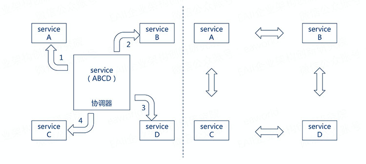
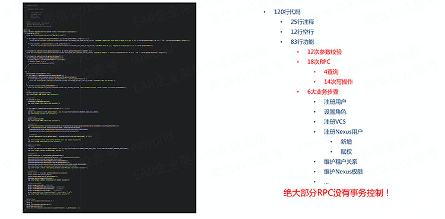
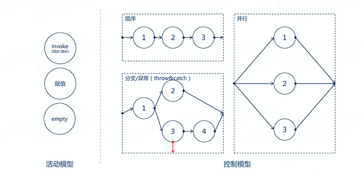
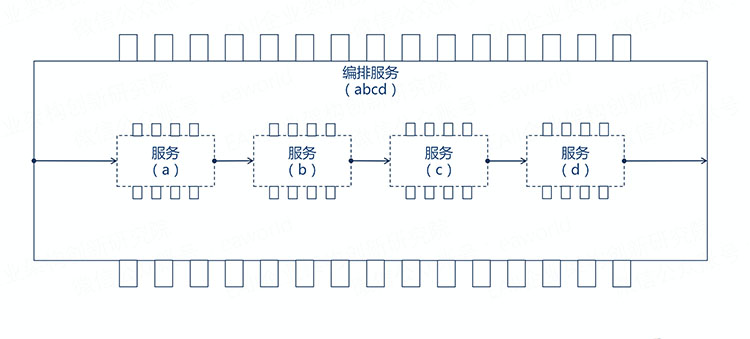
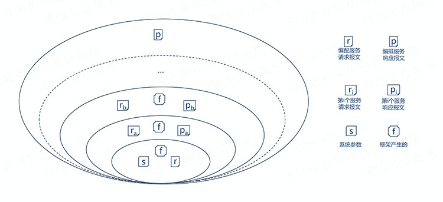
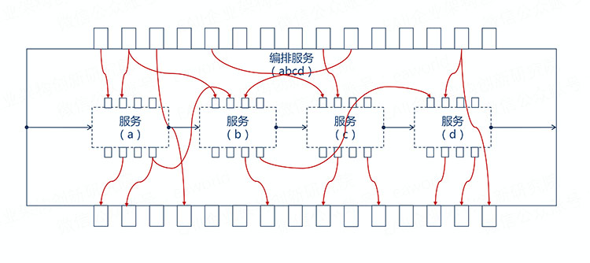
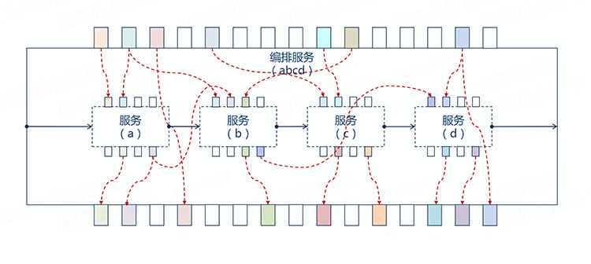
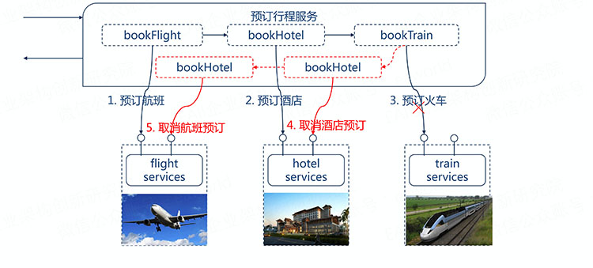
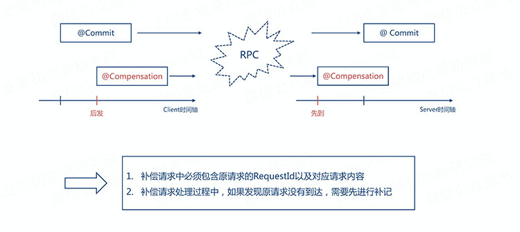

# [服务都微了，编排怎么整?](http://p.primeton.com/articles/59030eeda6f2a40690f0362f)

2017年

> 相对于传统架构，微服务架构下更需要通过各微服务之间的协作来实现一个完整的业务流程，可以说服务编排是微服务架构下的必备技能。但是，编排涉及到RPC、分布式事务等等，编排的质量不能仅仅取决于老师傅的手艺，需要有完善的编排框架来支撑。

转载本文需注明出处：EAii企业架构创新研究院（微信号：eaworld），违者必究。如需下载此文PPT，加入微信群参与微课堂、架构设计与讨论直播请直接回复此公众号：“加群 姓名 公司 职位 微信号”。

**目录：**

1. **编制、编排傻傻分不清楚**

1. **“编排”的关键在于流程+适配**

1. **“编排”中的分布式事务应满足最终一致性**

1. **“编排”需要更友好的运维工具支撑**

相对于传统架构，微服务架构下更需要通过各微服务之间的协作来实现一个完整的业务流程，可以说服务编排是微服务架构下的必备技能。但是，编排涉及到RPC、分布式事务等等，编排的质量不能仅仅取决于老师傅的手艺，需要有完善的编排框架来支撑。

首先作一点说明，我们认为流程有长流程和短流程之分，长流程是指包含人工活动的流程，流程的完成时间因为人的因素会在一个较大范围内波动；短流程指的是不包含人工活动的流程，在流程启动后会在一个较短的预期时间内完成。

相对于长流程，短流程会更关注与响应时间和tps等指标，也更关注自动保证事务一致性的能力。所以在技术设计上长流程和短流程会有较大的区别，今天本文主要介绍的是短流程相关的那些事儿。

## 一、编制、编排傻傻分不清楚

说到编排，不得不提两个概念：编制和编排。

**编制的英文是Orchestration，本意是乐队指挥**，在演出的时候，乐队由指挥来统一的进行指挥和控制。

**编排的英文是Choreography，本意是舞蹈编舞**，舞蹈表演通常是舞蹈演员对外部感应作出响应，比如音乐的响应，并且需要与舞伴的行动和表情进行配合。

这两个词用在微服务下，也有类似的含义：

**微服务的编制强调的是通过一个可执行的中心流程来协同内部及外部的服务交互。**通过中心流程来控制总体的目标，涉及的操作，服务调用顺序。

**微服务的编排强调的是协作，通过消息的交互序列来控制各个部分资源的交互。**参与交互的资源都是对等的，没有集中的控制。

可能还是不太好理解，借一个现成的例子：

编制（Orchestration）就好像交通信号灯，控制着车辆什么时候可以通行。而编排（Choreography）就好像是环岛，没有集中的控制，只有一系列的规则来指明车辆在接近十字路口的时候必须要等待，直到有空间进入环岛环绕系统，然后寻找适当的时候离开。

编制初看起来好像没有编排自由，灵活。但是编排也有不完美的地方：

- 编排使一个业务流程会嵌入到多个服务中，维护会困难重重。
- 编排的对等特点，使得两端的服务强耦合，将表现为很难适应需求的变化。

在扩展性上和工程化上编制在一定程度上更优于编排，在一个业务域内编制更适用，而编排更适用跨业务域的流程。

后面要分享的内容，实际上是编制的模式，所以在小节标题上甚至都加了引号。仍然使用编排是因为：

- 第一，他已经太深入人心了，几乎没有听到服务编制的说法。
- 第二，我认为刻意的区分“编制”与“编排”并没有多大价值，重要的是保证各参与方对所用的术语有共同的理解。

## 二、“编排”的关键在于流程+适配

前段时间我参加了一个devops的项目，其中有一部分是这样子的：

在这短短的120行代码中，有25行注释，12行空行，83行功能，包括12次参数校验，18此Rpc（包括14次写操作），包括6大业务步骤，主要功能是实现添加一个用户。但是啊但是，这里面绝大部分是没有事务控制的，可想而知，当真的出现数据不一致的时候我们修复的过程是有多头疼。

我们不能把代码质量完全寄托于老师傅的手艺，编排完全是有章可循的。结合我们自己的产品经验，来说一说要构建一个编排框架要做些什么事儿，这里不可能覆盖所有的细节，所讲的都是个人认为比较重要的。

编排包含3个基本的活动模型**（赋值、invoke（调用）、空）**和5个基本的控制模型**（顺序、分支、异常抛出、异常捕获、并行）**。

当然很多编排框架提供了更多方便的活动，比如普元的编排框架提供了本地调用、rest调用、webservice调用等活动，从而在使用上更加的方便。

有了这些基本的模型，我们就能方便的编排出复杂的业务流程。

作为一个老师傅，在invoke的时候我们知道有同步和异步的区别，同步实现起来简单，但是在多级级联编排的时候要避免因为某个服务的长响应时间导致雪崩效应，一般可以通过设置合理的超时事件和服务熔断策略来避免；同样在异步调用的时候，应该能自动缓存上下文和避免缓存爆掉，能自动建立异步响应和请求之间的关联。

同样提到并行也必须考虑不同的聚合方式，部分聚合？全部聚合？

流程编排完成之后也仅仅是走完了第一步，我们还需要**给每个被编的服务提供正确的参数，是一个适配的过程。**

一个编排服务（abcd）由a、b、c、d服务编排而成，每个服务都会有自己的出参入参。适配的过程就是从上下文中给入参赋值以及将出参的结果写入到上下文中。

**编排服务执行到不同阶段，组成上下文的模型也是不一样的。**从最初服务的开始执行的时候，上下文中只有系统级的参数和入参（请求报文）。到执行完一个被编服务后上下问就会增加这个被编服务的出参（响应报文），执行上下文是一个不断增大的过程。

所以适配不仅仅存在与编排服务的入参和被编服务的入参之间，还存在于被编服务和在其之前的服务出参之间。

最直接的莫过于依靠我们勤劳的双手，完成点到点的映射赋值。只是吧，“勤劳”完了也是没有什么成就感的。

当然，我们作为老师傅还是有一些过人之处的，我们有一种解放双手的武器。

这个武器就是元数据，我们通过使用元数据对所有的出参和入参标记着色，然后就可以自动完成同样颜色之间的自动映射。

之前说到执行上下文的组成模型的时候还包括一个框架产生的部分，这一部分数据主要是流水号（id）和安全方面的考量。按照[《基于微服务的企业应用架构设计范式》](http://mp.weixin.qq.com/s?__biz=MzI5MDEzMzg5Nw==&mid=2660394363&idx=1&sn=e064f8fdebee56e20461e238c346f5d6&chksm=f742479dc035ce8bd6d82a921a632ad0ec36d20577b8a4b68531d29f44047930b616e008da17&scene=21#wechat_redirect)流水号的生成应该遵循GAIR模式。

- **globalId**: 全局流水号，如果请求中的globalId为空，则编排服务生成；否则保持不变
- **answerId**: 响应流水号，服务提供者生成；可以作为提供者受理的凭证
- **inRequestId**: 前台流水号，由前台生成
- **requestId**: 请求流水号，编排服务的协调器生成；生成规则由服务提供者定义

能编排流程，能适配参数，这个编排框架已经具备运行的能力，后面我们要考虑的就是事务的一致性问题。

## 三、“编排”中的分布式事务

应满足**最终一致性**

依据CAP理论，必须在可用性（availability）和一致性（consistency）之间做出选择。如果选择提供一致性需要付出在满足一致性之前阻塞其他并发访问的代价。这可能持续一个不确定的时间，尤其是在系统已经表现出高延迟时或者网络故障导致失去连接时。

依据目前的成功经验，可用性一般是更好的选择，但是在服务和数据库之间维护数据一致性是非常根本的需求，我们的编排框架应该选择满足最终一致性。补偿模式就是就是一种很好的实现最终一致性的途径。

我们通过一个实例来说明补偿模式，一家旅行公司提供预订行程的业务，可以通过公司的网站提前预订飞机票、火车票、酒店等。

假设一位客户规划的行程是，（1）上海-北京6月19日9点的某某航班，（2）某某酒店住宿3晚，（3）北京-上海6月22日17点火车。在客户提交行程后，旅行公司的预订行程业务按顺序串行的调用航班预订服务、酒店预订服务、火车预订服务。最后的火车预订服务成功后整个预订业务才算完成。

如果火车票预订服务没有调用成功，那么之前预订的航班、酒店都得取消。取消之前预订的酒店、航班即为补偿过程。

在补偿模式中，我们要求参与补偿的微服务必须提供补偿操作，并且补偿操作必须是幂等的。补偿框架可以在异常时自动调用补偿操作完成补偿。

现在restful作为一个轻量级的rpc协议已经被广泛采用，能不能很好的支持restful服务的事务一致性也是衡量一个编排框架的是否成熟的一个标准。我们公司的王博士设计了一套restful扩展规范来支持补偿模式的事务一致性。

通过PATCH的HTTP Method来表示compensation操作，并且支持通过服务来查询编排服务执行的状态。

再说一个常见的坑：

由于是通过rpc的调用，因为网络和调度的关系，可能出现补偿请求比原交易先到达的情况。这会导致补偿操作直接会失败，因为此时原交易尚未发生；最终原交易到达时会被成功的执行，最终就导致了事务不一致。

填这个坑的办法就是在编排框架发现补偿操作补偿的原交易不存在时，补记录一条原交易的流水，从而保证原交易晚到时会因为记录流水失败而不会成功。

关于事务一致性的更多内容可以参考之前的关于数据一致性的分享：

- [《微服务架构下的数据一致性保证（一）》](http://mp.weixin.qq.com/s?__biz=MzI5MDEzMzg5Nw==&mid=2660392782&idx=1&sn=d28e43bf6f7cf140eed9fffcf2f29e86&scene=21#wechat_redirect)

- [《微服务架构下的数据一致性保证（二）》](http://mp.weixin.qq.com/s?__biz=MzI5MDEzMzg5Nw==&mid=2660392866&idx=1&sn=6b5d58b83dd71d7d7302b91f7a89c910&scene=21#wechat_redirect)

- [《微服务架构下的数据一致性保证（三）》](http://mp.weixin.qq.com/s?__biz=MzI5MDEzMzg5Nw==&mid=2660392948&idx=1&sn=11602f1258af8bbf88322558aa8a2f21&scene=21#wechat_redirect)

## 四、“编排”需要更友好的运维工具支撑

在生产环境中，我们需要通过查看日志来排除故障，应该有支持日志全路径回放的工具，来帮助我们快速定位故障。

另外我所讲的编排实际是编制，是一种集中式的控制，也就意味着如果被编排的服务有响应缓慢的情况，可能会影响到其他服务。这时候我们需要更快的监控来帮助我们发现这类服务，从而尽早优化。

## 五、总结

最后，总结一下，服务编排有两种：编排和编制。**编制是集中式控制，编排强调的是协作。**在扩展性上和工程化上编制在一定程度上更优于编排，在一个业务域内编制更适用，而编排更适用跨业务域的流程。

**考虑到服务编排的复杂性，我们不能完全依靠经验丰富的老师傅，使用编排框架能大大提供生产力。**构造一个编排框架至少要支持**3+5模型**，应该采用**元数据**着色来自动适配服务参数的方法，更进一步要考虑事务（分布式）一致性，补偿模式通常是一种很好的保证事务一致性的方法。

> **关于作者**
> 田向阳
> 现任普元解决方案中心架构师。曾就职于神州数码主持研发新一代自主渠道主线、中间业务平台。金融领域技术高手，操作系统、编程原理爱好者，喜欢问为什么的工程师。
>
>
> **关于EAii**
> EAii（Enterprise Architecture Innovation Institute）企业架构创新研究院，致力于软件架构创新与实践，加速企业数字化转型。
>
>
> **eaworld**项目（微信号：eaworld，长按二维码关注）
>
> eaworld是EAii的官方微信账号。
>