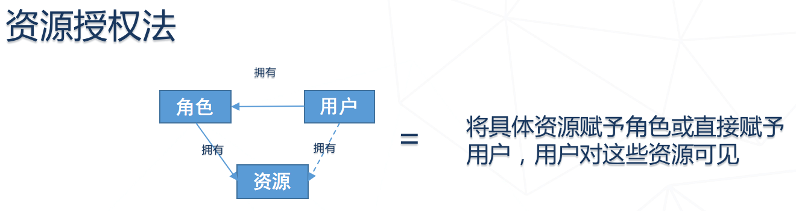

# 应用基础框架之权限控制

2019年4月

引言：

本文主要是向大家介绍下我们的应用基础框架coframe，以及在权限控制方面的一些设计与实践。

目录：

一、应用基础框架简介

二、应用权限模型设计

三、应用权限控制

## 一、应用基础框架简介

相信很多同学都有过这样的经历，刚做完一个项目，开始一个新项目的时候，发现基础能力又要重新开发一遍，用户，登陆，菜单，机构人员，权限管理等等。重复的工作枯燥而没有价值，却不得不做。能否来个什么框架，可以直接提供这些开箱即用的基础能力？

回答当然是有，我们这里把这种包含了应用基础能力与通用业务模块的框架，称之为应用基础框架。它就像一个半成品的车架，已经有了基本的架子，轮子，发动机，方向盘等，基本上已经可以跑了。但是车子更多的其它能力，还等待人后续去完善。

完整的应用基础框架，应当包括应用后端基础框架与前端展现基础框架（包括 web 或移动）。这样两者配合使用，才能直接为应用提供开箱即用的业务能力。

不论前后端，我们认为框架可以分为以下四层：

1. 基础依赖层：基本上定义的框架的技术栈，采用什么语言，什么框架，依赖哪些基础库或组件等
2. 基础能力层：定义的是基础能力，后端包括对异常的定义，国际化的处理，ORM模型的抽像等等，前端则是对菜单，路由，通信等的框架化封装，通用基础组件的抽取等
3. 通用业务层：实现通用的一些业务能力，如用户管理，登入登出，权限控制等等
4. 用户业务层：这一层交由用户去扩展，实现各自已的业务能力

Coframe就是我们构建的这样一套应用基础框架。它的后端框架，基于 spring boot + spring security + jpa, 前端基于 vue + iview。

coframe提供的基础能力有：

1. 组织机构：机构树管理，机构管理，岗位管理，工作组管理，员工管理
2. 用户认证：用户管理，本地认证，单点登陆（需与 iam 集成）
3. 权限管理：权限模板管理，角色模板管理，角色管理，资源组管理，菜单管理，功能管理
4. 数据字典：字典类型管理，字典项管理，字典国际化，导入导出
5. 日志管理：统一日志接口，日志全索

所有这些能力开箱即用。

下面我们重点分享一下关于应用权限方面我们的一些设计与实践

## 二、应用权限模型设计

首先，我们要了解一下，什么是权限。我们认为，权限就是用户对某些资源的控制能力。所以，模型上我们就有了一个抽像的资源概念。

资源按类型具化，可能是用户在门户上可见的菜单，或者是页面上可见可点击的某些按钮，或者用户在应用后端可以调用的某个接口等。

用户通过角色，与这些资源建立了关联，我们才能在系统中通过用户找到这些资源，然后对它进行控制。

因此，用户，角色，资源的关系，就是一个用户可分配多个角色，一个角色，可以关联多个资源。如下图所示：

为了方便角色进行资源授权的管理，我们又提出了几个服务于它们的概念：角色模板，权限模板，资源组。

资源组，顾名思义，就是资源的分组。它是一个树状模型，目前主要设计使用了三层。顶层的代表着某一块的资源总集，比如某个子系统的资源总集。

权限模板，它通过关联多个顶层的资源组，可以代表着某个范围内的可授权资源总集。角色模板关联着权限模板，从它的这个资源集合中挑出了一部分。

角色则是在创建的时候，复制模板的这些资源授权。但它后续可以修改，整个可授权资源仍为权限模板代表的总集。

资源的授权如上图所示。顶层的资源组代表着某一块的资源总集，第二层则代表不同的资源类型，如菜单，功能，环境等。第三层代表着模块，比如机构管理模块的菜单。第三层的资源组之下，才关联具体的资源。对角色或者角色模板进行资源授权配置时，只需要找到对应的资源类型与模块，再找到相应的资源，点击是否勾选即可完成授权，非常地直观。

用户是如何与资源关联起来的呢？如下图，这里我们假设了一个示例。

某应用集成了 coframe，其下又分了三个子系统。为了方便资源的管理，我们为每个子系统设置了一个顶层的资源组，然后为它配置了下层资源组与资源。然后，我们设置了两个权限模板，其中一个负责 coframe 与子系统一的资源，另一个则负责三个子系统的资源。基于两个权限模板，我们分别创建了角色一与角色二。三个用户中，用户一分配了角色一，用户二分配了角色一与二，用户三分配了角色二。用户一可分配 coframe 与子系统一中的资源，用户二可分配所有资源，用户三则只能分配三个子系统的资源。这样，资源的组合与隔离，会变得相当方便与直观。

## 三、应用权限控制

我们认为，应用的权限控制可以分为如下四类：

1. 菜单：用户在应用门户中可见哪些菜单可以通过权限控制
2. 按钮/链接：用户在门户页面中，哪些按钮可见可操作，可通过权限控制
3. 接口调用：不通过门户，直接通过客户端进行接口调用，接口是否允许调用可以通过权限控制
4. 数据：用户是否可见某些数据，能否操作可以通过权限控制

### 菜单控制

菜单的控制其实比较简单。用户登陆成功后，前端会再来取一次用户的菜单项。后端服务根据用户分配的角色中，包含的菜单资源，在门户中组织出他所持有的菜单树。

但是菜单的组织过程，却也可以有一些不同。这里我们一种称为动态结构，另一种为静态结构。

动态结构首先要求菜单本身为树状结构，且菜单对应的页面（vue 中叫路由），图标等也记录在菜单中。整个菜单的层次结构，由菜单本身的树状结构表现。这种结构的好处是菜单配置非常灵活，菜单可以完全通过页面操作进行定制。这种结构适合经常需要动态变更的系统，且菜单配置人员对前端要非常地熟悉。

另一种静态菜单结构，则菜单只需要一个平铺关系即可。菜单的层级，顺序，路由，图标等由前端定义，后端只定义用户可以用到哪些菜单。缺点是菜单定制不够灵活，但优点也很明显，非常便于前端开发，前后端分工更明确。

### 按钮/链接控制

有些系统中，会将按钮的权限与后端功能的权限分开设计为两个模型，但 coframe 中这两个合为一个叫做功能的模型。功能有唯一编码，这个编码在按钮上可控制按钮的显示，在方法上可以控制方法能否调用。

按钮的控制也比较简单，特别是组件化的前端开发框架中。只需要为所有的按钮组件添加一个权限码定义，在页面渲染时，判断一下当前用户是否拥有这个权限码，有则显示此按钮，没有则将按钮从父组件中删除。

### 接口调用控制

在接口调用控制上，我们考虑过使用现成的一些控制方法，如 spring method security。但是它只能控制到角色级，虽然可以规则匹配，但仍然不够灵活。所以，我们基于功能编码，自行设计了一套。

它的基本原理是，我们使用 annotation，在每个需要控制的方法，添加了调用此方法需要的功能编码。方法被调用时，我们通过 aspect 对方法进行拦截，取得调用它所要求的功能码。然后我们在当前用户所拥有所有的功能码（在用户登陆时已查询出来放在 context 中了）中进行对比，如果存在就允许方法调用，否则抛出无权调用的异常。

鉴于有些需要控制的方法可能在父类中，所以我们定义了两个 annotation，一个定义在类上，可以配置父类上需要控制的方法。另一个定义在方法上，配置方法控制的权限码。查询方法调用所需权限码时，优先在方法上找到，找不到再到类上去查找。

为了方便集成的应用实现接口调用控制，我们定义了一个抽象的方法权限切片处理类，封装了对方法调用的拦截过程。应用只需要继承这个类，配置需要拦截哪些接口即可。

### 数据权限控制

数据权限，我们认为数据权限 = 数据可见控制 + 数据操作控制。

而数据操作控制，通过按钮控制与接口调用控制组合，基本上可达到想要的效果。

那数据可见如何控制呢？我们归纳为两种：**成员法**与**资源授权法**。

成员法，就是用户如果为某个领域的成员，则他就可以看到这个领域，以及这个领域中的资源。如何实现呢？简单一点的办法，就是用户的某个角色，属于这个领域，就可以认为这个用户是这个领域的成员。像租户隔离，devops 中的项目隔离，其实就是用的这种方法。

资源授权法，将某个精确的资源授权角色，或者直接授予用户。成员法实现数据可见控制有一个问题，就是粗度太大，不好实现更精确更细粒度的资源可见控制。要实现更细粒度的，可以使用资源授权法。但粒度细也就代表着管理复杂，孰好孰坏需要权衡后去使用。

关于作者：秦双春，现任普元云计算架构师。曾在PDM，云计算，数据备份，移动互联相关领域公司工作，十年以上IT工作经验。曾为科企桌面虚拟化产品的核心工程师，爱数容灾备份云柜系统设计师，万达信息的食安管理与追溯平台开发经理。国内IAAS云计算的早期实践者，容器技术专家。
