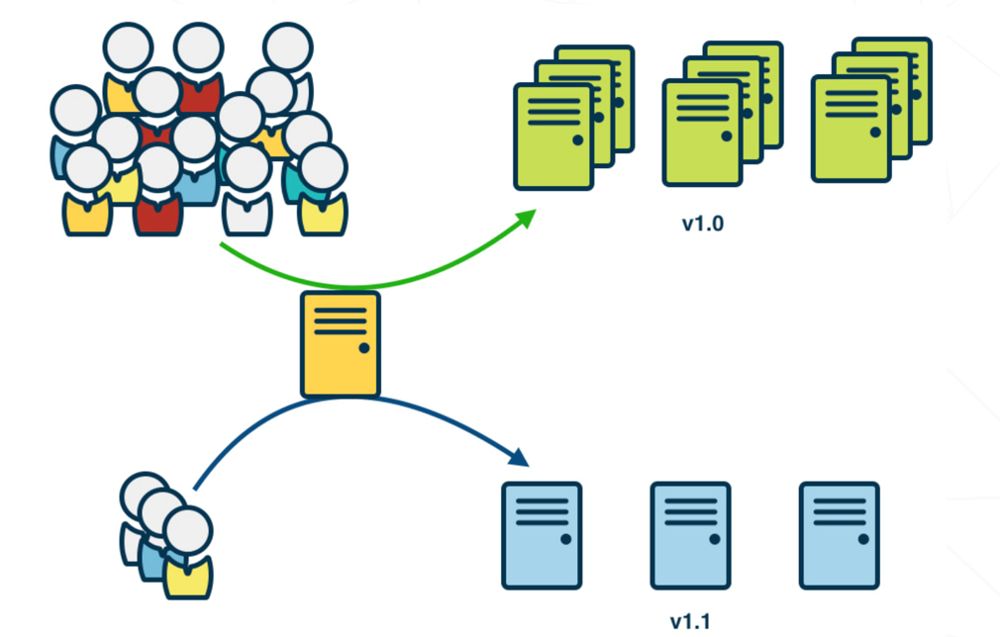
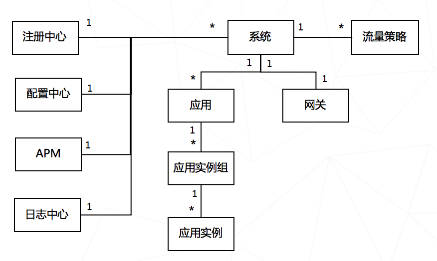
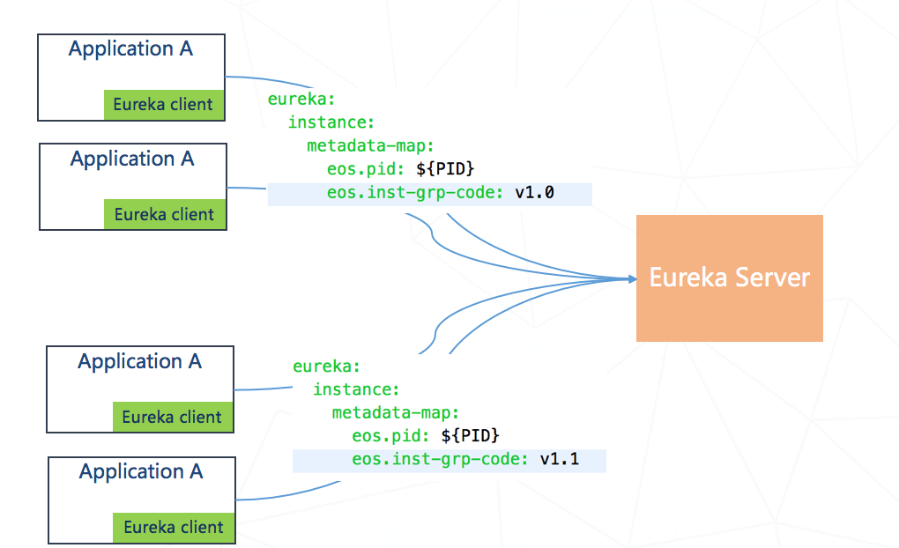
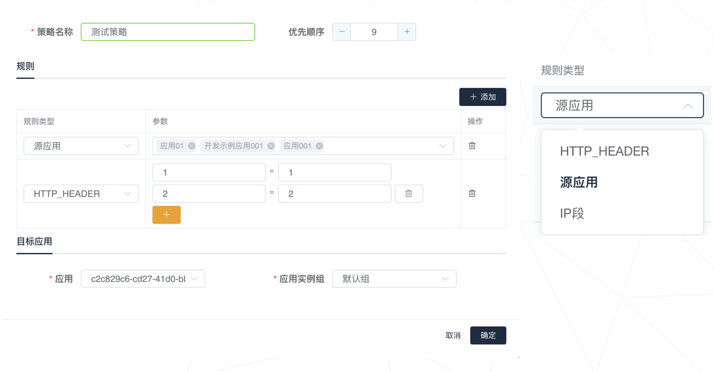
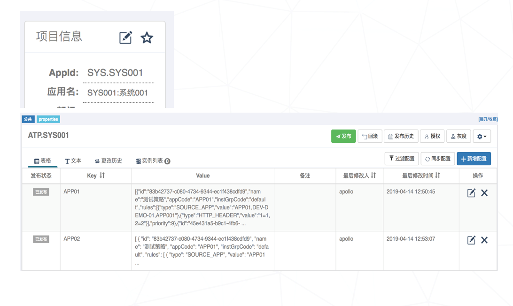
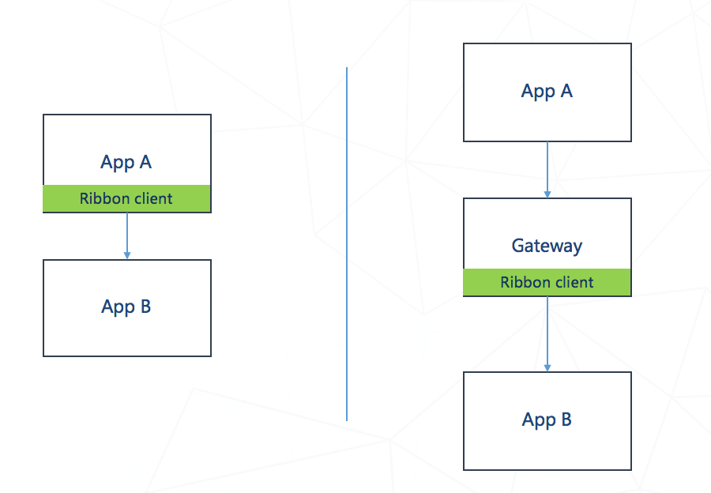
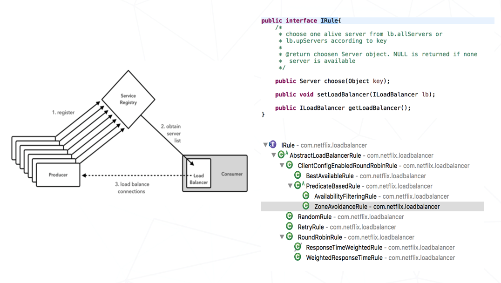
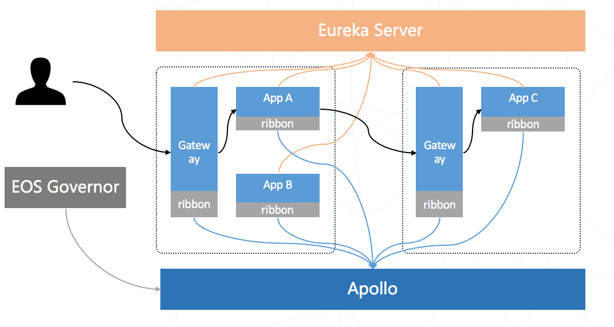
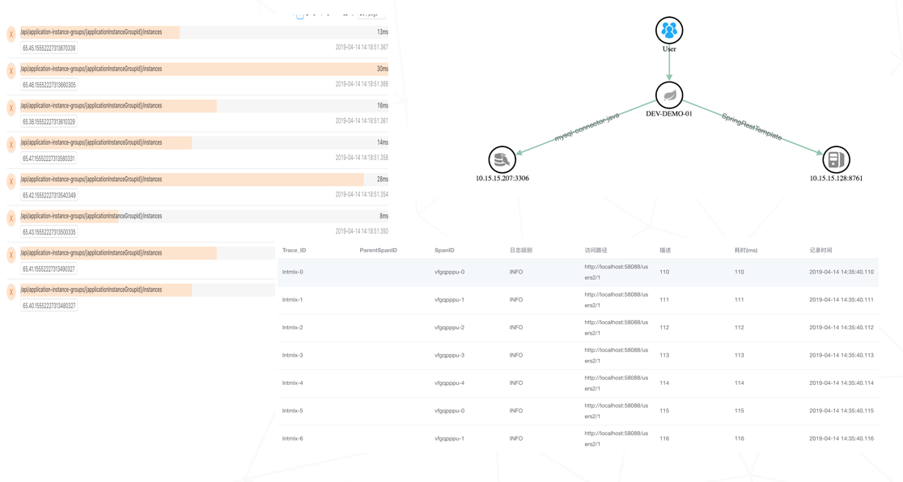

# [微服务平台之灰度发布](http://p.primeton.com/articles/5cb7e51a4be8e61159002edd)

2019年4月

> 用灰度发布来控制上线风险

引言：

灰度发布是指在应用的新、旧版本间平滑过渡的一种发布方式。根据特定的规则，挑选一部分用户访问灰度版本的服务，并逐步扩大范围，最终把所有用户访问迁移到新的版本上来。灰度发布时，主要涉及设置流控规则和部署新版本这两个动作，本次主要是介绍在EOS8微服务平台里灰度发布的流量控制。

目录：

一、灰度发布介绍

二、灰度发布实践

三、灰度发布后的监控

## 一、灰度发布介绍

灰度发布是指在应用的新、旧版本间平滑过渡的一种发布方式。在应用发布与产品迭代中，通常会采用灰度发布来控制上线风险。在发布前先进行小规模的生产环境验证，让新版本的应用实例来承接、处理限定规模或范围的业务流量。通过收集使用体验的数据，对应用新版本的功能、性能、稳定性等指标进行评判，进而决定扩大新版本部署范围直至全量升级或回滚至老版本。

灰度发布时，主要涉及设置流控规则和部署新版本这两个动作，这2个动作没有一定的先后次序。可以：

1. 部署新版本 -> 设置流控规则：可能的问题是在灰度规则设置生效前，进入新版本应用实例的流量可能不是灰度的。

2. 设置流控规则 -> 部署新版本：可能的问题是新版本未部署前，灰度流量会降级路由到非灰度环境，在第一批新版本实例在发布后，有受到全部灰度流量冲击的风险。

## 二、灰度发布实践

下面主要介绍下EOS8微服务平台里灰度发布的流量控制。

### 1、概念介绍

这是EOS8里的【系统】相关的概念模型：

1. 一个系统有多个应用组成，一个应用就是一个微服务，一个应用可以有多个实例组
2. 一个系统有一个网关，跨系统之间的API调用需要经过该网关
3. 一个系统上可以配置多个流量策略，该流量策略对系统内应用和网关同时起作用

### 2、实例组注册

实例组是一个逻辑概念。EOS8通过在应用的application.yml文件里的注册中心相关配置里，增加一个key为eos.inst-grp-code的自定义的metadata，用来指定分组，value可以是应用版本或其它值。

### 3、流量策略设置

通过EOS8的Governor页面可以设置一个系统的流量策略。一个系统内可以有多个流量策略，流量策略可以设置优先级以及是否启用。一个策略主要由2部分组成：

1. 规则：用于定义的用于匹配请求来源，支持HTTP_HEADER、源应用以及IP段3种规则。
2. 目标应用：用于定义满足【规则】的请求会被路由到本系统的哪个应用以及哪个实例组。

流量策略会保存在Apollo的配置中心，这样可以方便应用和网关监听流量策略配置的变化。

我们会给每个系统在Apollo上创建一个项目，项目名称为 “SYS.”+系统编码，系统编码要求全局唯一。在该项目下，我们会创建一个Apollo公共的Namespace，名称为 ”ATP.”+系统编码，使用公共namespace是为了让应用和网关都可以使用该namespace的配置。

保存在Apollo上的配置，是以目标应用编码为key，value是和该目标编码相关的流量策略集合。

### 4、请求路由

调用请求分类分为2部分：

1. 系统内调用：系统内应用互相调用，这种调用不需要经过网关，由应用之间直接互调，支持RestTemplate和Feign
2. 跨系统调用：跨系统的应用互相调用，需要经过网关路由转发

EOS8的微服务平台里使用的是Spring Cloud Netflix和Spring Cloud Gateway，所以以上2种情况可以归纳为如何在Ribbon Client上实现流量策略的路由转发，不同点在于：

1. 系统内调用时，如果规则是HTTP_HEADER，匹配的是Client(RestTemplate或者Feign)发送时的请求头
2. 跨系统调用时，如果规则是HTTP_HEADER，匹配的是网关收到的请求头

Ribbon 是一种客户端负载，配合注册中心一起使用时，可以根据被调用的服务名选取合适的实例进行服务调用。Spring Cloud Netflix Ribbon 也提供了比较方便的扩展，可以自定义IRule并通过AutoConfiguration自动注入。

可以在自定义的IRule里实现根据流控策略选择合适应用实例进行服务调用，配合Apollo Client一起使用，可以达到动态修改流控策略的效果。

需要注意的是如果是Hystrix和Ribbon一起使用的时候，可能会遇到跨线程传递数据的问题，可以有以下几种方案选择:

1. 使用HystrixRequestVariableDefault
2. 自定义HystrixConcurrencyStrategy
3. 使用Spring Cloud Sleuth

### 5、实现流程

总结一下，灰度发布的大概实现流程：

1. 应用启动时指定实例分组，并注册到注册中心

2. 应用连接到Apollo，获取本系统的流量策略，并设置Apollo的监听器，监听流量策略配置的变化

3. Governor修改流量策略并保存到配置中心

4. 当有请求访问时，不论Gateway还是App都会在Ribbon上做负载均衡，做负载均衡时就会根据要访问的应用编码查看是否有流控策略，如果有流控策略则按流控策略路由，如果所有流控策略都不满足会就会路由到默认组；如果没有流控策略也是路由到默认组

## 三、灰度发布后的监控

灰度发布后，需要监控灰度发布的版本是否正确，比如：

1. 是否有不满足流控策略的请求路由到灰度版本实例，或者应该路由到灰度版本的请求
2. 灰度版本的程序功能是否正确，响应时间是否正常等
3. 灰度版本的整个请求链路日志是否正确

这些可以通过Governor的业务链路来查看，监控信息主要来自于SkyWalking以及ES的日志。确认无误后，可以增加灰度版本实例，并下线老版本。
