# [一文了解金融行业服务治理](http://p.primeton.com/articles/5d2ee1b44be8e604d6002d12)

2019年7月

> 通过服务治理体系支持金融行业基础架构向微服务架构转型。

引言：

微服务等新技术在解决系统敏捷性的同时，也带来了新的问题，众多的服务被识别出来后需要有效的管理起来，内部系统与外部系统通过服务方式进行双向集成，既有服务“引进来”，也有服务“走出去”。数量和种类繁多的服务如何管理？如何在复杂的微服务系统中实现问题快速定位与恢复？

从业界发展经验和众多实际案例来看，这一系列问题都需要建立企业服务治理体系来解决，通过服务治理体系支持金融行业基础架构向微服务架构转型。

目录：

一、服务治理原则

二、服务治理体系

三、服务治理平台

## 一、服务治理原则

### 组织：建立专业的人员保障

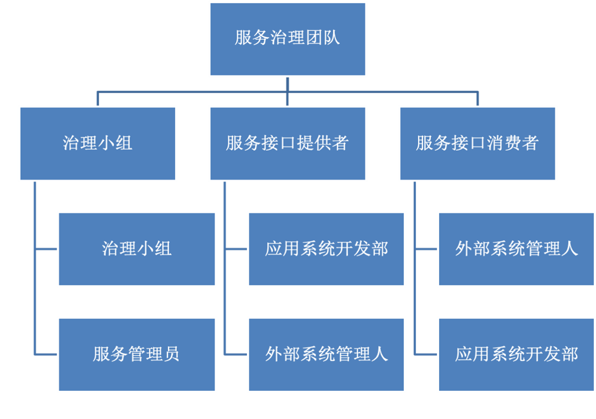

服务治理是咨询+实施类项目，不仅仅是部署一套平台工具。为了实现服务治理的效果，需要由专业的人员参与。各个角色的职能如下：

- 治理小组，推动和实施服务治理活动，确保管理体系和平台工具的执行，监控服务接口的运行情况，评估服务治理的绩效，保证服务治理最终实现业务目标和需求。

- 服务管理员，在服务治理系统中完成应用系统名称的注册和注销；完成对服务接口注册申请审批、变更审批、注销审批，定期检查和审计服务接口使用情况和状态。

- 服务接口提供者的应用系统开发部，内部服务接口的提供方责任人，负责提供服务接口，保障服务接口运行稳定、可靠。

- 服务接口提供者的外部系统管理人，在业务支撑系统中有可能调用的外部服务，比如天气预报、航班信息等。

- 服务接口消费者的外部系统管理人，外部系统使用业务支撑系统开放出来的接口，比如：话费查询、余额查询等。

- 服务接口消费者的应用系统开发部，业务支撑系统内部各个系统之间的调用通过集成平台进行，服务消费者按照管理规范进行服务接口调用。

完善的管理流程和后面的几个原则有一定的关联性，比如流程的参与者是“专业的人员”、流程环节中的相关操作，需要由平台和工具提供支撑。

### 技术：建立统一的技术标准

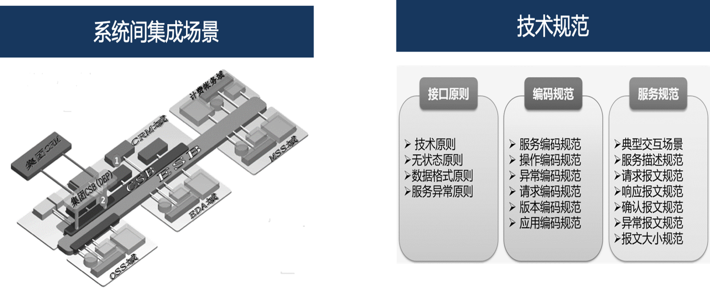

在“移动互联”和“互联网+”的时代，服务调用的次数更高，时间响应的要求更短。统一的技术标准可以减少开发时间，减少不必要的协议转换、消息转换，提高响应速度，服务治理更关注于过程管理本身。

服务治理过程中统一技术标准的意义类似于古代“车同轨，书同文”。也就是服务调用过程中涉及到诸多技术标准：接口原则、编码规范、服务规范等要统一，并且随着技术和为了提高服务开发效率和响应速度，需要制定统一的技术标准，服务治理的重点从早期的协议转换演进为服务管理。

### 平台：以平台支撑服务治理

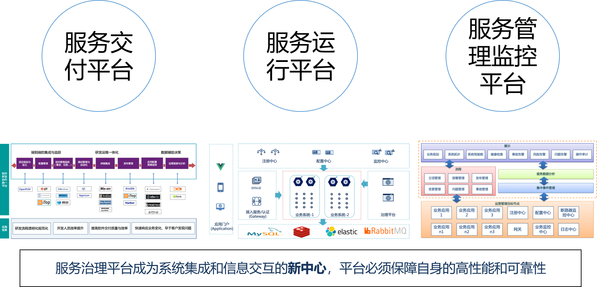

企业数字化时代，产业链控制力空前强大，企业间协作越来越频繁。服务治理的平台工具必须能够承受更大的压力。

企业数字化转型之后，系统间集成越来越多，服务治理平台处于核心的枢纽位置，平台的稳定性和性能是业务运营的基础。

强大的平台要求主要体现在：高性能、可靠性、扩展性等非功能性方面！

平台工具：

- 设计期
  - 登记平台：负责微服务全生命周期管理，包括 域、业务系统、应用、微服务、微服务版本、API；
  - 交付平台：即DevOps，负责服务的开发、测试、构建、发布等能力；
服务定义库：负责存放服务定义信息，包含已发布和未发布的各个版本的服务描述信息；

- 运行期
  - 注册中心：负责应用实例和服务实例的元信息管起来，并推送给消费者，定期从提供者更新配置；
  - 配置中心：负责微服务配置管理，更新服务标识，调整服务配置，设置服务策略多层；
  - 监控中心：运行期微服务监控、网关管理与监控、应用配置管理等;全面实现可管，可优；

### 系统：先解耦、再整合

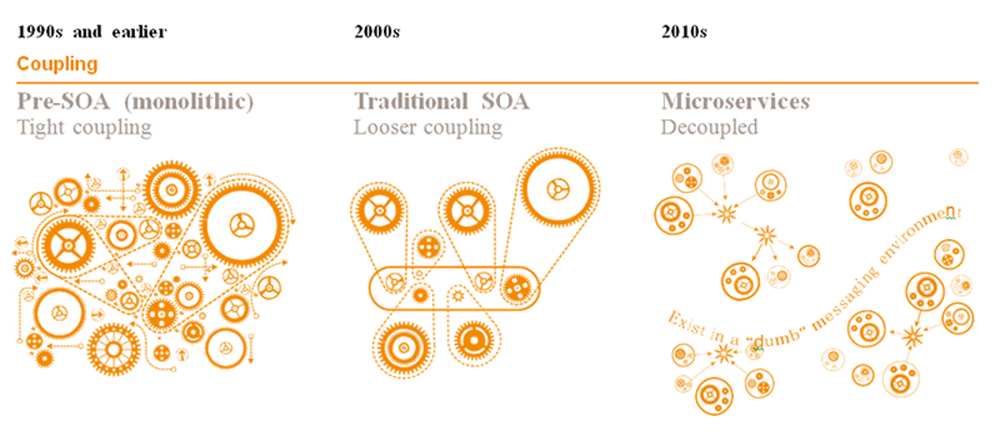

现有大而全的系统犹如一张大网，错综复杂，系统边界不清晰、系统部署架构和功能架构不清晰。牵一发而动全身，项目改造难度极大、成本极高。

企业为了适应业务的发展，IT系统必须敏捷。敏捷的前提是对现有的“大饼”系统需要解耦，解耦之后业务系统由多个小系统组成，系统间边界清晰、系统间交互明了。通过解耦减低了系统演进的复杂度、提高业务创新和业务融合的速度。

需要从三个方面解决问题：

- 解耦：将现有大而全的系统采用服务架构和标准化技术进行功能和部署的解耦；
- 集成：因为业务的关联性，解耦伴随着需要解决集成问题，通过引入工具对服务进行管控；
- 管控：通过在服务集成基础之上建设服务治理平台，实现服务的全生命周期管理，全面提升IT集成能力。

### 服务：自上而下和自下而上区分对待

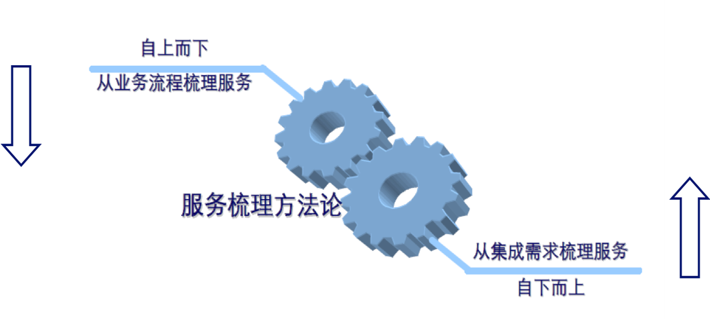

在系统解耦和服务发现的过程中涉及到两种服务梳理方法， “自上而下”和“自下而上”两种方式各有利弊，项目实施时需要根据实际情况选择合适的服务梳理方法。只有适合实际系统改造的方法才是最好的。

多维度的服务拆分：

- 业务限界上下文
- 业务变更频率
- 系统非功能性需求
- 组织结构
- 团队规模
- 技术异构和现有系统复杂度

### 流程：结合企业IT管理需求设置合适的管理流程

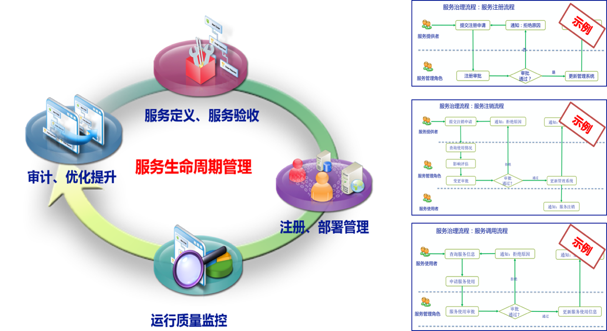

服务治理的过程很复杂，主要因为如下方面的原因：

- 首先，涉及到的人员多：服务提供方、服务消费者、服务管理员等角色；
- 然后，涉及到的环节多：服务定义、服务注册与部署、服务运行监控、服务优化等环节；
- 最后，涉及到的流程多：服务注册、服务注销、服务变更、服务调用等流程；

服务治理实现了服务的全生命周期管理，项目实施时需要根据企业管理要求制定出可落地、可执行的管理流程。清晰的定义出什么人（组织），在什么地方（平台），做什么事情（工具）。

流程管理可以是线下的，也可以借助专业的BPM平台实现。两种方案实施的成本和周期差异较大，实施方案需要根据实际情况而定。

### 工具：完备的管理手段

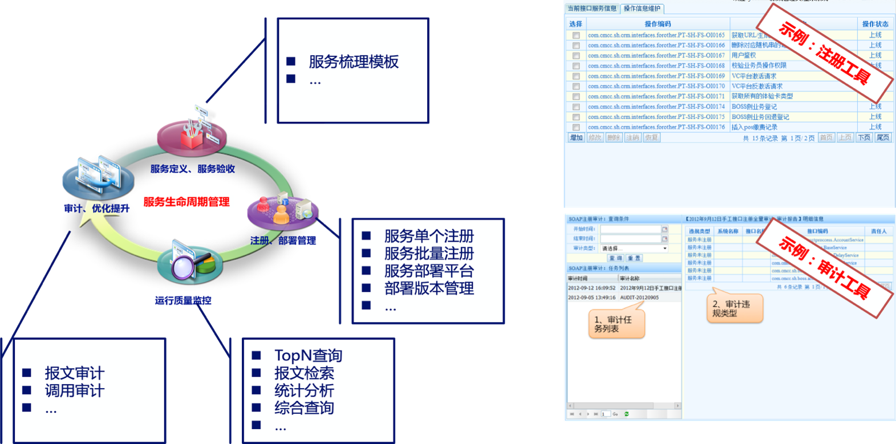

平台提供服务调用、单个服务注册、批量服务注册、报文审计、调用审计、TopN查询、报文检索、统计分析查询等功能。

通过完备的管理工具实现对服务的全生命周期管理。

服务治理平台首先满足服务集成的功能，在服务治理过程中还需要提供灵活易用的工具，实现对服务的全生命周期管理。

### 审计：建立独立第三方稽核

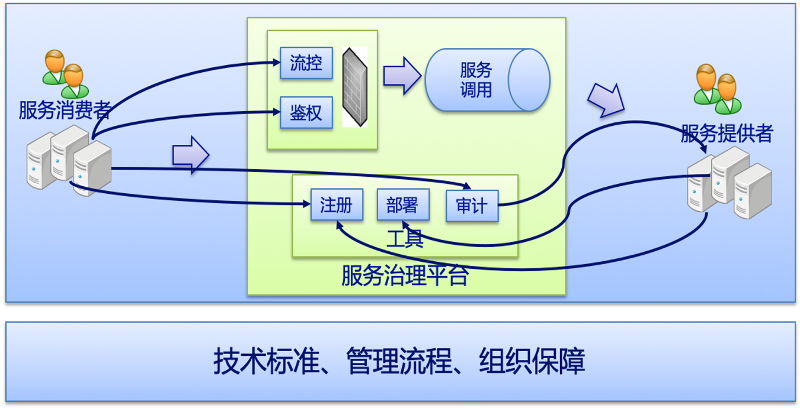

建立独立第三方稽核的含义是：

服务治理涉及到服务管理的各个阶段和众多的参与者，为了检查技术标准和管理流程的执行情况，在关键环节需要对服务消费者和服务提供者进行实施稽核的人员必须中立，能够提供专业、公平、公正的审计报告，并指导各方持续改进。

服务治理项目团队需要制定出符合企业IT架构发展的技术标准和管理流程，并能够提供相应的管理工具对关键环节进行稽核，对标准和流程的执行情况能够及时度量。

同时兼顾服务提供者和服务消费者，真正做到“标准可落地，流程可执行”，因此，服务治理项目建议由独立的第三方组织实施。

服务治理项目实施成功的关键因素是项目团队能够保持中立的立场，提供公平、公正的稽核管理。

### 过程：持续化的服务管理

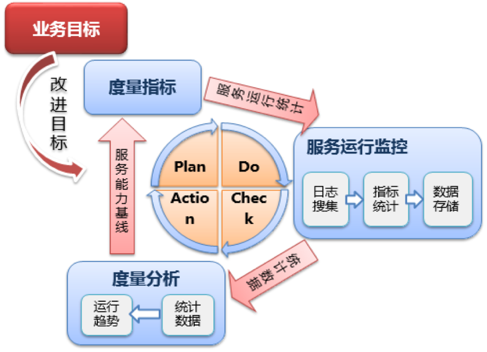

服务上线仅仅是服务生命周期管理的开始，业务的连续性需要IT系统提供长期的稳定运行，服务治理是一个持续的工作，服务治理的过程需要专职、专业的人员，采用完善的流程，利用丰富的工具，不间断的检查技术标准和管理过程的合规性。

## 二、服务治理体系

### 服务建模

服务建模是一个收集、分析、识别的过程。

- Step1： 业务需求的收集和整理。

  包含特定的场景、用户群、业务目标等硬性指标，还可以包含如用户体验、较之竞争对手的一些特色等的软性指标。

- Step2：业务分析。

  可视化业务建模。与业务领域专家一起使用通用语言文档化整个业务过程。

- Step3：识别候选业务过程需要的所有服务。

  这些服务有些是新实现的，有些是已有的。有些可能是在微服务架构体系下通过API 网关调用实现的，有些可能是通过ESB调用实现的。包含：

  - 原子的（单步的）；
  - 组合好的（多步的，操作类流程，有无工作流皆可）
  - 已有的虚拟服务流程（如：承保、核保、风险指标或登记的计算）
  - 基础设施（如：邮件通知、短信通知、在系统中生成一条代办事项）

- Step4：对上一步识别的服务所使用的对象确定并可视化其状态和行为。

- Step5：服务识别过程成果基于服务模型等规范的落地实现

  服务识别成果与对于服务模型、元数据的对应归纳、分类和具体实现设计、编码、复用等工作

- Step6：服务的发布

  服务在开发、 测试、生产环境中的部署、调试和上线

- Step7：服务在运行态的监控、发现与治理

### 元数据模型

元数据模型分为静态和运行态两类

#### 元数据模型-静态

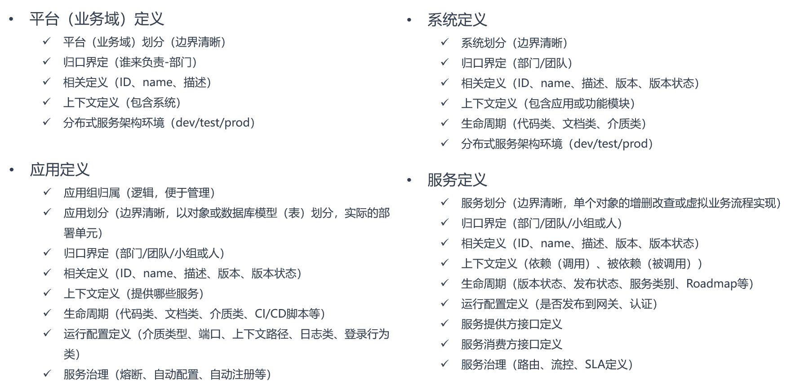

静态包含：按层级划分为：平台定义、系统定义、应用定义和服务定义。根据业务变化，可以在对应分类中，扩充属性。

### 元数据模型-运行态

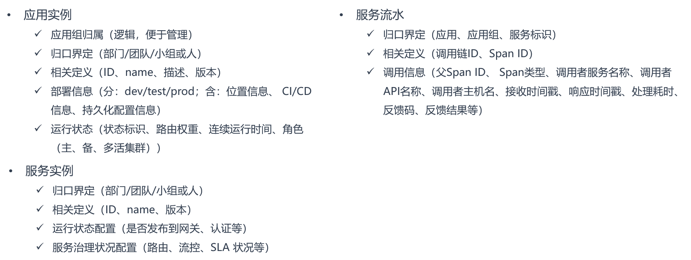

运行态模型包含：应用实例、服务实例及服务流水。

### 模型之间的关系

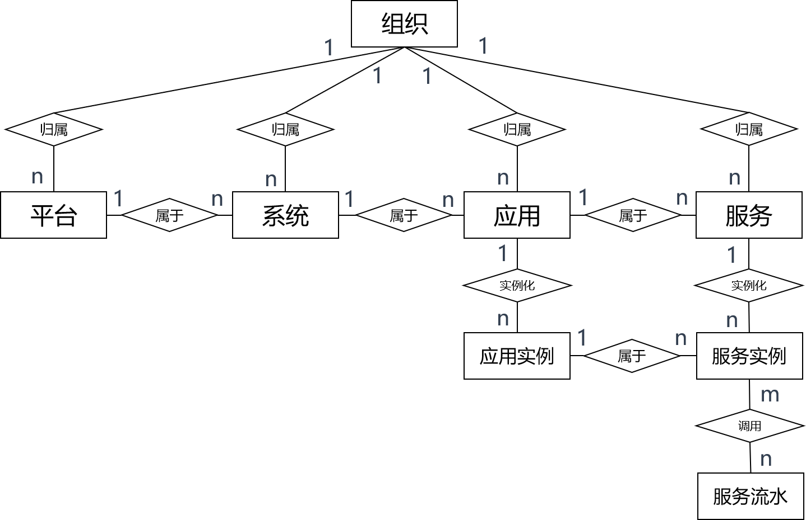

我们看一下各模型之间的对应关系，首先从组织层面的隶属关系来看，一个部门可以负责多个平台，一个部门下的一个团队可以负责一个或多个系统，一个团队下的一个小组或个人可以负责一个应用和多个负责。

一个平台包含多个系统，一个系统包含多个应用，一个应用包含多个服务。应用实例是从应用定义对象的实例化。服务实例是从服务定义对象的实例化。

一个应用实例，通常会支撑提供多个服务实例。服务之间的调用，产生服务流水。

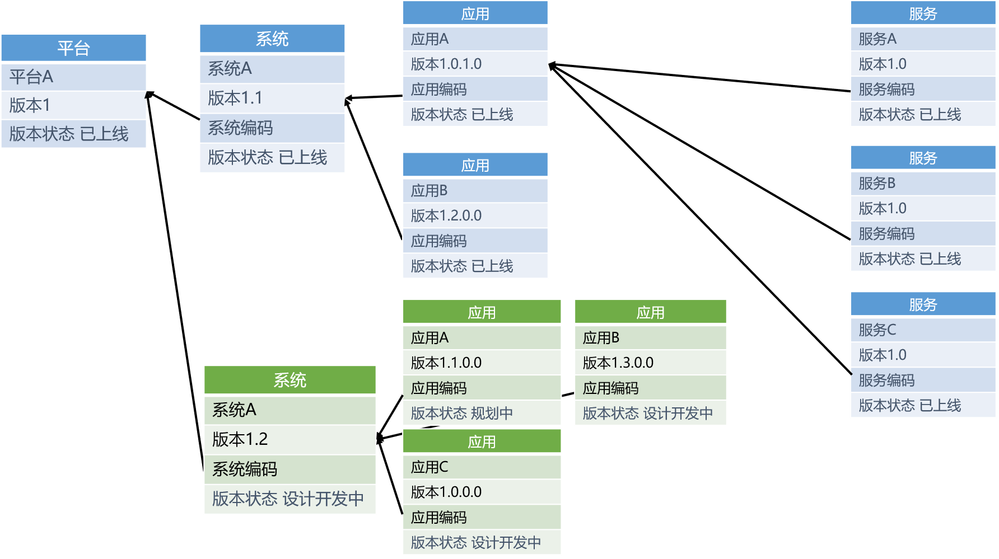

模型按照“平台-系统-应用-服务”这样的层级建立关系。

### 依赖关系的梳理

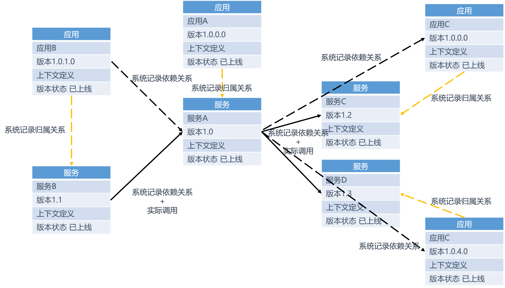

依赖关系有归属关系、记录依赖关系和调用依赖关系。

### 服务生命周期数据流和控制流

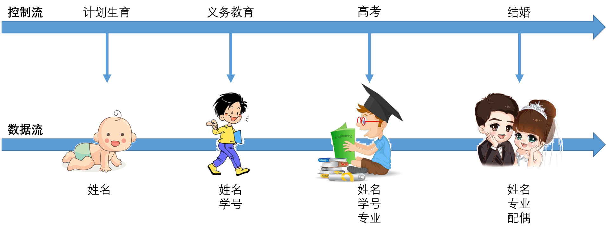

在控制流的干预下，数据流在不同的时点上呈现出不同的变化，例如婴儿只有姓名标签，没有学号标签，等他上学了才有学号。

服务生命周期中的服务治理模型的标签亦是如此，会随着所处的服务生命周期发生一些变化。

### 服务生命周期数据流

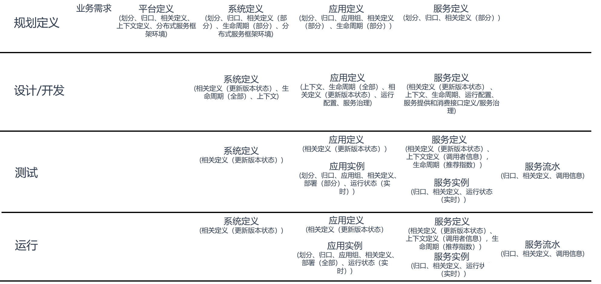

服务的生命周期我们定义为规划、设计/开发、测试、运行是个阶段，数据流的规范是指各类对象属性在生命周期各阶段中，哪些被赋值和初始化，哪些值会有更新。就像上面提到的人的一生的标签。

在规划阶段根据业务需求，平台、系统、应用和服务都将对划分、归口、相关定义类的数据进行初始化，对于平台和系统，生命周期和分布式架构相关属性也会有值。

在设计/开发阶段，系统、应用和服务将被具体实现，所以这三类的几乎所有属性都将被初始化。
在测试阶段，应用和服务将被实例化，实例将从定义对象中继承大部分属性，并且动态更新自己的运行态属性。

在运行阶段，应用和服务实例只是换到了生产环境运行，同样实例将从定义对象中继承大部分属性，并且动态更新自己的运行态属性。

### 服务生命周期控制流规范

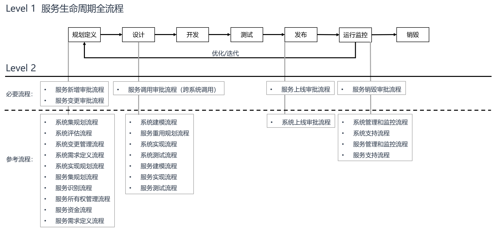

服务在整个生命周期，它的生成、交互、变更、销毁都会对周边的系统、应用、服务造成影响，那如何来评估和控制影响带来的成本压力和风险，这需要我们在关键点上加必要的控制点，这就形成了我们的控制流规范。在规范中，控制点分为两类：建议的必要流程和参考流程。必要流程即为必选，参考流程可以根据组织自身情况来选用，达成风险控制与效率的平衡。

### 控制流的抽象模型-RACI

RACI，是在流程应用中抽象出的业务模式，是用来明确组织过程中各个角色及其相关责任的方法，其中：

- 谁负责（R = Responsible）,即负责执行任务的角色，他/她具体负责操控项目、解决问题
- 谁批准（A = Accountable）,即对任务负全责的角色，只有经他/她同意或签署之后，项目才能得以进行
- 咨询谁（C = Consulted）,拥有完成项目所需的信息或能力的人员
- 通知谁 (I =Informed),即拥有特权、应及时被通知结果的人员，却不必向他/她咨询、征求意见

我们对于控制流的表述，是通过RACI的模型来进行的，简单来说，就是针对这条流程谁来负责、需要谁批准，有问题可以咨询谁，流程到达特定环节需要通知谁。

### 角色定义

- 服务开发团队：负责需求分析，服务的设计、开发、测试、部署、运维等具体工作的角色团队；

- 架构管理团队：是关于系统、服务、业务以及IT相关事项的最终决策者。负责审批微服务体系战略方向/架构、资源、成本等的管控/服务治理原则的把控等管理职能；

- 生产运维部：负责生产环境的部署、变更、运维、安全风险评估等工作的角色团队；

- 风险管理委员会：负责重要业务系统的业务相关风险评估；

- 业务管理团队：是关于业务需求提出、服务资金、激励分配相关事项的最终决策者。 

### 服务新增审批流程

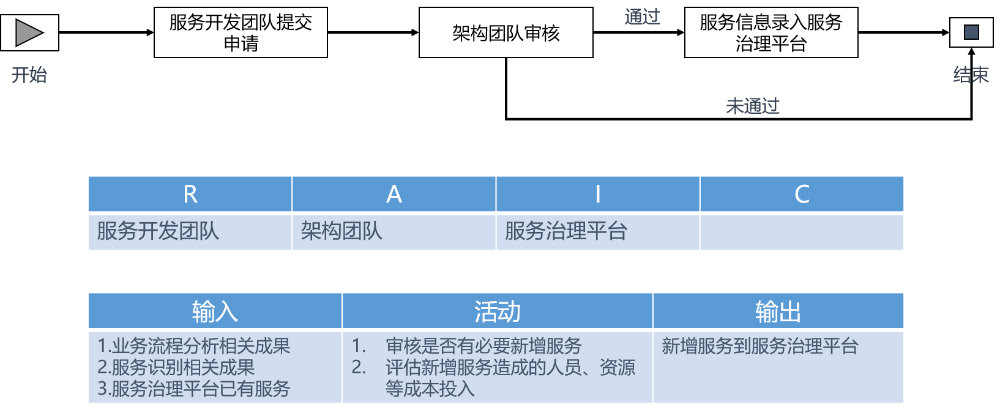

服务新增审批流程，由服务开发团队提出申请，经架构团队审核批准，审批通过后录入服务治理平台。

输入为业务流程分析的相关成果，服务识别相关成果，治理平台中注册的已有服务。

主要活动，评估是否有必要新增服务，并评估新增服务带来的人员、资源等成本压力。

输出为：新增服务的相关属性定义到治理平台。

### 服务变更审批流程

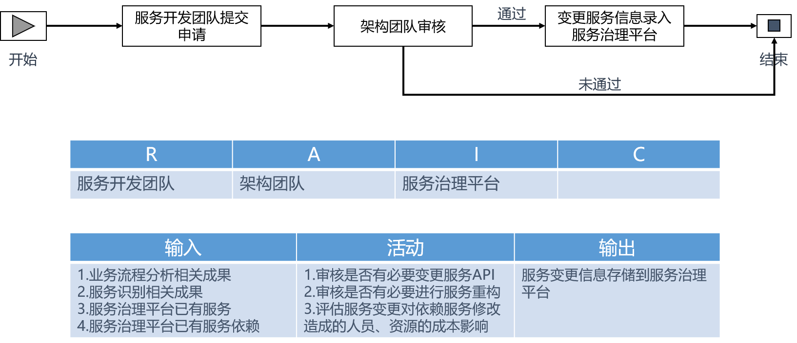

服务变更审批流程，由服务开发团队提出申请，经架构团队审核批准，审批通过后录入服务治理平台。

输入为业务流程分析的相关成果，服务识别相关成果，治理平台中注册的已有服务，以及服务之间的依赖管理。

主要活动，评估是否有必要变更服务API，是否有必要进行服务的重构，评估变更和重构带来的人员、资源等成本压力。

输出为：新增服务的相关属性定义到治理平台。

### 服务调用审批流程

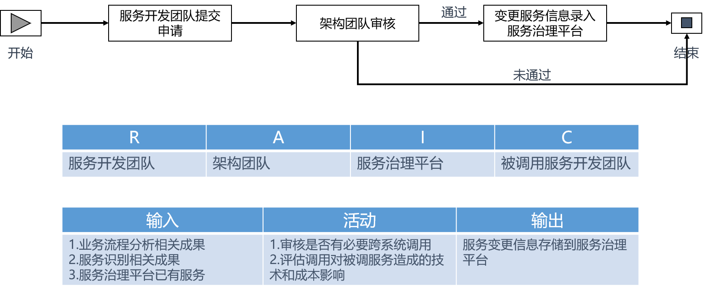

服务调用审批流程，由服务开发团队提出申请，经架构团队审核批准，审批通过后录入服务治理平台。

输入为业务流程分析的相关成果，服务识别相关成果，治理平台中注册的已有服务。

主要活动，评估是否有必要跨系统进行服务调用，评估变更和重构带来的人员、资源等成本压力。

输出为：新增服务的相关属性定义到治理平台。

### 服务上线审批流程

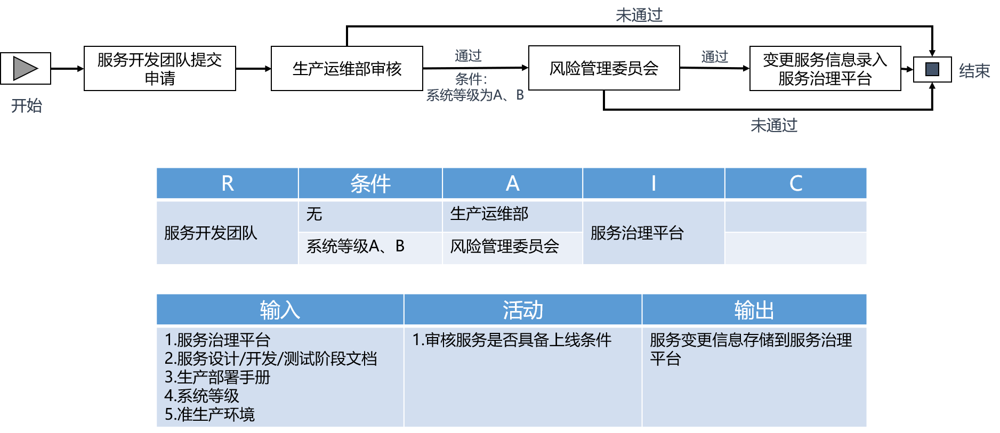

服务上线审批流程，由服务开发团队提出申请，如系统等级为A、B则由风险管理委员会审批，其它等级经生产运维部审核批准，审批通过后录入服务治理平台。

输入为服务生成过程中的相关成果。

主要活动，评估是否具备上线条件。

输出为：新增服务的相关属性定义到治理平台。

### 服务销毁审批流程

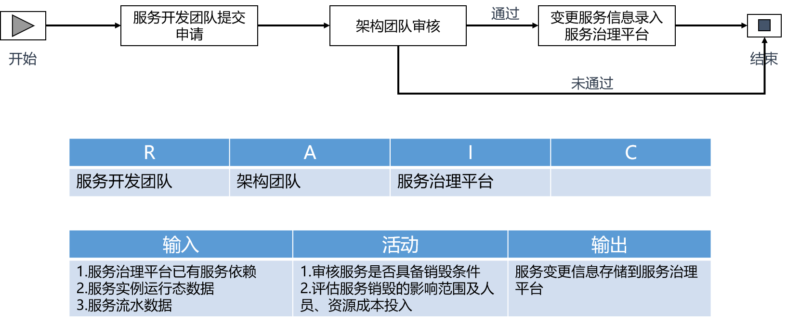

服务销毁审批流程，由服务开发团队提出申请，经架构团队审批，审批通过后录入服务治理平台。

输入为服务间依赖、服务实例运行态的数据以及服务流水数据。

主要活动，评估是否具备销毁的条件，以及销毁带来的人员和资源成本压力。

输出为：新增服务的相关属性定义到治理平台。

### 服务治理平台与其他系统的关系

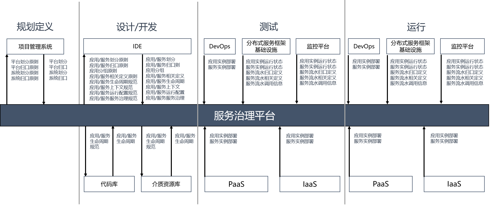

这个关系的梳理也是按生命周期这个维度来做的。

## 三、服务治理平台演进

### 服务治理平台演进阶段划分

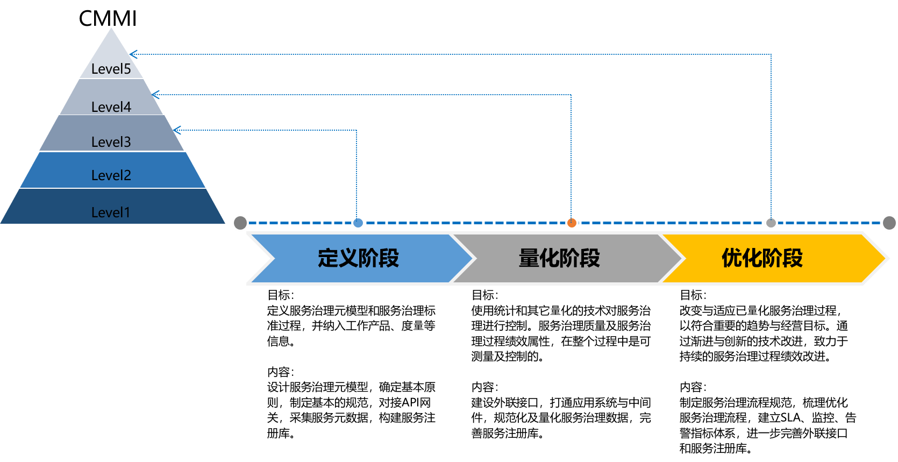

我们参考CMMI能力成熟度模型来划分服务治理平台的演进阶段。

### 定义阶段

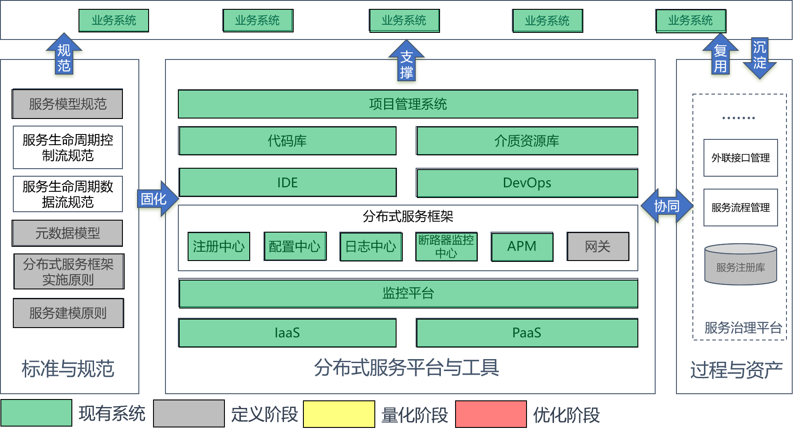

定义阶段主要打通网关，收集建立基本的服务治理模型数据。

### 量化阶段

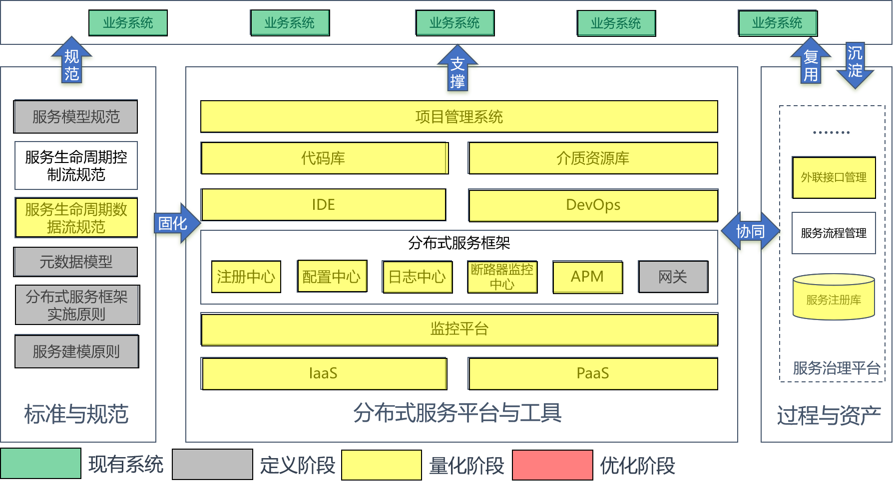

量化阶段全面打通各个应用系统，全面收集度量数据进行统计分析。

### 优化阶段

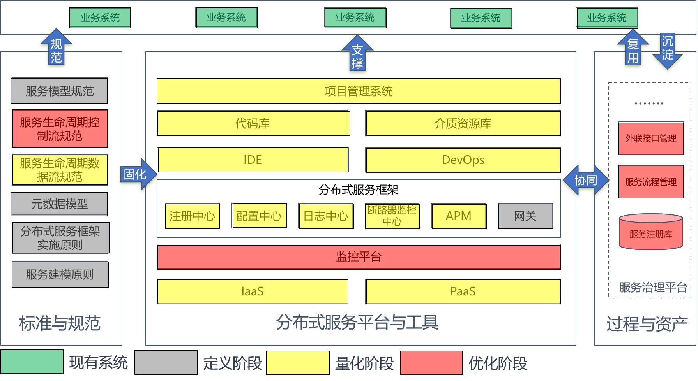

优化阶段通过分析度量数据持续优化服务治理平台。

### 服务治理平台架构蓝图规划

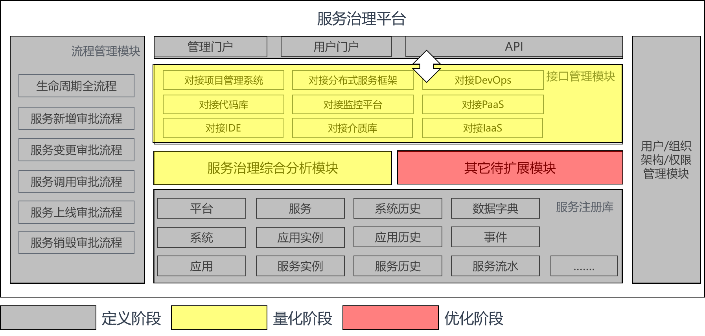

服务治理平台按照前面划分的三个阶段逐渐建立和完善。

关于作者：黄豆，数字化金融研究院研究员，擅长系统分析和架构设计、金融三级密钥安全体系及信息安全保障、虚拟化和云计算技术、JavaEE技术；参与研发的神州商桥电子商务平台获得“全国电子商务示范单位”称号；带领团队研发的国电通云终端系统在国网多个省公司推广应用。
